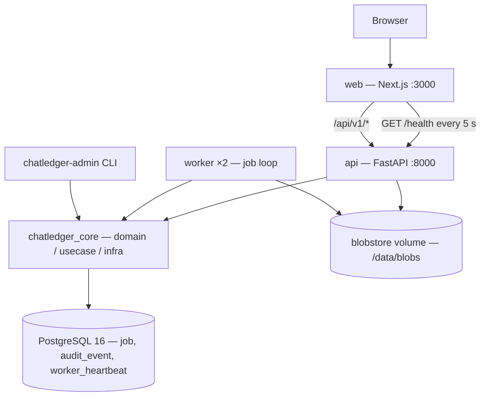

# ChatLedger

ChatLedger turns Slack exports into defensible, reproducible RSMF evidence
productions. Every message that does not reach the export is accounted for by a
reason code, and every run carries a manifest that lets you prove two runs are
identical, or explain why they are not.

## Quick start

Requires Docker with Compose v2.

```bash
git clone <repository-url> chatledger
cd chatledger
docker compose up
```

Then open <http://localhost:3000>. The API listens on <http://localhost:8000>
(`GET /health`, OpenAPI at `/docs`). Two workers start by default; scale them
with `docker compose up -d --scale worker=4`.

> If port 5432 is already in use on your machine, set `CHATLEDGER_DB_PORT=55432`
> in a `.env` file next to `docker-compose.yml`.

## Architecture



- **web**: a Next.js App Router app (TypeScript strict, Tailwind v4, TanStack
  Query). It uses a typed client generated from the API's OpenAPI schema.
- **api**: FastAPI. It applies Alembic migrations on start, returns a uniform
  error envelope `{"error": {"code", "message", "details"}}`, and echoes
  `X-Request-ID`.
- **worker**: a PostgreSQL job queue (`FOR UPDATE SKIP LOCKED`) with leases,
  retries and crash recovery. Each worker writes a heartbeat every 10 s.
- **chatledger_core**: the shared domain, use cases and adapters, with
  clean-architecture layering enforced by `import-linter`.
- **audit_event**: an append-only audit log, enforced by database triggers.

### Repository layout

| Path | Contents |
|---|---|
| `packages/core` | `chatledger_core`: config, domain, use cases, PostgreSQL adapters, Alembic migrations |
| `apps/api` | `chatledger_api`: FastAPI composition root and HTTP layer |
| `apps/worker` | `chatledger_worker`: job loop, handlers, `chatledger-admin` CLI |
| `apps/web` | Next.js web app |
| `docs/adr` | Architecture Decision Records |
| `scripts` | Coverage gate, git-SHA resolver, smoke test |

## Benchmarks

Measured with the synthetic export generator presets on a warm image cache.

| Preset | Messages | Conversations | Ingest time | Peak worker RSS | Throughput |
|---|---|---|---|---|---|
| `small` | pending (F04) | pending (F04) | pending (F04) | pending (F04) | pending (F04) |
| `medium` | pending (F04) | pending (F04) | pending (F04) | pending (F04) | pending (F04) |
| `large` | pending (F04) | pending (F04) | pending (F04) | pending (F04) | pending (F04) |

## Development

Local tooling: [uv](https://docs.astral.sh/uv/) (Python 3.12),
[pnpm](https://pnpm.io/) 9 (Node 22), GNU Make and Docker.

```bash
make install            # uv sync + pnpm install
docker compose up -d db # PostgreSQL 16 for integration tests (creates chatledger_test)
make check              # every quality gate CI runs
```

| Target | What it does |
|---|---|
| `make up` / `make down` | Build and start / stop the stack |
| `make check` | `lint` + `typecheck` + `test` + `web-test` + `web-build` |
| `make lint` | `ruff check`, `ruff format --check`, `import-linter`, `eslint` (`lint-py`, `lint-web`) |
| `make typecheck` | `mypy --strict` and `tsc --noEmit` (`typecheck-py`, `typecheck-web`) |
| `make test` | pytest (unit + integration against `TEST_DATABASE_URL`), then the per-segment coverage gate: `parsing`, `model` and `gates` each need ≥ 80% |
| `make web-test` | `vitest run` |
| `make web-build` | `next build` |
| `make migrate` | `alembic upgrade head` against `DATABASE_URL` |
| `make gen-api-types` | Regenerate `apps/web/src/lib/api/schema.d.ts` from the API's OpenAPI schema |
| `make fixtures-intake` | Write the large intake fixtures (1.5 GB export, 2 GB + 1 file, 200,001-entry ZIP) to `tests/fixtures/intake/generated/` (gitignored, about 1.6 GB on disk, byte-stable) |
| `make smoke` | Boot the stack, wait for health, check the web shell and run a `noop` job |

Configuration is read only by `chatledger_core/config.py`; every setting and
its default is listed in [`.env.example`](.env.example). The Python tests read
[`.env.test`](.env.test). Variables already exported take precedence.

Operator CLI (inside the worker container):

```bash
docker compose exec worker chatledger-admin enqueue-noop --fail-times 1
docker compose exec worker chatledger-admin job-status <job-id>
```

## Matters and collection intake

A **matter** is a named case container (name 3–80 characters, unique
case-insensitively; description optional, at most 500). A **collection** is one
Slack export ZIP registered into a matter. Upload with a raw streaming `POST`
(the body is the ZIP, `Content-Type: application/zip`, original name in
`X-Filename`, percent-encoded):

```bash
curl -X POST "http://localhost:8000/api/v1/matters/$MATTER_ID/collections" \
  -H "Content-Type: application/zip" -H "X-Filename: export.zip" \
  --data-binary @export.zip
```

The API hashes the file with SHA-256 while it is written, so memory stays flat.
The blob lands read-only (`0444`) at `/data/blobs/sha256/<2 hex>/<hash>.zip`.
Identical bytes added to another matter reuse the same blob.

| Rule | Limit | Error |
|---|---|---|
| File size | 2 GiB (`MAX_UPLOAD_BYTES`), checked from `Content-Length` before any byte is read | 413 `FILE_TOO_LARGE` |
| File name | `X-Filename` ends in `.zip`, at most 255 characters, no `/`, `\` or NUL | 400 `MISSING_FILENAME`, 422 `INVALID_FILENAME` |
| Same export twice in a matter | Compared by SHA-256 | 409 `COLLECTION_DUPLICATE` |
| Collections per matter | 20 (`MAX_COLLECTIONS_PER_MATTER`) | 409 `COLLECTION_LIMIT_REACHED` |
| Valid ZIP | Central directory must parse | 422 `ARCHIVE_REJECTED` (`not_a_zip`) |
| Safe paths | No `..` component, leading `/` or drive letter (after `\` → `/`) | 422 `ARCHIVE_REJECTED` (`path_escape`) |
| Entry count | At most 200,000 (`ARCHIVE_MAX_ENTRIES`) | 422 `ARCHIVE_REJECTED` (`entry_count`) |
| Declared uncompressed size | At most 20 GiB | 422 `ARCHIVE_REJECTED` (`uncompressed_size`) |
| Compression ratio | At most 100:1 for entries over 1 MiB | 422 `ARCHIVE_REJECTED` (`compression_ratio`) |
| Slack markers | `users.json` and `channels.json` at the root, or both directly inside one top-level folder | 422 `NOT_A_SLACK_EXPORT` |

Rules run in the order shown and the first failure wins. Nothing is
decompressed during validation; the worker's streaming parser (F04) enforces
actual sizes. Every accepted file is audited as `collection.added`, every
rejection as `collection.rejected`. Partial uploads are deleted on disconnect,
and a janitor in the API removes `tmp/*.part` files older than 10 minutes.

Run `make fixtures-intake` to generate the large fixtures used by the upload
memory check (`scripts/e2e/upload_memory.sh`).

## Architecture Decision Records

| ADR | Decision |
|---|---|
| [0001](docs/adr/0001-postgres-as-job-queue.md) | PostgreSQL as the job queue |
| [0002](docs/adr/0002-content-addressed-blob-storage.md) | Content-addressed blob storage |
| [0003](docs/adr/0003-deterministic-message-ids.md) | Deterministic message IDs |
| [0004](docs/adr/0004-streaming-json-parsing.md) | Streaming JSON parsing |
| [0005](docs/adr/0005-reason-code-accounting.md) | Reason-code accounting |
| [0006](docs/adr/0006-clean-architecture-layering.md) | Clean-architecture layering |
| [0007](docs/adr/0007-sync-sqlalchemy-psycopg3.md) | Synchronous SQLAlchemy 2 with psycopg 3 |
