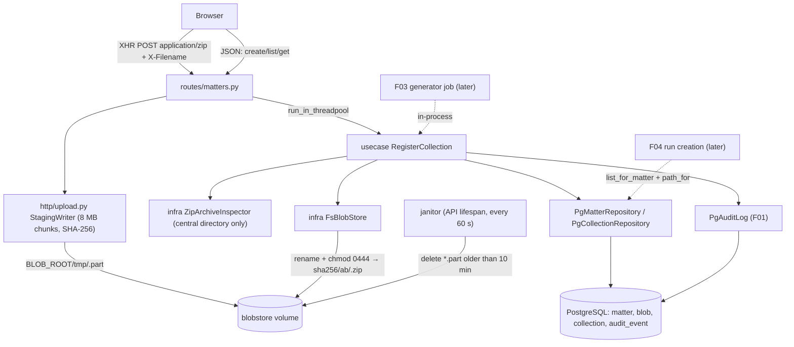

# Spec: Matter and Collection Intake

**Complexity:** medium

## 1. Technical Overview

**What.** F02 introduces the first domain aggregates:
- **Matter:** a named case container.
- **Collection:** one Slack export ZIP registered into a matter.
- **Blob:** the immutable, content-addressed file behind a collection.

It delivers:
- A streaming upload path that hashes ZIPs of up to 2 GB with SHA-256 while writing them to the blob volume, keeping API memory flat.
- A synchronous registration use case shared by the API (uploads) and, later, the F03 generator job. It validates that the archive is a safe Slack export, enforces the per-matter duplicate and 20-collection rules, stores the blob immutably, extracts collection metadata and writes audit events.
- The web flows: the matters ledger, the "New matter" modal, the matter page with its tab bar, the drop-zone upload with live progress, and the collection cards.

**Why.** Everything downstream reads collections:
- F04 processes a run over every collection in a matter.
- F03 registers generated exports through the same use case.

Placing a hash-verified, content-addressed copy at the head of the pipeline is what makes later manifests reproducible (`input_inventory_hash` is built on collection SHA-256s). Rejecting unsafe archives here keeps the worker's streaming parser away from zip bombs and path traversal.

**Scope.**

**Included:**
- Domain entities `Matter`, `Collection`, `BlobRef` and their errors.
- Ports `MatterRepository`, `CollectionRepository`, `BlobStore` and `ArchiveInspector`.
- PostgreSQL adapters and a filesystem blob store.
- Use cases `CreateMatter`, `ListMatters`, `GetMatter`, `RegisterCollection`, `ListCollections`.
- Migration `0002_intake` (tables `matter`, `blob`, `collection`).
- API routes under `/api/v1/matters` (6 endpoints), including the raw streaming upload.
- An upload staging writer, plus a stale-temp janitor that runs in the API process.
- Archive validation rules:
  - Slack export markers.
  - Entry count at most 200,000.
  - Declared uncompressed total at most 20 GB.
  - Per-entry compression ratio at most 100:1 (for entries larger than 1 MiB).
  - No unsafe paths.
  - Must be a valid ZIP.
- Metadata extraction: entry count, conversation folder count, earliest and latest day-file date, root prefix.
- Audit events `matter.created`, `collection.added` and `collection.rejected`.
- Web:
  - `/matters` ledger table with an empty state.
  - The New matter dialog.
  - `/matters/[matterId]` layout with route-based tabs (Collections enabled; Runs, Conversations, Search and Exports disabled).
  - Header-bar current matter name.
  - Collections tab: drop zone, upload progress row, verification state, error states, collection cards.
- Fixtures: committed small ZIPs in `tests/fixtures/intake/`, and a deterministic generator for the large ones (`make fixtures-intake`).
- ADR 0002 updated to the PRD path layout (`sha256/<first 2 hex>/<hex>.zip`).

**Excluded (owned by later features):**
- The "Generate synthetic export" button and ground-truth storage (F03). F02 leaves an `actions` slot in the Collections tab header for it.
- Run creation and anything that reads ZIP contents beyond the central directory (F04).
- Deleting matters or collections (PRD Out of Scope).

**Input contracts (Consumes):** none from other features. F01 infrastructure is used implicitly: `AuditLog`, the error envelope, settings, DB engine and the app shell.

**Output contracts (Provides):**
- **To F03:**
  - Matter records (matter ID, name) through `GetMatter` and `ListMatters`.
  - The registration entry point `RegisterCollection.execute(matter_id, staged_path, original_filename, source="generator", sha256=None)`, which returns the collection ID and SHA-256 or raises a typed `DomainError`.
- **To F04:** collection records (collection ID, matter ID, SHA-256, stored ZIP path, size, original filename, added-at), through `CollectionRepository.list_for_matter(matter_id)` in `added_at` order and `BlobStore.path_for(sha256)`.

## 2. Architecture Impact

**Affected components:**
- New:
  - `packages/core/chatledger_core/domain/intake/*`
  - `packages/core/chatledger_core/usecase/intake/*`
  - `packages/core/chatledger_core/infra/intake/*`
  - `packages/core/chatledger_core/infra/blobstore/*`
  - `packages/core/chatledger_core/migrations/versions/0002_intake.py`
  - `apps/api/chatledger_api/http/routes/matters.py`
  - `apps/api/chatledger_api/http/upload.py`
  - `apps/api/chatledger_api/janitor.py`
  - `apps/web/src/app/matters/[matterId]/**`
  - `apps/web/src/features/intake/**`
  - `tests/fixtures/intake/*`
  - `scripts/fixtures/make_intake_fixtures.py`
- Modified:
  - `config.py` (intake limits)
  - `apps/api/chatledger_api/main.py` (wiring, janitor lifespan)
  - `apps/api/chatledger_api/http/routes/v1.py` (include matters router)
  - `apps/web/src/app/matters/page.tsx` (ledger table)
  - `apps/web/src/components/shell/HeaderBar.tsx` (current matter)
  - `apps/web/src/lib/api/schema.d.ts` (regenerated)
  - `Makefile` (`fixtures-intake`)
  - `.gitignore`
  - `.env.example`, `.env.test`
  - `docs/adr/0002-content-addressed-blob-storage.md`



## 3. Technical Decisions

| Decision | Chosen Approach | Alternative Considered | Trade-off |
|----------|----------------|----------------------|-----------|
| Upload transport | Raw streaming `POST /api/v1/matters/{id}/collections`, body = ZIP bytes, `Content-Type: application/zip` (or `application/octet-stream`), file name in `X-Filename` (RFC 5987 percent-encoded UTF-8). Handler iterates `request.stream()`, coalesces into 8 MiB writes in a threadpool, and updates SHA-256 incrementally | `multipart/form-data` via `python-multipart`; resumable tus-style chunks | No resume: an interrupted upload restarts at 0%. Gains a provably flat memory profile, no extra dependency, and simple XHR progress |
| Registration execution | Synchronous use case `RegisterCollection`, called by the upload handler after staging and in-process by F03 | Async worker job with a `pending` collection state | The request stays open for validation (central directory only: < 2 s for 200,000 entries). Avoids collection states and polling in F02 |
| Validation input | `zipfile.ZipFile` central directory only: names, declared `file_size`/`compress_size`, flags. No entry is decompressed | Full extraction or CRC verification | Zip-bomb checks rely on declared sizes. F04's streaming parser enforces actual sizes when it reads entries |
| Compression-ratio rule | Reject when any entry with `file_size > 1 MiB` has `file_size / max(compress_size, 1) > 100` | Apply to every entry | Small, highly repetitive JSON (e.g. 300 KB of identical join events) can legitimately exceed 100:1. The threshold keeps the protection where expansion matters |
| Concurrency and atomicity | Validate on the staged temp file outside the transaction. Then one transaction: `SELECT … FROM matter WHERE id=:id FOR UPDATE`, then duplicate check, then cap check, then blob move (idempotent), then `INSERT blob … ON CONFLICT DO NOTHING`, then `INSERT collection`, then audit. `UNIQUE (matter_id, blob_sha256)` is the final guard | Advisory locks; optimistic retry | Serialises intake per matter, which suits a single-user app. If the DB transaction fails after the rename, the blob stays on disk unreferenced; it is content-addressed, so it is harmless and reused by the next registration |
| Blob layout | `{BLOB_ROOT}/sha256/{hex[0:2]}/{hex}.zip`, file mode `0444`, temp files under `{BLOB_ROOT}/tmp/`, same filesystem, so `os.replace` is atomic | ADR 0002's `sha256/ab/cd/<digest>` | Follows the PRD path. ADR 0002 is amended. 256 fan-out directories are plenty for at most 20 × N collections |
| Rejected uploads | Duplicate-in-matter and validation failures delete the temp file. No blob is written unless the bytes already exist in the store for another matter | Keep rejected bytes for forensics | Rejections are reproducible from the client's copy. The audit event records SHA-256, size and reason |
| Stale temp cleanup | Immediate delete on client disconnect or any exception, plus a janitor thread started in the API lifespan that every 60 s deletes `tmp/*.part` whose mtime is more than 600 s old | Worker job for cleanup | Covers API crashes mid-upload without touching the queue. The janitor only touches `tmp/` |
| Web upload client | `XMLHttpRequest` wrapper (`uploadCollection()`) exposing `onProgress({loaded,total,bytesPerSecond})` over a rolling 3 s window and `abort()`. One upload at a time per matter page (the drop zone is disabled while busy) | `fetch` with a streaming body | `fetch` has no upload progress events in browsers. Serial uploads keep the per-matter lock simple |
| Matter identity | UUID primary key. Case-insensitive uniqueness via a stored generated column `name_key = lower(btrim(name))` with a unique index | `citext` extension | Avoids an extension; the trimmed lowercase key also blocks names that differ only by surrounding spaces |

**Assumptions:**
- **A1 – Name validation:** names are trimmed before validation and storage. Length is 3–80 characters after trimming, and the message is exactly "Name must be 3–80 characters". Description is trimmed, at most 500 characters, and empty becomes `null`.
- **A2 – Accepted file names:** `X-Filename` must end in `.zip` (case-insensitive), be at most 255 characters, and must not contain `/`, `\` or NUL. A missing header returns 400 `MISSING_FILENAME`.
- **A3 – Size limit:**
  - A `Content-Length` above 2,147,483,648 is rejected with 413 before any byte is read.
  - Without `Content-Length` (chunked), the stream is cut at 2,147,483,649 bytes and rejected with 413.
  - Empty bodies are rejected as `ARCHIVE_REJECTED` with rule `not_a_zip`.
- **A4 – Export marker location:**
  - `users.json` and `channels.json` must both be at the archive root.
  - Otherwise both must sit directly inside exactly one top-level directory, which becomes the `root_prefix`.
  - `__MACOSX/` entries and `.DS_Store` files are ignored for this check and for counting.
- **A5 – Conversation folders:** a conversation folder is a direct child directory of `root_prefix` containing at least one entry named `YYYY-MM-DD.json` that is a valid calendar date. The earliest and latest dates come from those names. Invalid dates such as `2024-02-30.json` are ignored for the range but still count as entries.
- **A6 – Path safety:** entry names are normalised with `\` replaced by `/`. An entry is rejected when the name starts with `/`, contains a drive letter (`^[A-Za-z]:`), or has a `..` path component.
- **A7 – Rule order:** checks run in this order, first failure wins: valid ZIP, path safety, entry count, total uncompressed size, compression ratio, Slack markers. Each failure maps to one `rule` code (see §5).
- **A8 – Memory acceptance:** "API memory under 100 MB during upload" is measured as the peak RSS of the uvicorn worker process minus its idle RSS just before the upload, sampled every 500 ms. Container-level memory includes page cache from writing 1.5 GB and is not used.
- **A9 – Generated-export AC:** the PRD criterion about "a generated `small` export (50 conversations, 90-day range)" is verified with the committed fixture `tests/fixtures/intake/export-50conv-90d.zip`, which has the same shape. The generator is F03, outside F02's dependency closure.
- **A10 – Collection cap:** at most 20 collections per matter (`MAX_COLLECTIONS_PER_MATTER`, configurable). The 21st returns 409 `COLLECTION_LIMIT_REACHED`.
- **A11 – Audit entity for rejections:** `collection.rejected` uses `entity_type="matter"` and `entity_id=<matter_id>`, because no collection exists. Details are `{reason_code, rule?, message, original_filename, size_bytes?, sha256?, source}`.
- **A12 – Fixture generator:** `scripts/fixtures/make_intake_fixtures.py` uses a fixed seed (`20261001`), so generated files are byte-stable. `tests/fixtures/intake/generated/` is gitignored.

## 4. Component Overview

**Backend — `packages/core/chatledger_core`:**

| File Path | New/Modified | Purpose | Key Responsibilities |
|-----------|--------------|---------|---------------------|
| `config.py` | Modified | Settings | Add `max_upload_bytes` (2,147,483,648), `upload_chunk_bytes` (8,388,608), `upload_stale_seconds` (600), `upload_janitor_interval_seconds` (60), `max_collections_per_matter` (20), `archive_max_entries` (200,000), `archive_max_uncompressed_bytes` (21,474,836,480), `archive_max_ratio` (100), `archive_ratio_min_entry_bytes` (1,048,576) |
| `domain/intake/matter.py` | New | Matter entity | `Matter(id, name, description, created_at)`; `MatterSummary` adds `collection_count`, `total_size_bytes`; `validate_matter_input()` normalises and validates name/description |
| `domain/intake/collection.py` | New | Collection entity | `Collection(id, matter_id, sha256, original_filename, size_bytes, source, entry_count, conversation_count, export_date_from, export_date_to, root_prefix, added_at)`; `CollectionSource` enum (`upload`, `generator`) |
| `domain/intake/archive.py` | New | Archive value objects | `ArchiveEntry(name, file_size, compress_size, is_dir)`; `ArchiveMetadata`; `ArchiveRule` enum; pure function `inspect_entries(entries, limits) -> ArchiveMetadata` (raises `ArchiveRejectedError` / `NotASlackExportError`) |
| `domain/intake/errors.py` | New | Typed errors | `MatterNotFoundError` (404 `MATTER_NOT_FOUND`), `MatterNameTakenError` (409 `MATTER_NAME_TAKEN`), `MatterNameInvalidError` (422 `MATTER_NAME_INVALID`), `MatterDescriptionInvalidError` (422), `CollectionDuplicateError` (409 `COLLECTION_DUPLICATE`), `CollectionLimitReachedError` (409 `COLLECTION_LIMIT_REACHED`), `FileTooLargeError` (413 `FILE_TOO_LARGE`), `NotASlackExportError` (422 `NOT_A_SLACK_EXPORT`), `ArchiveRejectedError` (422 `ARCHIVE_REJECTED`, `details.rule`), `InvalidFilenameError` (422 `INVALID_FILENAME`) |
| `domain/intake/ports.py` | New | Ports | `MatterRepository` (`add`, `get`, `get_for_update`, `list_summaries`, `name_exists`), `CollectionRepository` (`add`, `find_by_sha`, `count_for_matter`, `list_for_matter`, `get`), `BlobStore` (`put_from_staging(staged_path, sha256) -> BlobRef`, `path_for(sha256)`, `exists`), `ArchiveInspector` (`read_entries(path) -> list[ArchiveEntry]`), `UnitOfWork` factory |
| `usecase/intake/create_matter.py` | New | Use case | Validate input → name uniqueness → insert → audit `matter.created` |
| `usecase/intake/list_matters.py`, `get_matter.py`, `list_collections.py` | New | Read use cases | Return summaries / detail / collections ordered by `added_at` |
| `usecase/intake/register_collection.py` | New | Registration entry point (API + F03) | Hash if needed → inspect → transaction (lock matter, duplicate, cap, blob put, inserts, audit) → return `Collection`; on any `DomainError` write `collection.rejected` in its own transaction and delete the staged file |
| `infra/intake/pg_matter_repository.py`, `pg_collection_repository.py` | New | SQL adapters | `TransactionalAdapter` subclasses with raw `text()` SQL; map unique violations to typed errors |
| `infra/intake/zip_archive_inspector.py` | New | ZIP adapter | `zipfile.ZipFile(path).infolist()` → `ArchiveEntry` list; `BadZipFile`/`LargeZipFile` → `ArchiveRejectedError(rule=not_a_zip)` |
| `infra/blobstore/fs_blob_store.py` | New | Blob store | Layout `sha256/<2>/<hex>.zip`; `os.replace` from staging; `chmod 0o444`; when target exists, verify size and discard staging; `fsync` file and directory |
| `infra/blobstore/staging.py` | New | Staging writer | `StagingWriter(tmp_dir, max_bytes, chunk_bytes)`: `write(chunk)`, `finish() -> StagedFile(path, sha256, size)`, `discard()`; `sweep_stale(tmp_dir, older_than)` |
| `migrations/versions/0002_intake.py` | New | Migration | Creates `matter`, `blob`, `collection` |

**Backend — `apps/api/chatledger_api`:**

| File Path | New/Modified | Purpose | Key Responsibilities |
|-----------|--------------|---------|---------------------|
| `http/routes/matters.py` | New | Routes | 6 endpoints (§5); Pydantic request/response models; upload handler streams via `StagingWriter`, then `run_in_threadpool(register.execute, …)` |
| `http/upload.py` | New | Upload helpers | Header parsing (`X-Filename` RFC 5987 decode, `Content-Length` precheck), disconnect detection (`ClientDisconnect`) → `discard()` |
| `janitor.py` | New | Stale temp sweeper | Daemon thread started/stopped in FastAPI lifespan; calls `sweep_stale` every `upload_janitor_interval_seconds` |
| `http/routes/v1.py` | Modified | Router | `router.include_router(matters.router)` |
| `main.py` | Modified | Composition root | Instantiate repositories, `FsBlobStore`, `ZipArchiveInspector`, use cases; lifespan with janitor |

**Frontend — `apps/web/src`:**

| File Path | New/Modified | Purpose | Key Responsibilities |
|-----------|--------------|---------|---------------------|
| `app/matters/page.tsx` | Modified | Matters ledger | Client query `GET /api/v1/matters`; ledger table (Name, Collections, Size, Created) newest first; F01 empty state when 0; "New matter" in `PageHeader` |
| `app/matters/[matterId]/layout.tsx` | New | Matter layout | Loads matter (404 → "Matter not found" state); `PageHeader` with name/description; `MatterTabs`; sets current matter in header |
| `app/matters/[matterId]/page.tsx` | New | Redirect | → `/matters/[matterId]/collections` |
| `app/matters/[matterId]/collections/page.tsx` | New | Collections tab | `DropZone`, `UploadRow`, `CollectionCard` list (oldest first), run-scope note, `actions` slot |
| `features/intake/api.ts` | New | Typed calls | `listMatters`, `createMatter`, `getMatter`, `listCollections` via `apiClient` + `unwrap` |
| `features/intake/uploadCollection.ts` | New | XHR uploader | Progress events (`loaded`, `total`, `percent`, `bytesPerSecond`), `abort()`, envelope parsing into `ApiError`, network failure → `UploadInterruptedError(percent)` |
| `features/intake/NewMatterDialog.tsx` | New | Create modal | Name + Description fields, inline validation, server error mapping, navigate on success |
| `features/intake/MatterTabs.tsx` | New | Tab bar | 5 tabs; 4 disabled with `Tooltip` "Available after a completed processing run" |
| `features/intake/DropZone.tsx` | New | Drop zone | Drag/drop + click-to-browse (`accept=".zip"`), client-side size and extension checks, disabled while uploading |
| `features/intake/UploadRow.tsx` | New | Upload state | States `uploading` (filename, %, MB transferred / total, MB/s), `verifying`, `error` (message + Dismiss/Retry), `interrupted` |
| `features/intake/CollectionCard.tsx` | New | Collection card | Filename, size, SHA-256 with copy button, added-at, conversation count, date range, source badge |
| `features/intake/format.ts` | New | Formatters | Bytes (KB/MB/GB, 1 decimal), dates (UTC `YYYY-MM-DD`), SHA abbreviation |
| `components/shell/HeaderBar.tsx` | Modified | Header | Render current matter name from a `CurrentMatter` context |
| `lib/api/schema.d.ts` | Modified | Types | Regenerated with `make gen-api-types` |

**Fixtures and tooling:**

| File Path | New/Modified | Purpose | Key Responsibilities |
|-----------|--------------|---------|---------------------|
| `tests/fixtures/intake/*.zip` | New | Committed fixtures | 7 small ZIPs (see contract Static inputs) built by the generator script and committed |
| `scripts/fixtures/make_intake_fixtures.py` | New | Fixture generator | `--small` rebuilds committed fixtures; `--large` writes `generated/` files; fixed seed; ZIP entries in sorted order with fixed timestamps |
| `Makefile` | Modified | Targets | `fixtures-intake` (large fixtures) |
| `docs/adr/0002-content-addressed-blob-storage.md` | Modified | ADR | Path layout `sha256/<2>/<hex>.zip`, 0444 mode, staging dir, janitor |

**Database:**

| Migration File | Tables Affected | Operation | Notes |
|----------------|-----------------|-----------|-------|
| `packages/core/chatledger_core/migrations/versions/0002_intake.py` | `matter`, `blob`, `collection` | CREATE | `down_revision = "0001_foundation"` |

## 5. API Contracts

All routes are mounted under `/api/v1`. No authentication (single-user local app). Errors use the F01 envelope `{error:{code,message,details}}`.

### Endpoint: Create matter
- **Method:** POST · **Path:** `/api/v1/matters`

**Request:**

| Field | Type | Required | Validation | Description |
|-------|------|----------|------------|-------------|
| `name` | `string` | Yes | 3–80 chars after trim; unique case-insensitive | Matter name |
| `description` | `string \| null` | No | ≤ 500 chars after trim | Free text |

```json
{ "name": "Acme v. Beta", "description": "Slack collection for the Beta dispute." }
```

**Response (201):** `Matter`

| Field | Type | Description |
|-------|------|-------------|
| `id` | `uuid` | Matter ID |
| `name` | `string` | Trimmed name |
| `description` | `string \| null` | Trimmed description |
| `created_at` | `datetime` | UTC ISO 8601 |
| `collection_count` | `integer` | 0 on creation |
| `total_size_bytes` | `integer` | 0 on creation |

```json
{
  "id": "7f3c1d52-0a6e-4f3b-9a51-2f7d1c9e8b10",
  "name": "Acme v. Beta",
  "description": "Slack collection for the Beta dispute.",
  "created_at": "2026-10-01T19:02:11.481Z",
  "collection_count": 0,
  "total_size_bytes": 0
}
```

### Endpoint: List matters
- **Method:** GET · **Path:** `/api/v1/matters`
- **Response (200):** `{ "items": [Matter…] }`, ordered by `created_at` descending. No pagination (single-user PoC; fewer than 1,000 matters expected).

### Endpoint: Get matter
- **Method:** GET · **Path:** `/api/v1/matters/{matter_id}`
- **Response (200):** `Matter`. A malformed or unknown ID returns 404 `MATTER_NOT_FOUND`.

### Endpoint: Upload collection
- **Method:** POST · **Path:** `/api/v1/matters/{matter_id}/collections`
- **Headers:**

| Header | Required | Validation | Description |
|--------|----------|------------|-------------|
| `Content-Type` | Yes | `application/zip` or `application/octet-stream` | Otherwise 415 `UNSUPPORTED_MEDIA_TYPE` |
| `X-Filename` | Yes | percent-encoded UTF-8; decoded value ends in `.zip`, ≤ 255 chars, no `/`, `\`, NUL | Original file name |
| `Content-Length` | No | ≤ 2,147,483,648 | Pre-checked before reading |

- **Body:** raw ZIP bytes.

**Response (201):** `Collection`

| Field | Type | Description |
|-------|------|-------------|
| `id` | `uuid` | Collection ID |
| `matter_id` | `uuid` | Owning matter |
| `sha256` | `string` | 64 lowercase hex chars |
| `original_filename` | `string` | Decoded `X-Filename` |
| `size_bytes` | `integer` | Bytes received |
| `source` | `string` | `upload` \| `generator` |
| `entry_count` | `integer` | ZIP entries excluding `__MACOSX/` and `.DS_Store` |
| `conversation_count` | `integer` | Conversation folders (A5) |
| `export_date_from` | `date \| null` | Earliest day-file date |
| `export_date_to` | `date \| null` | Latest day-file date |
| `root_prefix` | `string` | `""` or `"<folder>/"` |
| `added_at` | `datetime` | UTC |

```json
{
  "id": "c0a8012e-5b1f-4c7e-8d2a-6f9b3e1d4a77",
  "matter_id": "7f3c1d52-0a6e-4f3b-9a51-2f7d1c9e8b10",
  "sha256": "9b1f0c5e3d7a2b6c8e4f1a0d9c7b5e3f2a1d0c9b8e7f6a5d4c3b2a1f0e9d8c7b",
  "original_filename": "acme-slack-export-2024.zip",
  "size_bytes": 1610612736,
  "source": "upload",
  "entry_count": 4512,
  "conversation_count": 50,
  "export_date_from": "2024-01-03",
  "export_date_to": "2024-04-01",
  "root_prefix": "",
  "added_at": "2026-10-01T19:05:44.120Z"
}
```

### Endpoint: List collections
- **Method:** GET · **Path:** `/api/v1/matters/{matter_id}/collections`
- **Response (200):** `{ "items": [Collection…] }`, ordered by `added_at` ascending.

### Endpoint: Get collection
- **Method:** GET · **Path:** `/api/v1/matters/{matter_id}/collections/{collection_id}`
- **Response (200):** `Collection`. An unknown ID, or one in another matter, returns 404 `COLLECTION_NOT_FOUND`.

**Error Codes:**

| Code | HTTP Status | Message (exact) / Details |
|------|-------------|---------------------------|
| `MATTER_NAME_INVALID` | 422 | "Name must be 3–80 characters" |
| `MATTER_DESCRIPTION_INVALID` | 422 | "Description must be at most 500 characters" |
| `MATTER_NAME_TAKEN` | 409 | "A matter with this name already exists" · details `{existing_matter_id}` |
| `MATTER_NOT_FOUND` | 404 | "Matter not found." |
| `COLLECTION_NOT_FOUND` | 404 | "Collection not found." |
| `MISSING_FILENAME` | 400 | "X-Filename header is required." |
| `INVALID_FILENAME` | 422 | "File must be a .zip archive." |
| `UNSUPPORTED_MEDIA_TYPE` | 415 | "Upload must be sent as application/zip." |
| `FILE_TOO_LARGE` | 413 | "File exceeds the 2 GB limit (<size>)." · details `{limit_bytes, size_bytes?}` |
| `COLLECTION_DUPLICATE` | 409 | "This export is already in this matter as collection <filename> (added <YYYY-MM-DD>). SHA-256: <hash>." · details `{existing_collection_id, original_filename, added_at, sha256}` |
| `COLLECTION_LIMIT_REACHED` | 409 | "This matter already has 20 collections (limit 20)." · details `{limit}` |
| `NOT_A_SLACK_EXPORT` | 422 | "Not a Slack workspace export: users.json and channels.json not found." |
| `ARCHIVE_REJECTED` | 422 | "Archive rejected: <rule text>" · details `{rule}` with rule ∈ `not_a_zip` ("file is not a valid ZIP archive"), `path_escape` ("entry path escapes archive"), `entry_count` ("more than 200,000 entries"), `uncompressed_size` ("uncompressed size above 20 GB"), `compression_ratio` ("compression ratio above 100:1") |

## 6. Data Model

**Table: `matter`**

| Column | Type | Nullable | Default | Description |
|--------|------|----------|---------|-------------|
| `id` | `uuid` | No | `gen_random_uuid()` | Primary key |
| `name` | `varchar(80)` | No | - | Trimmed display name |
| `name_key` | `varchar(80)` | No | generated `lower(btrim(name))` stored | Case-insensitive uniqueness key |
| `description` | `varchar(500)` | Yes | - | Optional |
| `created_at` | `timestamptz` | No | `clock_timestamp()` | Creation time |

**Table: `blob`**

| Column | Type | Nullable | Default | Description |
|--------|------|----------|---------|-------------|
| `sha256` | `char(64)` | No | - | Primary key, lowercase hex |
| `size_bytes` | `bigint` | No | - | File size |
| `storage_path` | `text` | No | - | Relative path `sha256/<2>/<hex>.zip` |
| `created_at` | `timestamptz` | No | `clock_timestamp()` | First stored |

**Table: `collection`**

| Column | Type | Nullable | Default | Description |
|--------|------|----------|---------|-------------|
| `id` | `uuid` | No | `gen_random_uuid()` | Primary key |
| `matter_id` | `uuid` | No | - | FK → `matter.id` |
| `blob_sha256` | `char(64)` | No | - | FK → `blob.sha256` |
| `original_filename` | `varchar(255)` | No | - | As uploaded |
| `size_bytes` | `bigint` | No | - | Copy of blob size |
| `source` | `varchar(16)` | No | - | `upload` \| `generator` |
| `entry_count` | `integer` | No | - | ≥ 0 |
| `conversation_count` | `integer` | No | - | ≥ 0 |
| `export_date_from` | `date` | Yes | - | Earliest day file |
| `export_date_to` | `date` | Yes | - | Latest day file |
| `root_prefix` | `varchar(255)` | No | `''` | Folder containing the export |
| `added_at` | `timestamptz` | No | `clock_timestamp()` | Registration time |

**Indexes:**

| Index Name | Columns | Type | Purpose |
|------------|---------|------|---------|
| `uq_matter_name_key` | `matter(name_key)` | unique btree | Case-insensitive unique names |
| `ix_matter_created_at` | `matter(created_at DESC)` | btree | Ledger ordering |
| `uq_collection_matter_blob` | `collection(matter_id, blob_sha256)` | unique btree | Duplicate guard per matter |
| `ix_collection_matter_added` | `collection(matter_id, added_at)` | btree | Listing, F04 ordering |
| `ix_collection_blob` | `collection(blob_sha256)` | btree | Blob reverse lookup |

**Constraints:**

| Constraint | Type | Definition | Purpose |
|------------|------|------------|---------|
| `ck_matter_name_len` | CHECK | `char_length(btrim(name)) BETWEEN 3 AND 80` | Defence in depth |
| `ck_blob_sha256_hex` | CHECK | `sha256 ~ '^[0-9a-f]{64}$'` | Canonical digest |
| `fk_collection_matter` | FOREIGN KEY | `matter_id REFERENCES matter(id) ON DELETE RESTRICT` | No deletes in PoC |
| `fk_collection_blob` | FOREIGN KEY | `blob_sha256 REFERENCES blob(sha256) ON DELETE RESTRICT` | Blob outlives references |
| `ck_collection_source` | CHECK | `source IN ('upload','generator')` | Valid sources |
| `ck_collection_counts` | CHECK | `entry_count >= 0 AND conversation_count >= 0 AND size_bytes > 0` | Sanity |
| `ck_collection_dates` | CHECK | `export_date_from IS NULL OR export_date_to >= export_date_from` | Ordered range |

**Migration Example:**
```sql
CREATE TABLE matter (
    id UUID PRIMARY KEY DEFAULT gen_random_uuid(),
    name VARCHAR(80) NOT NULL CONSTRAINT ck_matter_name_len CHECK (char_length(btrim(name)) BETWEEN 3 AND 80),
    name_key VARCHAR(80) GENERATED ALWAYS AS (lower(btrim(name))) STORED,
    description VARCHAR(500),
    created_at TIMESTAMPTZ NOT NULL DEFAULT clock_timestamp()
);
CREATE UNIQUE INDEX uq_matter_name_key ON matter (name_key);
CREATE INDEX ix_matter_created_at ON matter (created_at DESC);

CREATE TABLE blob (
    sha256 CHAR(64) PRIMARY KEY CONSTRAINT ck_blob_sha256_hex CHECK (sha256 ~ '^[0-9a-f]{64}$'),
    size_bytes BIGINT NOT NULL,
    storage_path TEXT NOT NULL,
    created_at TIMESTAMPTZ NOT NULL DEFAULT clock_timestamp()
);

CREATE TABLE collection (
    id UUID PRIMARY KEY DEFAULT gen_random_uuid(),
    matter_id UUID NOT NULL CONSTRAINT fk_collection_matter REFERENCES matter(id) ON DELETE RESTRICT,
    blob_sha256 CHAR(64) NOT NULL CONSTRAINT fk_collection_blob REFERENCES blob(sha256) ON DELETE RESTRICT,
    original_filename VARCHAR(255) NOT NULL,
    size_bytes BIGINT NOT NULL,
    source VARCHAR(16) NOT NULL CONSTRAINT ck_collection_source CHECK (source IN ('upload','generator')),
    entry_count INTEGER NOT NULL,
    conversation_count INTEGER NOT NULL,
    export_date_from DATE,
    export_date_to DATE,
    root_prefix VARCHAR(255) NOT NULL DEFAULT '',
    added_at TIMESTAMPTZ NOT NULL DEFAULT clock_timestamp(),
    CONSTRAINT ck_collection_counts CHECK (entry_count >= 0 AND conversation_count >= 0 AND size_bytes > 0),
    CONSTRAINT ck_collection_dates CHECK (export_date_from IS NULL OR export_date_to >= export_date_from)
);
CREATE UNIQUE INDEX uq_collection_matter_blob ON collection (matter_id, blob_sha256);
CREATE INDEX ix_collection_matter_added ON collection (matter_id, added_at);
CREATE INDEX ix_collection_blob ON collection (blob_sha256);
```

## 7. Testing Strategy

**Test File Structure:**

| Test File | Test Type | Target | Coverage Goal |
|-----------|-----------|--------|---------------|
| `packages/core/tests/unit/intake/test_archive_rules.py` | Unit | `domain/intake/archive.py` | 100% |
| `packages/core/tests/unit/intake/test_matter_validation.py` | Unit | `domain/intake/matter.py` | 100% |
| `packages/core/tests/unit/intake/test_staging.py` | Unit | `infra/blobstore/staging.py` | 95% |
| `packages/core/tests/unit/intake/test_fs_blob_store.py` | Unit | `infra/blobstore/fs_blob_store.py` (tmp dir) | 95% |
| `packages/core/tests/unit/intake/test_zip_archive_inspector.py` | Unit | `infra/intake/zip_archive_inspector.py` against committed fixtures | 95% |
| `packages/core/tests/integration/intake/test_register_collection.py` | Integration | `RegisterCollection` + PG adapters | 95% |
| `packages/core/tests/integration/intake/test_matter_repository.py` | Integration | `PgMatterRepository` | 90% |
| `apps/api/tests/integration/test_matters_api.py` | Integration | Matter routes | 100% of routes |
| `apps/api/tests/integration/test_collection_upload_api.py` | Integration | Upload route (TestClient streaming) | 100% of route |
| `apps/api/tests/unit/test_upload_headers.py` | Unit | `http/upload.py` | 100% |
| `apps/api/tests/unit/test_janitor.py` | Unit | `janitor.py` | 90% |
| `scripts/tests/test_make_intake_fixtures.py` | Unit | Fixture generator determinism | n/a |

**`test_archive_rules.py`:**

| Test Function | Description | Assertions |
|---------------|-------------|------------|
| `test_markers_at_root` | users.json + channels.json at root | `root_prefix == ""` |
| `test_markers_in_single_top_folder` | Both inside `Acme/` | `root_prefix == "Acme/"` |
| `test_markers_split_across_folders_rejected` | users in `A/`, channels in `B/` | `NotASlackExportError` |
| `test_missing_users_json` | channels only | `NotASlackExportError` |
| `test_macosx_entries_ignored` | `__MACOSX/` + `.DS_Store` present | excluded from counts and marker check |
| `test_path_escape_dotdot` / `test_path_escape_absolute` / `test_path_escape_drive_letter` / `test_backslash_normalised` | Unsafe names | `ArchiveRejectedError(rule=path_escape)` |
| `test_entry_count_limit` | 200,001 synthetic entries | `rule=entry_count`; 200,000 passes |
| `test_uncompressed_total_limit` | Forged sizes summing to 20 GiB + 1 | `rule=uncompressed_size` |
| `test_ratio_over_limit_large_entry` | 50 MiB / 40 KiB | `rule=compression_ratio` |
| `test_ratio_ignored_below_threshold` | 900 KiB / 2 KiB | passes |
| `test_rule_order_first_failure_wins` | Path escape + ratio | `rule=path_escape` |
| `test_conversation_count_and_dates` | 3 folders, days 2024-01-03..2024-01-10 | count 3, from/to correct |
| `test_invalid_calendar_date_ignored` | `2024-02-30.json` | not in range, still in entry_count |
| `test_no_day_files_yields_null_dates` | Markers only | dates `None`, count 0 |

**`test_register_collection.py`:**

| Test Function | Description | Assertions |
|---------------|-------------|------------|
| `test_registers_new_collection` | minimal export into empty matter | row created, blob row, file at `sha256/<2>/<hex>.zip` mode 0444, audit `collection.added` |
| `test_duplicate_in_same_matter_rejected` | Same staged bytes twice | `CollectionDuplicateError` with existing id; 1 collection row; staged file deleted; audit `collection.rejected` |
| `test_same_blob_other_matter_reused` | Same bytes into 2 matters | 2 collections, 1 blob row, same storage path, second staged file deleted |
| `test_limit_reached` | Matter with 20 collections | `CollectionLimitReachedError`; no new row |
| `test_not_slack_export_audited` | missing-users fixture | error raised; audit `collection.rejected` with `reason_code=NOT_A_SLACK_EXPORT`; no blob file |
| `test_unknown_matter` | Random UUID | `MatterNotFoundError` |
| `test_hashes_when_sha_not_supplied` | `sha256=None` | digest equals `hashlib.sha256(file)` |
| `test_concurrent_duplicate_registration` | 2 threads, same bytes, same matter | exactly 1 succeeds, other `CollectionDuplicateError` |
| `test_generator_source_recorded` | `source="generator"` | row `source == 'generator'` |

**`test_collection_upload_api.py`:**

| Test Function | Description | Assertions |
|---------------|-------------|------------|
| `test_upload_minimal_export_201` | Stream fixture | 201 body fields, `sha256` equals hashlib digest |
| `test_upload_metadata_50conv` | export-50conv-90d fixture | `conversation_count=50`, dates 2024-01-03/2024-04-01 |
| `test_upload_duplicate_409` | Twice | 409 `COLLECTION_DUPLICATE` with `existing_collection_id` |
| `test_upload_content_length_over_limit_413` | Header 2,147,483,649 | 413 before body read |
| `test_upload_stream_over_limit_413` | Chunked generator past `max_upload_bytes` (small limit via settings) | 413, no temp files remain |
| `test_upload_missing_filename_400` / `test_upload_non_zip_extension_422` / `test_upload_wrong_media_type_415` | Header validation | codes as §5 |
| `test_upload_not_slack_export_422` / `test_upload_path_traversal_422` / `test_upload_zip_bomb_422` / `test_upload_not_a_zip_422` | Fixtures | codes and `details.rule` |
| `test_upload_unknown_matter_404` | Random UUID | 404 `MATTER_NOT_FOUND`, no temp files |
| `test_upload_client_disconnect_discards_temp` | Simulated `ClientDisconnect` mid-stream | `tmp/` empty, no collection |

**`test_matters_api.py`:** `test_create_matter_201`, `test_create_matter_trims_name`, `test_name_too_short_422_message`, `test_name_too_long_422`, `test_duplicate_name_case_insensitive_409`, `test_description_too_long_422`, `test_list_matters_newest_first_with_counts`, `test_get_matter_404`, `test_matter_created_audit_event`.

**`test_janitor.py`:** `test_sweeps_parts_older_than_threshold`, `test_keeps_recent_parts`, `test_ignores_non_part_files`.

**Frontend tests (Vitest + Testing Library + MSW):**
- `features/intake/NewMatterDialog.test.tsx`: `shows_length_error_inline`, `shows_name_taken_error_from_api`, `navigates_to_collections_on_success`.
- `app/matters/page.test.tsx` (updated): `renders_empty_state_when_no_matters`, `renders_ledger_rows_newest_first`.
- `features/intake/MatterTabs.test.tsx`: `collections_enabled_others_disabled_with_tooltip`.
- `features/intake/DropZone.test.tsx`: `rejects_file_over_2gb_before_upload`, `rejects_non_zip_extension`, `disabled_while_uploading`.
- `features/intake/uploadCollection.test.ts`: `reports_progress_and_speed`, `maps_error_envelope`, `network_error_raises_interrupted_with_percent` (fake XHR).
- `features/intake/UploadRow.test.tsx`: `uploading_state_shows_filename_percent_mb_speed`, `verifying_state_text`, `interrupted_state_offers_retry`.
- `features/intake/CollectionCard.test.tsx`: `renders_hash_with_copy_button`, `renders_conversation_count_and_date_range`.

**E2E / scripted scenarios:**
- Large upload memory check (`scripts/e2e/upload_memory.sh`):
  1. `make fixtures-intake`.
  2. Create a matter via the API.
  3. Sample uvicorn RSS through `docker compose exec api ps -o rss=` every 500 ms while `curl --data-binary @large-export-1_5gb.zip` runs.
  4. Assert peak minus idle is under 100 MB.
  5. Assert the response SHA-256 equals `sha256sum`.
- Browser flow (Playwright, run ad hoc): create a matter, drop `export-50conv-90d.zip`, wait for the card, and assert the conversation count and date range.
