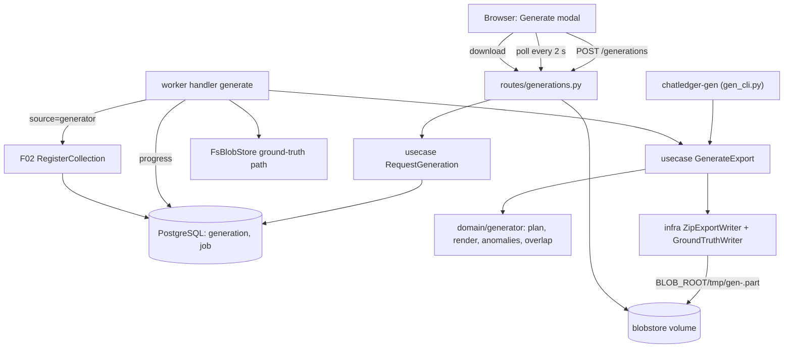

# Spec: Synthetic Slack Export Generator

**Complexity:** complex

## 1. Technical Overview

**What.** F03 delivers a deterministic generator of Slack workspace export ZIPs together with a machine-readable ground-truth file, and the two ways to run it:
- **CLI:** `chatledger-gen`, a console script of the worker package, writes `<out>/slack-export-<seed>-<preset>-<profile>.zip` and `<out>/ground-truth-<seed>.json`.
- **UI job:** a `generate` job kind on the F01 queue. The worker runs the same generator, stages the ZIP under `BLOB_ROOT/tmp/`, stores the ground truth next to the blob, and registers the ZIP through the F02 `RegisterCollection` entry point with source `generator`.

It also delivers:
- A `generation` record per UI request (parameters, progress, outcome, link to the collection), with endpoints to request, list, read and retry generations and to download the ground truth.
- The "Generate synthetic export" modal, the pending collection card with progress, the "Synthetic" badge and the "Download ground truth" link on the Collections tab.
- Overlapping re-delivery exports (`--overlap-of`), whose overlapping day files are byte-identical to the original export's.

**Why.** F04 to F07 need realistic, reproducible input with known defects, and reviewers need to try the product without real data. Byte-identical output for the same seed and parameters makes tests and benchmarks reproducible. The ground truth lets F07 verify that every injected anomaly is detected with the expected reason code. Streaming one conversation at a time keeps the generator under 500 MB RSS at one million messages.

**Scope.** F03 has no Core/Full split in the PRD, so the whole feature is in scope.

**Included:**
- Pure generator domain (`domain/generator`): parameter validation, presets, workspace plan, per-conversation message rendering, anomaly injection, ground-truth model, overlap derivation.
- Deterministic ZIP writer and ground-truth writer (`infra/generator`).
- Use cases `RequestGeneration`, `ListGenerations`, `GetGeneration`, `RetryGeneration`, `RunGeneration` and `GetGroundTruth`.
- Migration `0003_generation` (table `generation`).
- `generate` worker handler: disk check, progress reporting, registration, ground-truth storage, failure classification.
- `chatledger-gen` CLI with progress lines and final path/SHA-256 report.
- API routes under `/api/v1/matters/{id}/generations` and the ground-truth download route; the F02 collection payload gains a `generation` object.
- Web: generate modal, pending/failed generation cards, synthetic badge, ground-truth link.
- Ground-truth JSON Schema fixture and test-only knobs (disk free-space override, per-conversation delay, forced failure) delivered by this feature.

**Excluded (owned by other features):**
- Running F04+ processing on generated exports, quality gates and the completeness report (F07 reads the ground truth).
- Deleting generations or collections (PRD Out of Scope).

**Input contracts (Consumes):** F02 matter records (`GetMatter`, `ListMatters`) and the `RegisterCollection.execute(matter_id, staged_path, original_filename, source="generator", sha256=<digest>)` entry point returning a `Collection` or raising a typed `DomainError`. F01: `JobQueue`, `AuditLog`, error envelope, settings, handler registry.

**Output contracts (Provides):** the ground-truth file (schema in §5), stored beside the collection blob and downloadable per collection. It is read by F07.

## 2. Architecture Impact

**Affected components:**
- New:
  - `packages/core/chatledger_core/domain/generator/*`
  - `packages/core/chatledger_core/usecase/generator/*`
  - `packages/core/chatledger_core/infra/generator/*`
  - `packages/core/chatledger_core/migrations/versions/0003_generation.py`
  - `apps/worker/chatledger_worker/handlers/generate.py`
  - `apps/worker/chatledger_worker/gen_cli.py`
  - `apps/api/chatledger_api/http/routes/generations.py`
  - `apps/web/src/features/generator/**`
  - `tests/fixtures/generator/ground-truth.schema.json`
- Modified:
  - `packages/core/chatledger_core/config.py` (generator settings)
  - `packages/core/chatledger_core/infra/blobstore/fs_blob_store.py` and `domain/intake/ports.py` (ground-truth path helpers)
  - `packages/core/chatledger_core/usecase/intake/list_collections.py`, `infra/intake/pg_collection_repository.py` (collection payload carries generation info)
  - `apps/api/chatledger_api/http/routes/matters.py`, `v1.py`, `main.py` (collection payload, router, wiring)
  - `apps/worker/chatledger_worker/handlers/__init__.py`, `main.py`, `pyproject.toml` (register kind, wiring, `chatledger-gen` script)
  - `apps/web/src/app/matters/[matterId]/collections/page.tsx` (fills the F02 `actions` slot), `features/intake/CollectionCard.tsx` (badge, link)
  - `apps/web/src/lib/api/schema.d.ts` (regenerated)
  - `pyproject.toml` (import-linter: new package in forbidden-config list), `.env.example`, `.env.test`, `docker-compose.yml` (new env passthrough)



## 3. Technical Decisions

| Decision | Chosen Approach | Alternative Considered | Trade-off |
|----------|----------------|----------------------|-----------|
| Code placement | Generator logic is pure and sits in `domain/generator` (yields `(path, bytes)` entries and anomaly records, no I/O). ZIP/ground-truth file writing is `infra/generator`. The CLI lives in the worker package beside `chatledger-admin`. Layering stays `infra -> usecase -> domain` | A new workspace package `apps/generator` | Reuses the existing layering contract and the worker image (CLI available via `docker compose exec worker chatledger-gen`). No new package to wire |
| Determinism | One root `random.Random(seed)`. The plan (users, conversations, member lists, per-conversation sub-seeds, per-day layout) is drawn from it in a fixed order before any conversation is rendered. Each conversation then uses its own `random.Random(sub_seed)`, so a conversation renders identically whether generated alone (overlap replay) or in sequence. No wall clock, locale, env, hash-ordering or filesystem-order reads | One PRNG consumed sequentially across all conversations | Sub-seeds are still derived from the single seeded PRNG, honouring the PRD intent, and make the byte-identical overlap and the one-conversation-at-a-time streaming possible |
| Anomaly selection | Counts are exact: `count = round_half_up(rate x base)`. Targets are chosen by sampling without replacement from the eligible candidates with the seeded PRNG | Per-record Bernoulli draws | Counts match the profile table within rounding, as the acceptance criterion demands, instead of varying statistically |
| Streaming output | ZIP entries are emitted in sorted path order (root JSON files interleaved with conversation folders by path). A conversation is rendered, written and released before the next. Ground-truth anomalies are kept as compact tuples (about 100 bytes each), sorted at the end by conversation ID, `ts`, type, and streamed to disk | Buffer all conversations, or a two-pass external sort | Peak memory stays far below 500 MB at 1,000,000 messages, including a re-delivery with about 300,000 duplicate entries |
| Day-file density | A conversation's messages are spread over `ceil(messages / 8)` active days at most (never more than the export's day count), so the archive stays below F02's 200,000-entry limit even for `large` | Spread over all days | Slightly bursty days, but every generated ZIP is accepted by F02 registration |
| Job progress | `generation` row holds `progress_messages`; the handler updates it at most every 5,000 messages. The UI polls `GET generations` every 2 s | Server-sent events | Matches the PRD 2-second refresh; no streaming infrastructure |
| Failure classification | Permanent, handler-detected failures (disk space, duplicate, collection limit, matter gone) mark the generation `failed` with an error code and message, and the job completes (no retries). Crashes and unexpected exceptions go through the queue's lease and retry rules (3 attempts). A job that exhausts retries is surfaced as `failed` from the job state | Raise for everything | A duplicate must not be retried three times. The F01 retry rules still cover crashes, as the PRD requires |
| Ground-truth storage | `<BLOB_ROOT>/sha256/<2>/<hex>.ground-truth.json` (mode 0444), next to the ZIP blob. It is written before registration (idempotent for the same digest) and removed when registration fails and no blob exists for that digest. `generation.ground_truth_sha256` links it to the collection | A `ground_truth` table | The PRD says "next to the collection blob". Same bytes always carry the same ground truth, so sharing across matters is safe |
| Crash-after-registration recovery | When registration raises `COLLECTION_DUPLICATE` and the existing collection has source `generator` and no generation row points to it, the handler adopts it (links and completes). Otherwise the duplicate is a real duplicate | Always fail on duplicate | A retry after a crash between registration and the row update must not turn into a false duplicate |
| Re-delivery parameters | A re-delivery inherits preset, messages, conversations and profile from the base generation; only the new seed is chosen | Free choice of every parameter | Byte-identical overlap requires the same workspace plan. The server echoes the effective parameters |

**Assumptions and Decisions (Auto-Accept, batch mode).** Every item below is a decision the PRD leaves open; review and override as needed.

- **A1 - Scope:** PRD F03 has neither Core nor Full Scope blocks; the whole feature is in scope (policy row: scope).
- **A2 - Quality gates:** all gates detected from the project (root `Makefile`) are included in the contract (policy row: quality gates). Nothing detected was left out.
- **A3 - Contract surfaces:** `CLI`, `HTTP API`, `UI`, `Worker` and `E2E` have PRD signals. `Service` is omitted: the generator library has no consumer outside this feature (F07 reads the file, not a function), so the Service Admission Rule is not met. `Event` has no signal.
- **A4 - Seed domain:** an integer from 0 to 2,147,483,647. Message: "Seed must be an integer between 0 and 2,147,483,647".
- **A5 - Non-custom presets:** `--messages` and `--conversations` are valid only with `--preset custom` (CLI exit code 2; API 422). `custom` requires both. Custom users = clamp(messages / 250, 10, 2000); custom days = 365.
- **A6 - Validation messages (exact):** "Messages must be between 1,000 and 1,000,000"; "Conversations must be between 1 and 5,000"; "Conversations must not exceed messages / 2". Checked in that order.
- **A7 - Fixed calendar:** no wall clock is read. Every export ends on 2025-12-31 UTC and spans `days` days ending there. Team ID is `T` plus 8 uppercase hex characters derived from the seed. The re-delivery shares the base export's team ID, users and conversations.
- **A8 - Message count:** `--messages N` is the number of base message records (regular messages including replies, thread broadcasts and bot messages). Event records (`channel_join`, `channel_leave`, `message_changed`, `message_deleted`) are extra. Anomaly mutations (unknown subtype, invalid or missing `ts`, schema violation) alter base records and keep them in N. `totals.message_records` in the ground truth equals N.
- **A9 - Users:** `users.json` lists exactly the preset's user count of human users. Unresolved-user anomalies reference extra user IDs never listed. Bots carry `bot_id` and `bot_profile` (identity) and are not in `users.json`; users with `deleted: true` stay listed (about 2%).
- **A10 - Conversation mix:** apportioned by largest remainder over 60/15/20/5 percent, ties broken in the order public, private, DM, MPIM. Public channels go to `channels.json`, private to `groups.json`, DMs to `dms.json`, MPIMs to `mpims.json`. Folders are named by channel name for channels and private groups and by conversation ID for DMs and MPIMs.
- **A11 - Volume allocation:** message counts per conversation are the largest-remainder allocation of weights `1/k^1.1` (rank k), with at least 1 message each. Rank 1 is assigned to a public channel.
- **A12 - Text realism rates:** 15% of messages contain a `<@U...>` mention of a listed user, 10% a `<url|label>` link. Reactions 8%, file shares 4%, bot messages 2%, replies 20% of base messages, thread broadcasts 3% of replies. All are exact counts (rounding as in decision "Anomaly selection").
- **A13 - Membership events:** each channel and group member gets one `channel_join` at or after the export start and, for 30% of members, a later `channel_leave`; 10% of leavers rejoin. Event records are extra (A8).
- **A14 - Anomaly pair split:** combined rows (edit/delete target missing; missing/invalid `ts`) split 50/50, an odd count giving the extra record to the first code. Anomaly bases: replies (orphan), base messages (edit, delete, unknown subtype, missing/invalid ts, schema violation, unresolved user, ts out of range), edit events (edit after delete uses base messages), day files (malformed, empty), file references, bot messages. Eligible candidates exclude records already mutated by another anomaly.
- **A15 - Anomaly vocabulary:** ground-truth `anomaly_type` values are `orphan_reply`, `edit`, `delete`, `edit_after_delete`, `edit_target_missing`, `delete_target_missing`, `unknown_subtype`, `missing_ts`, `invalid_ts`, `schema_violation`, `malformed_json`, `empty_file`, `unresolved_user`, `unresolved_file`, `bot_no_identity`, `ts_out_of_range`, `duplicate_source`. File-level anomalies have `message_ts` and `record_index` null.
- **A16 - Malformed day file:** truncated mid-array at a byte boundary inside a record, with at least one complete record before the cut when the file has more than one record.
- **A17 - Re-delivery semantics:** `--overlap-of <seed>` reproduces the base export's workspace using the invocation's preset, messages, conversations and profile with the base seed. The overlap window is the last `round(days x pct / 100)` days of the base period (`--overlap-days-pct`, integer 1-100, default 30). The re-delivery covers that window plus 30 further days. Day files in the window are byte-identical to the base export's. Records for the 30 new days come from the new seed with the invocation's profile rates. Every record in a window day file is recorded as `duplicate_source` (conversation, `ts`, new source file and record index); anomalies carried inside the window keep their own entries.
- **A18 - Output naming:** the re-delivery ZIP is named by its own seed, preset and profile (`slack-export-<seed>-<preset>-<profile>.zip`). The overlap relation is recorded in the ground truth (`overlap.base_seed`, `overlap.days_pct`).
- **A19 - CLI I/O:** progress lines go to stderr every 10,000 messages (`generated <n> / <total> messages`). Stdout ends with two lines, `ZIP <path> sha256:<hex>` and `GROUND_TRUTH <path> sha256:<hex>`. Exit codes: 0 success, 2 invalid arguments, 3 insufficient disk space, 4 I/O error. `--out` is created when missing.
- **A20 - Disk check:** estimate = 350 bytes x messages; required free space = estimate x 1.5, measured on `/data/blobs` for jobs and on the `--out` filesystem for the CLI. Message: "Not enough disk space: need ~<x> GB, <y> GB free." (one decimal, GB = 1,000,000,000 bytes).
- **A21 - Default modal values:** seed random 6-digit, preset `small`, profile `default`, no re-delivery base.
- **A22 - Profile descriptions:** clean "No injected anomalies"; default "Realistic mix of edits, deletions and rare defects"; stress "High defect rates to exercise every gate".
- **A23 - Generation states:** `queued`, `running`, `done`, `failed`. Retry is allowed for `failed` generations except those that failed with `COLLECTION_DUPLICATE`.
- **A24 - Test-only knobs delivered by this feature:** `GENERATOR_FREE_SPACE_OVERRIDE_BYTES` (replaces the measured free space), `GENERATOR_TEST_DELAY_MS_PER_CONVERSATION` (default 0) and `GENERATOR_TEST_FAIL_ALWAYS` (default false, makes every attempt fail at start). They default to inert values and are read only by the composition roots; the free-space override also applies to the CLI.
- **A25 - Ground-truth link to collection:** the file itself is content-determined and carries no collection ID. The link is `generation.collection_id` plus the per-collection download route (decision "Ground-truth storage").
- **A26 - Performance acceptance:** the `large` acceptance run uses `--profile clean` for exact record counting; a second run with `default` checks time and memory only.
- **A28 - Day layout bounds:** the largest conversation always has day files on the first and last day of the export's period, so the span of day-file dates equals the preset's day count.
- **A29 - Clean-profile acceptance:** the PRD clause "a run on it shows 0 quarantined and 0 flagged records" belongs to F04-F07. The contract verifies its generator-side precondition instead: a clean export contains no record that parsing would quarantine or flag (all files parse, no unknown subtypes, valid timestamps, all references resolvable).
- **A27 - Enqueue ordering:** the generation row is inserted and committed, then the job is enqueued; when enqueueing fails the row is removed and the error propagated.

## 4. Component Overview

**Backend core - `packages/core/chatledger_core`:**

| File Path | New/Modified | Purpose | Key Responsibilities |
|-----------|--------------|---------|---------------------|
| `config.py` | Modified | Settings | `generator_bytes_per_message` (350), `generator_disk_headroom` (1.5), `generator_progress_every` (5000), plus A24 knobs |
| `domain/generator/params.py` | New | Parameters | `Preset`, `Profile`, `GenerationParams`, `validate_params()` with A4-A6 messages, preset tables |
| `domain/generator/plan.py` | New | Workspace plan | Users, conversations, type mix, volume allocation, day layout, sub-seeds, fixed calendar |
| `domain/generator/rates.py` | New | Anomaly rates | Profile rate table and exact-count function |
| `domain/generator/render.py` | New | Conversation renderer | Day files for one conversation: threads, mentions, links, reactions, files, bots, membership events; deterministic canonical JSON |
| `domain/generator/anomalies.py` | New | Injection | Selects targets, mutates records, emits `AnomalyRecord` tuples with reason codes |
| `domain/generator/overlap.py` | New | Re-delivery | Derives window days, replays base conversations for those days, emits duplicate-source records |
| `domain/generator/ground_truth.py` | New | Ground-truth model | `AnomalyRecord`, ordering, canonical document assembly, totals |
| `domain/generator/errors.py` | New | Typed errors | `GenerationParamsInvalidError` (422), `GenerationNotFoundError` (404), `GenerationOverlapBaseInvalidError` (422), `GenerationNotRetryableError` (409), `GroundTruthNotFoundError` (404), `InsufficientDiskSpaceError` |
| `domain/generator/ports.py` | New | Ports | `GenerationRepository`, `ExportSink` (`add_entry(path, bytes)`), `DiskSpaceProbe` |
| `usecase/generator/generate_export.py` | New | Core pipeline | Disk check, plan, stream entries to sink, accumulate anomalies, write ground truth, return result (paths, SHA-256s, totals); progress callback and cancel check |
| `usecase/generator/request_generation.py` | New | Request | Validate, resolve overlap base, insert row, enqueue `generate` job |
| `usecase/generator/run_generation.py` | New | Job body | Mark running, run pipeline into staging, store ground truth, register collection, classify outcome, adopt orphan registration |
| `usecase/generator/list_generations.py`, `get_generation.py`, `retry_generation.py`, `get_ground_truth.py` | New | Read/retry | Derive effective state from row and job; enqueue a new job on retry; resolve ground-truth path per collection |
| `infra/generator/zip_export_writer.py` | New | ZIP sink | Deterministic ZIP: sorted entries, fixed `1980-01-01 00:00:00`, fixed permissions, deflate level fixed; incremental SHA-256 of output bytes |
| `infra/generator/ground_truth_writer.py` | New | JSON output | Streams the canonical document (sorted keys, separators `,` and `:`), hashes it |
| `infra/generator/pg_generation_repository.py` | New | SQL adapter | Raw `text()` SQL like the intake adapters; joins `job` for derived state |
| `infra/generator/disk.py` | New | Probe | `shutil.disk_usage` with the override setting |
| `infra/blobstore/fs_blob_store.py`, `domain/intake/ports.py` | Modified | Ground-truth path | `ground_truth_path_for(sha256)`, `put_ground_truth(sha256, staged_path)` (idempotent, 0444), `remove_ground_truth_if_unreferenced` |
| `infra/intake/pg_collection_repository.py`, `usecase/intake/list_collections.py` | Modified | Collection payload | Left join `generation` to expose `generation` info |
| `migrations/versions/0003_generation.py` | New | Migration | Creates `generation` |

**Worker - `apps/worker/chatledger_worker`:**

| File Path | New/Modified | Purpose | Key Responsibilities |
|-----------|--------------|---------|---------------------|
| `handlers/generate.py` | New | Job handler | Kind `generate`; payload `{generation_id}`; progress throttling; lease-lost abort between conversations; deletes partial output on any exit |
| `gen_cli.py` | New | CLI | Argument parsing and validation, progress and result printing, exit codes (A19) |
| `handlers/__init__.py`, `main.py`, `pyproject.toml` | Modified | Wiring | Register `generate`; build the use cases; add script `chatledger-gen = "chatledger_worker.gen_cli:main"` |

**API - `apps/api/chatledger_api`:**

| File Path | New/Modified | Purpose | Key Responsibilities |
|-----------|--------------|---------|---------------------|
| `http/routes/generations.py` | New | Routes | Create, list, get, retry generations; ground-truth download (`FileResponse`, attachment) |
| `http/routes/matters.py`, `http/routes/v1.py`, `main.py` | Modified | Wiring | Collection response model gains `generation`; include router; instantiate services |

**Frontend - `apps/web/src`:**

| File Path | New/Modified | Purpose | Key Responsibilities |
|-----------|--------------|---------|---------------------|
| `features/generator/GenerateDialog.tsx` | New | Modal | Seed, preset, custom fields, profile with descriptions, re-delivery dropdown; client validation with the A6 messages |
| `features/generator/GenerationCard.tsx` | New | Pending/failed card | "Generating... n / total messages" with progress bar; failure text and Retry; duplicate text without Retry |
| `features/generator/useGenerations.ts`, `api.ts` | New | Data | TanStack Query with `refetchInterval` 2,000 ms while any generation is active |
| `features/generator/params.ts` | New | Shared rules | Mirrors preset table and validation messages |
| `features/intake/CollectionCard.tsx` | Modified | Card | "Synthetic · seed <seed> · <profile>" badge and "Download ground truth" link when `generation` is present |
| `app/matters/[matterId]/collections/page.tsx` | Modified | Page | "Generate synthetic export" button in the `actions` slot; renders generation cards above collection cards |
| `lib/api/schema.d.ts` | Modified | Types | Regenerated |

**Fixtures and tooling:**

| File Path | New/Modified | Purpose | Key Responsibilities |
|-----------|--------------|---------|---------------------|
| `tests/fixtures/generator/ground-truth.schema.json` | New | JSON Schema | Structure of the ground-truth file (§5) |
| `scripts/e2e/generator_perf.sh` | New | Perf check | Runs `large` under `/usr/bin/time -v`, asserts time, RSS and record counts |

**Database:**

| Migration File | Tables Affected | Operation | Notes |
|----------------|-----------------|-----------|-------|
| `packages/core/chatledger_core/migrations/versions/0003_generation.py` | `generation` | CREATE | `down_revision = "0002_intake"` |

## 5. API Contracts

All routes are under `/api/v1`, unauthenticated, errors use the F01 envelope `{error:{code,message,details}}`.

### Endpoint: Create generation
- **Method:** POST - **Path:** `/api/v1/matters/{matter_id}/generations`

| Field | Type | Required | Validation | Description |
|-------|------|----------|------------|-------------|
| `seed` | `integer` | Yes | 0 to 2,147,483,647 | PRNG seed |
| `preset` | `string` | Yes | `small`, `medium`, `large`, `custom` | Size preset |
| `messages` | `integer` | custom only | 1,000 to 1,000,000 | Base message records |
| `conversations` | `integer` | custom only | 1 to 5,000 and at most messages / 2 | Conversations |
| `profile` | `string` | Yes | `clean`, `default`, `stress` | Anomaly profile |
| `overlap_of_collection_id` | `uuid \| null` | No | A synthetic collection of the same matter | Re-delivery base; preset, messages, conversations and profile are then taken from the base |

```json
{ "seed": 4821, "preset": "custom", "messages": 20000, "conversations": 40, "profile": "default", "overlap_of_collection_id": null }
```

**Response (202):** `Generation`

| Field | Type | Description |
|-------|------|-------------|
| `id` | `uuid` | Generation ID |
| `matter_id` | `uuid` | Owning matter |
| `job_id` | `uuid \| null` | Queue job |
| `state` | `string` | `queued`, `running`, `done`, `failed` |
| `seed`, `preset`, `profile` | | Effective parameters |
| `messages`, `conversations` | `integer` | Effective sizes |
| `overlap_of_collection_id` | `uuid \| null` | Base collection |
| `progress_messages` | `integer` | Messages generated so far |
| `total_messages` | `integer` | Equals `messages` |
| `collection_id` | `uuid \| null` | Set when `done` |
| `error` | `{code, message} \| null` | Set when `failed` |
| `created_at`, `updated_at` | `datetime` | UTC |

```json
{
  "id": "5d0e9a1c-2b7f-4a39-8c11-0e6f7a3b9d42",
  "matter_id": "7f3c1d52-0a6e-4f3b-9a51-2f7d1c9e8b10",
  "job_id": "a41b0c77-6d2e-43f0-9b8a-1c5e7d3f2a90",
  "state": "queued",
  "seed": 4821, "preset": "custom", "profile": "default",
  "messages": 20000, "conversations": 40,
  "overlap_of_collection_id": null,
  "progress_messages": 0, "total_messages": 20000,
  "collection_id": null, "error": null,
  "created_at": "2026-10-02T15:10:03.120Z", "updated_at": "2026-10-02T15:10:03.120Z"
}
```

### Endpoint: List generations
- **Method:** GET - **Path:** `/api/v1/matters/{matter_id}/generations`
- **Response (200):** `{ "items": [Generation...] }`, newest first. Effective state: a `queued` or `running` row whose job has permanently failed is returned as `failed` with `error {code: "GENERATION_FAILED", message: <last_error>}`.

### Endpoint: Get generation
- **Method:** GET - **Path:** `/api/v1/matters/{matter_id}/generations/{generation_id}`
- **Response (200):** `Generation`. Unknown ID, or one from another matter: 404 `GENERATION_NOT_FOUND`.

### Endpoint: Retry generation
- **Method:** POST - **Path:** `/api/v1/matters/{matter_id}/generations/{generation_id}/retry`
- **Response (202):** `Generation` in state `queued`, progress 0, error null, new `job_id`. Not failed (or failed with `COLLECTION_DUPLICATE`): 409 `GENERATION_NOT_RETRYABLE`.

### Endpoint: Download ground truth
- **Method:** GET - **Path:** `/api/v1/matters/{matter_id}/collections/{collection_id}/ground-truth`
- **Response (200):** `application/json`, `Content-Disposition: attachment; filename="ground-truth-<seed>.json"`, body is the stored file byte for byte. A collection without a generation, or an unknown collection: 404 `GROUND_TRUTH_NOT_FOUND`.

### Modified: Collection payload (F02 list and get)
Adds `generation: { "id": uuid, "seed": int, "preset": string, "profile": string, "has_ground_truth": bool } | null`. `null` for uploaded collections.

### Ground-truth file (Provides)
Canonical JSON (sorted keys, separators `,` and `:`, UTF-8, trailing newline). Top-level keys:

| Key | Type | Description |
|-----|------|-------------|
| `schema_version` | `integer` | 1 |
| `generator_version` | `string` | Generator version constant |
| `seed`, `preset`, `profile` | | Parameters of this export |
| `messages`, `conversations` | `integer` | Effective sizes |
| `overlap` | `{base_seed, days_pct} \| null` | Re-delivery relation |
| `totals` | `{message_records, conversations, anomalies, anomalies_by_type}` | Counts |
| `anomalies` | `array` | Sorted by `conversation_id`, then `message_ts` (null first), then `anomaly_type` |

Each anomaly: `{anomaly_type, conversation_id, message_ts, source_file, record_index, expected_reason_code}`.

```json
{ "anomaly_type": "edit", "conversation_id": "C0A1B2C3D", "message_ts": "1735000000.000200",
  "source_file": "general/2025-12-01.json", "record_index": 12, "expected_reason_code": "X_EDIT_EVENT" }
```

**Error codes:**

| Code | HTTP | Message |
|------|------|---------|
| `GENERATION_PARAMS_INVALID` | 422 | One of the A4-A6 messages · details `{field}` |
| `GENERATION_OVERLAP_BASE_INVALID` | 422 | "Re-delivery base must be a synthetic collection of this matter." |
| `MATTER_NOT_FOUND` | 404 | F02 message |
| `GENERATION_NOT_FOUND` | 404 | "Generation not found." |
| `GENERATION_NOT_RETRYABLE` | 409 | "Only failed generations can be retried." |
| `GROUND_TRUTH_NOT_FOUND` | 404 | "Ground truth not found." |

Generation failure codes stored in `error.code`: `INSUFFICIENT_DISK_SPACE` ("Not enough disk space: need ~<x> GB, <y> GB free."), `COLLECTION_DUPLICATE` ("Identical synthetic export already in this matter (same seed and parameters)."), `COLLECTION_LIMIT_REACHED` and `MATTER_NOT_FOUND` (F02 messages), `GENERATION_FAILED` (unexpected, last error text).

## 6. Data Model

**Table: `generation`**

| Column | Type | Nullable | Default | Description |
|--------|------|----------|---------|-------------|
| `id` | `uuid` | No | `gen_random_uuid()` | Primary key |
| `matter_id` | `uuid` | No | - | FK `matter(id)` |
| `seed` | `bigint` | No | - | 0 to 2,147,483,647 |
| `preset` | `varchar(8)` | No | - | `small`/`medium`/`large`/`custom` |
| `profile` | `varchar(8)` | No | - | `clean`/`default`/`stress` |
| `messages` | `integer` | No | - | Effective message count |
| `conversations` | `integer` | No | - | Effective conversation count |
| `overlap_of_collection_id` | `uuid` | Yes | - | FK `collection(id)` |
| `overlap_days_pct` | `smallint` | No | `30` | Window percentage |
| `job_id` | `uuid` | Yes | - | FK `job(id)` ON DELETE SET NULL |
| `state` | `varchar(10)` | No | `'queued'` | `queued`/`running`/`done`/`failed` |
| `progress_messages` | `integer` | No | `0` | Reported progress |
| `collection_id` | `uuid` | Yes | - | FK `collection(id)` |
| `ground_truth_sha256` | `char(64)` | Yes | - | Digest of the stored ground-truth file |
| `error_code` | `varchar(64)` | Yes | - | Failure code |
| `error_message` | `text` | Yes | - | Failure text |
| `created_at` | `timestamptz` | No | `clock_timestamp()` | Creation |
| `updated_at` | `timestamptz` | No | `clock_timestamp()` | Last change |

**Indexes:**

| Index Name | Columns | Type | Purpose |
|------------|---------|------|---------|
| `ix_generation_matter_created` | `matter_id, created_at DESC` | btree | List per matter |
| `uq_generation_collection` | `collection_id` WHERE not null | unique btree | One generation per collection; join for the badge |

**Constraints:**

| Constraint | Type | Definition | Purpose |
|------------|------|------------|---------|
| `ck_generation_state` | CHECK | `state IN ('queued','running','done','failed')` | Valid states |
| `ck_generation_preset` / `ck_generation_profile` | CHECK | enum lists | Valid values |
| `ck_generation_messages` | CHECK | `messages BETWEEN 1000 AND 1000000 AND conversations BETWEEN 1 AND 5000` | Range guard |
| `ck_generation_done_collection` | CHECK | `state <> 'done' OR collection_id IS NOT NULL` | Done implies collection |

**Migration (outline):**
```sql
CREATE TABLE generation (
    id UUID PRIMARY KEY DEFAULT gen_random_uuid(),
    matter_id UUID NOT NULL REFERENCES matter(id),
    ...
);
CREATE INDEX ix_generation_matter_created ON generation (matter_id, created_at DESC);
CREATE UNIQUE INDEX uq_generation_collection ON generation (collection_id) WHERE collection_id IS NOT NULL;
```

## 7. Testing Strategy

**Test File Structure:**

| Test File | Test Type | Target | Coverage Goal |
|-----------|-----------|--------|---------------|
| `packages/core/tests/unit/generator/test_params.py` | Unit | `domain/generator/params.py` | 100% |
| `packages/core/tests/unit/generator/test_plan.py` | Unit | `plan.py` | 95% |
| `packages/core/tests/unit/generator/test_rates.py` | Unit | `rates.py` | 100% |
| `packages/core/tests/unit/generator/test_render.py` | Unit | `render.py` | 95% |
| `packages/core/tests/unit/generator/test_anomalies.py` | Unit | `anomalies.py` | 95% |
| `packages/core/tests/unit/generator/test_overlap.py` | Unit | `overlap.py` | 95% |
| `packages/core/tests/unit/generator/test_ground_truth.py` | Unit | `ground_truth.py` | 100% |
| `packages/core/tests/unit/generator/test_zip_export_writer.py` | Unit | `infra/generator/zip_export_writer.py` | 95% |
| `packages/core/tests/unit/generator/test_generate_export.py` | Unit | `GenerateExport` end to end on `small` | 90% |
| `packages/core/tests/integration/generator/test_run_generation.py` | Integration | `RunGeneration` + PG + F02 registration | 90% |
| `packages/core/tests/integration/generator/test_generation_repository.py` | Integration | `PgGenerationRepository` | 90% |
| `apps/api/tests/integration/test_generations_api.py` | Integration | Generation routes and ground-truth download | 100% of routes |
| `apps/worker/tests/unit/test_gen_cli.py` | Unit | Argument parsing, exit codes, output lines | 95% |
| `apps/worker/tests/integration/test_generate_handler.py` | Integration | Handler outcomes (done, duplicate, disk, crash retry) | 90% |
| `apps/web/src/features/generator/*.test.tsx` | Frontend | Dialog, card, polling | n/a |
| `scripts/tests/test_generator_perf_script.py` | Unit | Perf script argument handling | n/a |

**`test_params.py`:**

| Test Function | Description | Assertions |
|---------------|-------------|------------|
| `test_preset_tables` | small, medium, large values | messages, conversations, users, days match the PRD |
| `test_custom_requires_sizes` | custom without messages | `GenerationParamsInvalidError` |
| `test_messages_range` | 999, 1,000, 1,000,000, 1,000,001 | boundary results and exact message |
| `test_conversations_cap` | conversations above messages / 2 | exact message |
| `test_non_custom_rejects_sizes` | small with messages | error |
| `test_seed_range` | -1, 0, 2,147,483,647, 2,147,483,648 | boundaries |

**`test_plan.py` and `test_render.py`:**

| Test Function | Description | Assertions |
|---------------|-------------|------------|
| `test_conversation_mix_largest_remainder` | 50 and 500 conversations | 30/8/10/2 and 300/75/100/25 |
| `test_zipf_allocation` | small preset | counts equal the largest-remainder allocation; rank 1 above 5% |
| `test_day_file_density_below_entry_limit` | large plan | day files at most 150,000 |
| `test_reply_broadcast_reaction_file_bot_counts` | small preset, clean | exact counts per A12 |
| `test_membership_events_alternate` | one channel | join/leave alternate per user |
| `test_conversation_render_independent_of_order` | render conversation 7 alone and in sequence | identical bytes |
| `test_canonical_json` | any day file | equals `json.dumps(sort_keys=True, separators=(",", ":"))` bytes |

**`test_anomalies.py`:**

| Test Function | Description | Assertions |
|---------------|-------------|------------|
| `test_exact_counts_default` | default profile on medium plan | each type count equals `round_half_up(rate x base)` |
| `test_clean_has_none` | clean | zero anomalies, no event records |
| `test_pair_split` | edit/delete target missing, odd count | first code gets the extra |
| `test_reason_code_mapping` | all types | PRD reason codes |
| `test_locations_resolve` | every entry | record at `source_file[record_index]` has the entry's `ts` |
| `test_sorted_order` | ground truth | conversation, ts, type ordering |

**`test_overlap.py`, `test_zip_export_writer.py`, `test_generate_export.py`:**

| Test Function | Description | Assertions |
|---------------|-------------|------------|
| `test_window_days` | 90 days at 30% and 50% | 27 and 45 days; export spans window + 30 |
| `test_window_day_files_byte_identical` | base vs re-delivery | identical bytes for window day files |
| `test_duplicate_source_entries` | re-delivery ground truth | one `duplicate_source` per window record |
| `test_zip_sorted_fixed_metadata` | any export | sorted paths, 1980-01-01 00:00:00, fixed attrs |
| `test_same_seed_same_bytes` | twice, different cwd/TZ/PYTHONHASHSEED | identical ZIP and ground-truth SHA-256 |
| `test_seed_changes_bytes` | seed 42 vs 43 | different SHA-256 |
| `test_zip_passes_f02_inspection` | small export through `inspect_entries` | accepted; 50 conversations; 90-day range |
| `test_memory_bound_streaming` | 100,000 messages with `tracemalloc` | peak below a fixed budget |

**`test_run_generation.py` / `test_generate_handler.py`:**

| Test Function | Description | Assertions |
|---------------|-------------|------------|
| `test_success_registers_generator_collection` | small default | collection source `generator`, ground truth stored 0444, generation done |
| `test_duplicate_fails_without_retry` | same params twice | failed `COLLECTION_DUPLICATE`, job attempts 1 |
| `test_adopt_orphan_registration` | collection exists, no generation row | generation completes |
| `test_disk_space_failure_cleans_partial` | override bytes tiny | failed `INSUFFICIENT_DISK_SPACE`, no tmp file |
| `test_limit_reached_failure` | matter with 20 collections | failed `COLLECTION_LIMIT_REACHED` |
| `test_progress_monotonic` | delay knob | progress never decreases, at most total |
| `test_forced_failure_exhausts_attempts` | fail-always knob | derived state failed after 3 attempts; retry succeeds after unsetting |
| `test_lease_lost_aborts_and_cleans` | lease flag set | no collection, staged file removed |

**Frontend tests:** `GenerateDialog.test.tsx` (defaults, custom fields, validation messages, no request on invalid input, re-delivery dropdown), `GenerationCard.test.tsx` (progress text, failed, duplicate without Retry), `CollectionCard.test.tsx` additions (badge and link only for synthetic).

**E2E scenarios (implementation guidance):** generate `small`/`default` through the modal and download the ground truth; generate the same parameters twice; generate a re-delivery of an earlier collection; reload mid-generation. Use `scripts/e2e/generator_perf.sh` for the `large` run.
