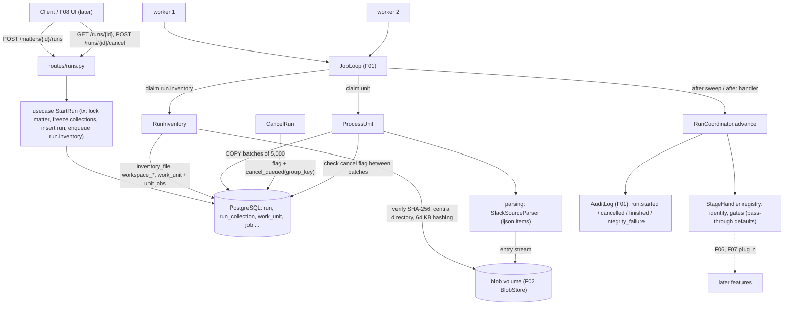

# Spec: Inventory and Streaming Ingestion

**Complexity:** complex

## 1. Technical Overview

**What.** F04 introduces the processing run and the ingestion half of the pipeline. It delivers:
- **Run aggregate.** A `Run` freezes the matter's collections and the run settings (time zone, 5 gate thresholds, settings hash) at creation. It moves through the state machine `queued → inventory → parse_build → identity → gates → completed_passed | completed_gate_failed | failed | cancelled`. At most one non-terminal run exists per matter.
- **Inventory stage.** One `run.inventory` job per run. It re-verifies each stored ZIP blob against the intake SHA-256, reads ZIP central directories only, hashes every entry by streaming (64 KB chunks), classifies it (`users`, `channels`, `dms`, `mpims`, `groups`, `day_file`, `other`) and computes the input inventory hash. It also parses the workspace metadata files (users, conversations, team ID) and creates one work unit per distinct conversation.
- **Work units.** One `unit` job per conversation, claimed through the F01 PostgreSQL queue (`FOR UPDATE SKIP LOCKED`, 60 s leases renewed every 20 s, at most 3 attempts). Each attempt runs in one database transaction, so a crash or a lost lease leaves no partial rows.
- **Streaming parse.** `ijson.items(stream, 'item')` reads each day file straight from the ZIP entry stream. Records are validated, buffered and flushed to staging tables with `COPY` in batches of 5,000. Malformed or unrecognised records go to an append-only quarantine table with a reason code, source file and record index.
- **Cancellation and failure handling.** `POST /runs/{id}/cancel` sets a flag that workers check between batches. Unreadable or tampered blobs, inventory exceptions and prolonged database outages move the run to `failed` with `last_error`.
- **Provided read models.** Parsed records, conversation metadata, team ID, workspace users, referenced user IDs, inventory, record-in counts, quarantine entries, unit outcomes, run settings and run progress, for F05, F06, F07 and F08.
- **Stage hooks.** The `identity` and `gates` stages are registered as `StageHandler`s. F04 ships pass-through defaults so a run completes end to end with F04 alone. F06 and F07 replace them.
- **API.** Six endpoints under `/api/v1` (start, list, get, cancel, inventory, quarantine) with the F01 error envelope.

**Why.** Everything downstream consumes F04's output. F05 builds conversations from the staged records, F06 resolves persons from the workspace users and referenced IDs, F07 reconciles from the inventory and counts, and F08 renders run status. The inventory fixes the inputs and makes the run reproducible (`input_inventory_hash`, `settings_hash`). Streaming with bounded batches keeps worker memory flat (ADR 0004), and the PostgreSQL queue (ADR 0001) gives parallelism without extra infrastructure.

**Scope.**

**Included:**
- Domain package `domain/ingestion` (run, settings, stages, work unit, inventory, quarantine, parsed-record value objects, errors, ports).
- Parsing package `parsing/` (Slack `SourceParser`, record validation, streaming reader, error-offset locator, referenced-user extraction).
- Use cases: `StartRun`, `CancelRun`, `GetRun`, `ListRuns`, `ListInventory`, `ListQuarantine`, `RunInventory`, `ProcessUnit`, `RunCoordinator`.
- PostgreSQL adapters, ZIP entry reader, COPY staging sink.
- Migration `0003_ingestion`.
- API routes (6 endpoints).
- Worker handlers `run.inventory` and `unit`, coordinator sweep hook, DB-outage detection.
- Run audit events `run.started`, `run.cancelled`, `run.finished`, `run.integrity_failure`.
- Structured worker logs (run ID, unit ID, stage, records, elapsed ms).
- `JobQueue.cancel_queued(group_key)` addition to the F01 queue primitives.
- Fault-injection settings for deterministic tests (disabled by default).
- Fixtures: committed small ZIPs in `tests/fixtures/ingestion/`, a deterministic generator for the large ones (`make fixtures-ingestion`), E2E scripts.

**Excluded (owned by later features):**
- Message IDs, version history, thread linking, memberships, deduplication, attachment resolution (F05).
- Persons and identity rules (F06).
- Gate evaluation, reports, manifest, overrides, the eligible-run rule (F07).
- The Start run form, progress view and `/progress` endpoint (F08).
- The synthetic export generator and its ground truth (F03).

**Input contracts (Consumes):**
- **From F02:** collection records (collection ID, matter ID, SHA-256, stored ZIP path, size, original filename, added-at, root prefix) through `CollectionRepository.list_for_matter(matter_id)` and `BlobStore.path_for(sha256)`.
- **From F01:** `JobQueue`, `AuditLog`, error envelope, `HeartbeatThread`, settings, DB engine and the worker loop.

**Output contracts (Provides):**
- **To F05:** `StagedRecordReader.iter_unit_records(unit_id)` (message records ordered by file order, then record index), `ConversationMetadataReader` (conversation metadata and `workspace_team_id`).
- **To F06:** `WorkspaceUserReader` (user records) and `ReferencedUserReader` (referenced user IDs per unit, by role with counts).
- **To F07:** `RunAccountingReader` (inventory, input inventory hash, record-in counts per file and conversation, quarantine entries, unit outcomes, run settings and settings hash, failed units, `records_unaccounted`).
- **To F08:** `GetRun` / `GET /api/v1/runs/{id}` (status, stage, unit counts, records processed, records per second, quarantine count by reason code, timestamps).
- **To later stages:** `StageHandler` registry for the `identity` and `gates` stages and a `PostParseHook` extension point on units.

## 2. Architecture Impact

**Affected components:**
- New:
  - `packages/core/chatledger_core/domain/ingestion/*`
  - `packages/core/chatledger_core/parsing/**` (coverage-gated segment)
  - `packages/core/chatledger_core/usecase/ingestion/*`
  - `packages/core/chatledger_core/infra/ingestion/*`
  - `packages/core/chatledger_core/migrations/versions/0003_ingestion.py`
  - `apps/api/chatledger_api/http/routes/runs.py`
  - `apps/worker/chatledger_worker/handlers/run_inventory.py`, `handlers/unit.py`, `outage.py`
  - `tests/fixtures/ingestion/*`, `scripts/fixtures/make_ingestion_fixtures.py`, `scripts/e2e/ingest_run.sh`, `scripts/e2e/ingest_memory.sh`
- Modified:
  - `packages/core/chatledger_core/config.py` (ingestion settings)
  - `packages/core/chatledger_core/domain/jobs/queue.py` and `infra/queue/pg_job_queue.py` (`cancel_queued`)
  - `packages/core/pyproject.toml` (`ijson` dependency)
  - `apps/api/chatledger_api/http/routes/v1.py`, `main.py` (wiring)
  - `apps/worker/chatledger_worker/loop.py` (sweep callback), `handlers/__init__.py`, `main.py` (wiring, outage tracker)
  - `pyproject.toml` (import-linter contract for `parsing`)
  - `Makefile` (`fixtures-ingestion`, `e2e-ingest`), `.gitignore`, `.env.example`, `.env.test`, `docker-compose.yml` (new env passthrough)
  - `apps/web/src/lib/api/schema.d.ts` (regenerated)
  - `docs/adr/0004-streaming-json-parsing.md`, `README.md`



## 3. Technical Decisions

| Decision | Chosen Approach | Alternative Considered | Trade-off |
|----------|----------------|----------------------|-----------|
| Run orchestration | Run state lives in the `run` row. A `RunCoordinator.advance(run_id)` is invoked at the end of every `run.inventory` and `unit` handler and by every worker on each queue sweep. It takes `SELECT … FOR UPDATE SKIP LOCKED` on the run row, syncs unit outcomes from job state, and moves the stage when no unit is pending | A dedicated "orchestrator" job per run; a separate scheduler process | No extra service or job kind. Coordination is idempotent and crash safe, because any worker can advance any run. Lease-expiry failures (set by the queue sweeper, not by a handler) are picked up on the next sweep, adding up to 15 s of latency |
| Unit atomicity | One database transaction per unit attempt covers staging rows, quarantine rows, counts, referenced users and the final `work_unit` update. The final update is guarded by `lease_worker` and `attempts`, so a worker that lost its lease cannot commit | Commit per batch and delete partial rows on retry | Retry is trivially idempotent and half-built units are never visible. A 200,000-message unit holds one long transaction (no worker memory impact). Live progress uses separate short autonomous updates of `work_unit.records_progress`. Each attempt still starts by deleting that unit's rows, as a belt-and-braces guard |
| Streaming parse and offsets | `ijson.items(stream, 'item', use_float=True)` over a counting reader (64 KiB reads). Records are validated one by one and flushed through `psycopg` `COPY ... FROM STDIN` every 5,000 records | `json.load`; per-record `INSERT`; a hand-written framer | Memory is bounded by one batch plus one file's metadata. `ijson` reports no offset, so the counting reader provides it (see A9) |
| Staging shape | Typed columns for the identity fields (`conversation_id`, `ts`, `user_id`, `bot_id`, `subtype`, `thread_ts`, provenance) plus `raw jsonb` for every other field, including `message`/`previous_message` | One table column per Slack field | New Slack fields never need a migration, and F05 reads the raw event untouched. Slightly larger rows |
| Parse-stage vs build-stage ownership | F04 parses and validates records and stores them as staged rows. It does not assign message IDs, fold edits or link threads | Parse and build in one pass | Keeps F04's quarantine to the six parse-stage reason codes. F05 consumes the staged rows through `PostParseHook` or the reader port |
| Cancellation | `cancel_requested_at` flag on `run`. `CancelRun` also bulk-cancels the run's queued unit jobs (`JobQueue.cancel_queued(group_key)`), so only in-flight units must stop. Handlers check the flag after every batch and between ZIP entries | Let every queued unit start and exit immediately | Stops within the 10 s budget even with 5,000 queued units. Adds one method to the F01 queue port |
| Stage pipeline | `StageHandler` registry with pass-through defaults for `identity` and `gates`. The `gates` default yields `completed_passed` | Leave runs in `identity` until F06/F07 exist | A run reaches a terminal state with F04 alone, which makes the performance and recovery behaviour verifiable. F06 and F07 register real handlers without changing F04 |
| Large-input fixtures | A deterministic generator in `scripts/fixtures/` produces the `medium`, `large` and single-conversation inputs | Depend on the F03 generator | F03 is not in F04's dependency closure. The fixture generator is a test tool only |

**Assumptions and decisions.** Every item below applies an Auto-Accept default or fills a detail the PRD leaves open. Review and override them here.

- **A1 – Scope:** full scope. F04 has no Core/Full split.
- **A2 – Surfaces:** the contract has `Service` (named consumers F05, F06, F07, F08 in PRD Section 8), `HTTP API`, `Worker` and `E2E`. There is no UI (PRD: "backend feature with no direct UI") and no CLI or event surface.
- **A3 – Quality gates:** detected from the `Makefile`: `make check` (wrapper that runs all) and its components `lint`, `typecheck`, `test`, `web-test`, `web-build`. All are included in the contract, as in F02. The `parsing` coverage segment (≥ 80%) becomes non-empty with F04.
- **A4 – Pattern conventions reused from F01/F02:**
  - Clean-architecture layers `infra → usecase → domain`, enforced by import-linter. Only composition roots read `config.py`.
  - Sync SQLAlchemy 2 with raw `text()` SQL in `TransactionalAdapter` subclasses and psycopg 3 (ADR 0007).
  - Typed `DomainError` subclasses with `code` and `http_status`. Error envelope `{error:{code,message,details}}`.
  - Alembic migration files with raw SQL (`0003_ingestion`, `down_revision = "0002_intake"`).
  - Persistent state is seeded by factories in `packages/core/tests/factories.py` plus the root `conftest.py` (no SQL seed files). Fixtures live under `tests/fixtures/<feature>/` with a gitignored `generated/` folder. The Python suite reads `.env.test`. There is no mock server convention, and none is needed.
- **A5 – Default gate thresholds:** the PRD says "defaults in F07". F04 stores the F07 table defaults itself so the run can be created without F07: `G_QUARANTINE_RATE` 0.5, `G_ORPHAN_REPLY_RATE` 1, `G_UNRESOLVED_USER_RATE` 0.5, `G_UNRESOLVED_ATTACHMENT_RATE` 5, `G_MALFORMED_FILE_RATE` 0.1 (percent, 0–100, at most 3 decimals). `G_RECONCILIATION` is not configurable.
- **A6 – Settings hash:** SHA-256 of canonical JSON (UTF-8, sorted keys, no whitespace) of `{"gate_thresholds": {<code>: "<decimal string>"}, "time_zone": "<IANA name>"}`. Thresholds are normalised through `Decimal` (trailing zeros removed, so `1.0` and `1` hash the same) and serialised as strings. The API accepts and returns JSON numbers.
- **A7 – Run numbering and start time:** `run_number` is a per-matter sequence assigned under the matter row lock (`SELECT … FROM matter FOR UPDATE`), the same lock F02 uses for intake. `started_at` is the creation time of the run. The audit event `run.started` is written in the same transaction.
- **A8 – Folder to conversation ID:** classic Slack exports name day-file folders by conversation name (channels, groups, mpims) or by ID (dms). The inventory stage resolves a folder to a conversation ID through the metadata files (name match across `channels.json`, `groups.json`, `mpims.json`, then ID match in `dms.json`). A folder with no metadata entry uses the folder name as its conversation ID, and gets a conversation row with `NULL` name and type, plus a log line `inventory.conversation_metadata_missing`. It is not quarantined, because no parse-stage reason code applies.
- **A9 – Malformed-JSON offset:**
  - The reported `byte_offset` is the offset within the decompressed entry at which the parser stopped.
  - For truncation (end of data inside the array) it equals the entry's uncompressed size.
  - For a syntax error inside the body, the failing 64 KiB window is replayed one byte at a time through `ijson`'s pure-Python backend, primed with the bytes since the start of the in-flight record (retained up to 1 MiB). The offset is then exact. When the in-flight record exceeds the retained window, the chunk-start offset is reported and the quarantine row carries `offset_precision = 'chunk'`.
  - `unparsed_tail_bytes` is the entry's uncompressed size minus `byte_offset`.
- **A10 – Record-in accounting:**
  - Records in for a file is the number of array elements encountered, plus 1 when the file ends in `Q_MALFORMED_JSON`. A file that fails at offset 0 counts 1 record in and sets `malformed = true`.
  - An empty day file (0 bytes or `[]`) counts 1 record in and writes one `X_EMPTY_FILE` entry, so that reconciliation balances.
  - A day file whose top-level JSON is not an array counts 1 record in with one `Q_SCHEMA_VIOLATION` entry.
- **A11 – Validation order (first failure wins):** not an object → `Q_SCHEMA_VIOLATION`; `ts` absent, null or empty → `Q_MISSING_TS`; `ts` not a string or not matching `^\d{10}\.\d{6}$` → `Q_INVALID_TS`; `subtype` present and outside the supported set → `Q_UNKNOWN_SUBTYPE`; a wrongly typed field (`text`, `user`, `bot_id`, `username`, `thread_ts`, `parent_user_id` not strings; `reply_count` not an integer; `reactions` or `files` not lists; `edited` not an object; `message_changed` without an object `message`) → `Q_SCHEMA_VIOLATION`.
- **A12 – Quarantine retention:** quarantine rows are append-only (a trigger raises on UPDATE/DELETE, like F01's audit log). Because quarantine rows are written inside the unit transaction, the rows of a failed attempt roll back and never persist.
- **A13 – Failed units and accounting:** when a unit fails its last attempt, all its staged and quarantine rows are absent (rolled back). `work_unit` keeps `state = failed`, `attempts`, `last_error` and `records_in` (records seen by the last attempt before it failed, best known). `RunAccountingReader.records_unaccounted` is the sum over non-failed units of `records_in − records_staged − records_quarantined`, and `failed_units` lists the failed units. F07 treats every failed unit as unreconciled, whatever its count.
- **A14 – Referenced user roles:** `author` (non-event messages with a string `user`), `mention` (`<@U…>` and `<@W…>` tokens in `text`), `editor` (`edited.user`, and `message.edited.user` of `message_changed` events), `reaction` (each ID in `reactions[].users`), `membership` (the `user` of `channel_join` and `channel_leave` events, which are not counted as `author`). Bot messages without a `user` add no author. `parent_user_id` adds nothing.
- **A15 – Conversation types:** `channels.json` → `public` (or `private` when `is_private` is true), `groups.json` → `private`, `dms.json` → `dm`, `mpims.json` → `mpim`. `created` is the epoch `created` converted to UTC. `initial members` is the `members` array.
- **A16 – Workspace team ID:** the most frequent non-null `team_id` among all `users.json` records of the run's collections (ties: lexicographically smallest). `NULL` when no user record carries one.
- **A17 – Cancel states:** cancel is accepted in `queued`, `inventory` and `parse_build` (and `identity` before the stage starts). From `gates` on, or in a terminal state, it returns 409 `RUN_NOT_CANCELLABLE`. The response is 202 with the run; the status becomes `cancelled` as soon as no unit of the run is leased (immediately when none is).
- **A18 – Empty run:** a run whose collections contain no day files has zero units and passes straight through the later stages.
- **A19 – Read endpoints:** `GET /matters/{id}/runs`, `GET /runs/{id}`, `GET /runs/{id}/inventory` and `GET /runs/{id}/quarantine` are not named in the PRD. They are added because F08 needs run status and because inventory and quarantine must be observable. `/progress` stays with F08. Inventory and quarantine pages use a keyset cursor (`limit` default 100, max 500).
- **A20 – DB outage:** a worker tracks how long its database calls have been failing. On the first successful call after an outage longer than `DB_OUTAGE_FAIL_SECONDS` (default 300), it moves every non-terminal run to `failed` with `last_error = "Database unavailable for more than 5 minutes."` and writes `run.finished`.
- **A21 – Throughput targets:** 200 MB/s hashing, 100,000 messages in under 120 s with 2 workers, and RSS under 300 MB are measured on the PRD reference machine (8 cores, 16 GB) by the scripts under `scripts/e2e/`. RSS is the worker's Python process peak, sampled every 1 s.
- **A22 – New dependency:** `ijson>=3.3` (with its C backend `yajl2_c` wheel) added to `packages/core`. The PRD mandates `ijson`.
- **A23 – Fault injection:** `INGEST_FAULT_FAIL_CONVERSATIONS` (comma-separated conversation IDs whose units raise on every attempt) and `INGEST_FAULT_BATCH_DELAY_MS` (sleep after each batch) and `INGEST_FAULT_INVENTORY_ERROR` (the inventory stage raises after verifying blobs) default to empty/0/false. They exist so failure and cancellation timing are reproducible, and they are part of this feature's own scope.
- **A24 – Large fixtures:** the `medium`, `large` and single-conversation inputs are built by `scripts/fixtures/make_ingestion_fixtures.py` with a fixed seed (`20261002`), so they are byte-stable. They are not the F03 generator's output, and their shape is described in the contract's Static inputs.
- **A25 – Time zone:** the run stores the IANA zone name after validation with `zoneinfo`. F04 does not use it for parsing (`ts` is epoch based). It is carried in settings for F05/F07.
- **A26 – Job kinds and grouping:** `run.inventory` (priority 50) and `unit` (priority 100). Every job of a run has `group_key = "run:<run_id>"`.

## 4. Component Overview

**Backend core — `packages/core/chatledger_core`:**

| File Path | New/Modified | Purpose | Key Responsibilities |
|-----------|--------------|---------|---------------------|
| `config.py` | Modified | Settings | Add `ingest_batch_records` (5000), `inventory_hash_chunk_bytes` (65536), `unit_max_attempts` (3), `quarantine_excerpt_bytes` (4096), `db_outage_fail_seconds` (300), `ingest_fault_fail_conversations` (""), `ingest_fault_batch_delay_ms` (0), `ingest_fault_inventory_error` (false), `cancel_flag_check_every_batches` (1) |
| `domain/ingestion/run.py` | New | Run aggregate | `Run`, `RunStatus` (with `is_terminal`, `is_cancellable`), `RunSettings`, `GateThresholds`, defaults (A5), `canonical_settings_json()`, `settings_hash()`, validation (`INVALID_TIMEZONE`, `INVALID_THRESHOLD`) |
| `domain/ingestion/work_unit.py` | New | Unit entity | `WorkUnit`, `UnitState`, `DayFileRef` (ordered by day, then collection added-at) |
| `domain/ingestion/inventory.py` | New | Inventory VOs | `InventoryEntry`, `FileKind`, `classify_entry(path, root_prefix)`, `input_inventory_hash(entries)` |
| `domain/ingestion/quarantine.py` | New | Quarantine VOs | `ReasonCode` enum (6 parse-stage codes), `QuarantineEntry`, `excerpt(raw, limit)` |
| `domain/ingestion/records.py` | New | Parsed data VOs | `ParsedRecord`, `ConversationMeta`, `WorkspaceMeta`, `UserRecord`, `ReferencedUser`, `UNIT_RECORD_FIELDS`, `SUPPORTED_SUBTYPES` |
| `domain/ingestion/errors.py` | New | Typed errors | `RunNotFoundError` (404 `RUN_NOT_FOUND`), `MatterHasNoCollectionsError` (422), `RunAlreadyActiveError` (409), `RunNotCancellableError` (409), `InvalidTimeZoneError` (422), `InvalidThresholdError` (422), `IntegrityCheckError` |
| `domain/ingestion/ports.py` | New | Ports | `RunRepository`, `InventoryRepository`, `UnitRepository`, `StagingSink`, `QuarantineRepository`, `StagedRecordReader`, `ConversationMetadataReader`, `WorkspaceUserReader`, `ReferencedUserReader`, `RunAccountingReader`, `SourceParser`, `ArchiveEntryReader`, `StageHandler`, `PostParseHook` |
| `parsing/streaming.py` | New | Stream utilities | `CountingReader` (64 KiB reads, byte position), `ErrorOffsetLocator` (A9), `Batcher` |
| `parsing/slack/classify.py` | New | Entry classification | Entry path → `FileKind`, folder, day date; metadata file recognition under `root_prefix` |
| `parsing/slack/validate.py` | New | Record validation | Ordered checks (A11) returning accepted record or `ReasonCode` |
| `parsing/slack/referenced_users.py` | New | Referenced IDs | Role extraction per A14, aggregated counts |
| `parsing/slack/metadata.py` | New | Metadata parsing | Streams `users.json`, `channels.json`, `dms.json`, `mpims.json`, `groups.json` into VOs; team ID rule (A16); folder to conversation ID (A8) |
| `parsing/slack/parser.py` | New | `SlackSourceParser` | Implements `SourceParser.inventory()`, `units()`, `parse_unit()` (generator of batches) |
| `usecase/ingestion/start_run.py` | New | Start run | Validate settings, transaction (lock matter, check collections and active run, number, insert run and `run_collection`, enqueue `run.inventory`, audit `run.started`) |
| `usecase/ingestion/cancel_run.py` | New | Cancel run | Set flag, `cancel_queued`, finalise when no unit is leased, audit `run.cancelled` |
| `usecase/ingestion/get_run.py`, `list_runs.py`, `list_inventory.py`, `list_quarantine.py` | New | Read use cases | Run snapshot with derived progress, keyset pages |
| `usecase/ingestion/run_inventory.py` | New | Inventory stage | Verify blobs (audit `run.integrity_failure`), hash entries, store inventory and metadata, compute hashes, create units and enqueue `unit` jobs |
| `usecase/ingestion/process_unit.py` | New | Unit processing | One transaction per attempt: cleanup, stream-parse via `SourceParser`, validate, `COPY` batches, quarantine, counts, referenced users, cancel and lease checks, fault injection, `PostParseHook` |
| `usecase/ingestion/run_coordinator.py` | New | State machine | `advance(run_id)`, `advance_all()`, unit outcome sync, stage handler dispatch, finalisation and `run.finished`, outage failure |
| `usecase/ingestion/stages.py` | New | Stage registry | `StageHandler` protocol, `PassThroughStage`, `StageRegistry` |
| `infra/ingestion/pg_run_repository.py` | New | SQL adapter | Run rows, counters, active-run guard, unit-count and progress aggregation |
| `infra/ingestion/pg_inventory_repository.py` | New | SQL adapter | Bulk insert, keyset listing, workspace tables |
| `infra/ingestion/pg_unit_repository.py` | New | SQL adapter | Unit rows, guarded finalisation, `file_record_count`, `referenced_user` |
| `infra/ingestion/pg_staging_sink.py` | New | COPY writer | `psycopg` `copy()` into `staged_message` inside the unit transaction |
| `infra/ingestion/pg_quarantine_repository.py` | New | SQL adapter | Insert and keyset listing of quarantine entries |
| `infra/ingestion/pg_readers.py` | New | Provided read models | Implements the reader ports for F05, F06, F07 |
| `infra/ingestion/zip_entry_reader.py` | New | ZIP adapter | Opens central directory, yields entry streams, never extracts to disk |
| `infra/queue/pg_job_queue.py`, `domain/jobs/queue.py` | Modified | Queue | Add `cancel_queued(group_key) -> int` (queued → done, `last_error = 'cancelled'`) |
| `migrations/versions/0003_ingestion.py` | New | Migration | Creates the ingestion tables (§6) |
| `pyproject.toml` (core) | Modified | Dependency | Add `ijson` |

**Backend API — `apps/api/chatledger_api`:**

| File Path | New/Modified | Purpose | Key Responsibilities |
|-----------|--------------|---------|---------------------|
| `http/routes/runs.py` | New | Routes | 6 endpoints (§5), Pydantic models, `run_in_threadpool` for use cases |
| `http/routes/v1.py` | Modified | Router | `include_router(runs.router)` |
| `main.py` | Modified | Composition root | Instantiate repositories and use cases, stage registry |

**Backend worker — `apps/worker/chatledger_worker`:**

| File Path | New/Modified | Purpose | Key Responsibilities |
|-----------|--------------|---------|---------------------|
| `handlers/run_inventory.py` | New | `run.inventory` handler | Calls `RunInventory`; maps `IntegrityCheckError` and exceptions to run failure (job completes, run `failed`) |
| `handlers/unit.py` | New | `unit` handler | Calls `ProcessUnit`; re-raises failures so the queue retries; marks the unit `failed` on the last attempt |
| `handlers/__init__.py` | Modified | Registry | Register the two kinds with their dependencies |
| `loop.py` | Modified | Loop | Optional `on_sweep` callback invoked with each sweep |
| `outage.py` | New | Outage tracker | Tracks failing database calls; triggers `fail_runs_after_outage` (A20) |
| `main.py` | Modified | Composition root | Build use cases, pass coordinator `advance_all` as `on_sweep` |

**Fixtures and tooling:**

| File Path | New/Modified | Purpose | Key Responsibilities |
|-----------|--------------|---------|---------------------|
| `tests/fixtures/ingestion/*.zip`, `tests/fixtures/ingestion/expected/basic-export.json` | New | Committed fixtures | Small valid and defective exports and the expected counts for the basic export |
| `scripts/fixtures/make_ingestion_fixtures.py` | New | Fixture generator | `--small` rebuilds committed fixtures; `--large` writes `generated/` inputs; fixed seed; entries sorted, fixed timestamps |
| `scripts/e2e/ingest_run.sh` | New | E2E driver | Throughput, crash recovery (`docker kill`), cancel timing, blob tamper |
| `scripts/e2e/ingest_memory.sh` | New | E2E driver | Samples worker RSS every 1 s over the `large` and single-conversation runs |
| `Makefile` | Modified | Targets | `fixtures-ingestion`, `e2e-ingest` |

## 5. API Contracts

All routes are mounted under `/api/v1`. No authentication (single-user local app). Errors use the F01 envelope `{error:{code,message,details}}`.

### Endpoint: Start run
- **Method:** POST · **Path:** `/api/v1/matters/{matter_id}/runs` · **Authentication:** none

**Request** (body optional; an empty body or `{}` uses all defaults):

| Field | Type | Required | Validation | Description |
|-------|------|----------|------------|-------------|
| `time_zone` | `string` | No | IANA name known to `zoneinfo`; default `UTC` | Run time zone |
| `gate_thresholds` | `object` | No | Keys limited to the 5 configurable gate codes; each value a number 0–100 with at most 3 decimals; unspecified keys use defaults (A5) | Gate thresholds in percent |

```json
{
  "time_zone": "America/Sao_Paulo",
  "gate_thresholds": { "G_QUARANTINE_RATE": 0.5, "G_ORPHAN_REPLY_RATE": 1.5 }
}
```

**Response (201):** `Run`

| Field | Type | Description |
|-------|------|-------------|
| `id` | `uuid` | Run ID |
| `matter_id` | `uuid` | Owning matter |
| `number` | `integer` | Per-matter sequence, starting at 1 |
| `status` | `string` | One of the 9 run states |
| `stage` | `string` | Current stage; equals `status` while non-terminal, otherwise the last stage reached |
| `settings` | `object` | `{time_zone, gate_thresholds{5 codes}}` |
| `settings_hash` | `string` | 64 lowercase hex chars |
| `collections` | `array` | Frozen list: `{id, original_filename, sha256, size_bytes, added_at}` in `added_at` order |
| `input_inventory_hash` | `string \| null` | Set at the end of the inventory stage |
| `workspace_team_id` | `string \| null` | Set at the end of the inventory stage |
| `units` | `object` | `{total, done, failed, cancelled}` |
| `records_processed` | `integer` | Sum of unit progress |
| `records_per_second` | `number` | `records_processed` ÷ seconds since `parse_build` began (final value once terminal); 0 before |
| `quarantine_by_reason` | `object` | `{reason_code: count}`, only codes with a count above 0 |
| `cancel_requested` | `boolean` | True after a cancel request |
| `last_error` | `string \| null` | Set when `failed` |
| `started_at` | `datetime` | UTC |
| `finished_at` | `datetime \| null` | UTC, set when terminal |

```json
{
  "id": "2d6c0a51-8f2e-4b6a-9a54-1f7c3b9d2e10",
  "matter_id": "7f3c1d52-0a6e-4f3b-9a51-2f7d1c9e8b10",
  "number": 1,
  "status": "queued",
  "stage": "queued",
  "settings": {
    "time_zone": "UTC",
    "gate_thresholds": {
      "G_QUARANTINE_RATE": 0.5,
      "G_ORPHAN_REPLY_RATE": 1,
      "G_UNRESOLVED_USER_RATE": 0.5,
      "G_UNRESOLVED_ATTACHMENT_RATE": 5,
      "G_MALFORMED_FILE_RATE": 0.1
    }
  },
  "settings_hash": "4b0f6c1e9a7d2f35c8e1b0a9d7c6f5e4a3b2c1d0e9f8a7b6c5d4e3f2a1b0c9d8",
  "collections": [
    {
      "id": "c0a8012e-5b1f-4c7e-8d2a-6f9b3e1d4a77",
      "original_filename": "basic-export.zip",
      "sha256": "9b1f0c5e3d7a2b6c8e4f1a0d9c7b5e3f2a1d0c9b8e7f6a5d4c3b2a1f0e9d8c7b",
      "size_bytes": 18234,
      "added_at": "2026-10-02T09:15:44.120Z"
    }
  ],
  "input_inventory_hash": null,
  "workspace_team_id": null,
  "units": { "total": 0, "done": 0, "failed": 0, "cancelled": 0 },
  "records_processed": 0,
  "records_per_second": 0,
  "quarantine_by_reason": {},
  "cancel_requested": false,
  "last_error": null,
  "started_at": "2026-10-02T09:20:01.004Z",
  "finished_at": null
}
```

### Endpoint: List runs
- **Method:** GET · **Path:** `/api/v1/matters/{matter_id}/runs`
- **Response (200):** `{ "items": [Run…] }`, newest first (`number` descending). No pagination (single-user PoC).

### Endpoint: Get run
- **Method:** GET · **Path:** `/api/v1/runs/{run_id}`
- **Response (200):** `Run`. A malformed or unknown ID returns 404 `RUN_NOT_FOUND`.

### Endpoint: Cancel run
- **Method:** POST · **Path:** `/api/v1/runs/{run_id}/cancel`
- **Response (202):** `Run` with `cancel_requested: true`. `status` is `cancelled` when no unit was in flight, otherwise it changes once the workers stop.

### Endpoint: List inventory
- **Method:** GET · **Path:** `/api/v1/runs/{run_id}/inventory?limit=100&cursor=<id>`
- **Response (200):**

| Field | Type | Description |
|-------|------|-------------|
| `items[].id` | `integer` | Inventory row ID (cursor) |
| `items[].collection_id` | `uuid` | Collection of the entry |
| `items[].path` | `string` | ZIP entry path, as stored |
| `items[].size_bytes` | `integer` | Uncompressed size |
| `items[].sha256` | `string` | SHA-256 of the entry's uncompressed bytes |
| `items[].kind` | `string` | `users` \| `channels` \| `dms` \| `mpims` \| `groups` \| `day_file` \| `other` |
| `next_cursor` | `integer \| null` | Pass as `cursor` for the next page |

```json
{
  "items": [
    { "id": 1, "collection_id": "c0a8012e-5b1f-4c7e-8d2a-6f9b3e1d4a77", "path": "users.json", "size_bytes": 912,
      "sha256": "0f1e2d3c4b5a69788796a5b4c3d2e1f00f1e2d3c4b5a69788796a5b4c3d2e1f0", "kind": "users" }
  ],
  "next_cursor": 2
}
```

### Endpoint: List quarantine
- **Method:** GET · **Path:** `/api/v1/runs/{run_id}/quarantine?reason_code=<code>&limit=100&cursor=<id>`
- **Response (200):**

| Field | Type | Description |
|-------|------|-------------|
| `items[].id` | `integer` | Quarantine row ID (cursor) |
| `items[].reason_code` | `string` | One of the 6 parse-stage codes |
| `items[].unit_id` | `uuid \| null` | Owning unit (null for metadata files) |
| `items[].collection_id` | `uuid` | Source collection |
| `items[].source_path` | `string` | Source ZIP entry |
| `items[].record_index` | `integer \| null` | Zero-based record index, null for file-level entries |
| `items[].byte_offset` | `integer \| null` | Failure offset for `Q_MALFORMED_JSON` |
| `items[].unparsed_tail_bytes` | `integer \| null` | See A9 |
| `items[].raw_excerpt` | `string` | At most 4,096 bytes (UTF-8) of the raw record |
| `next_cursor` | `integer \| null` | Next page cursor |

An unknown `reason_code` filter returns 422 `VALIDATION_ERROR`.

**Error Codes:**

| Code | HTTP Status | Message (exact) / Details |
|------|-------------|---------------------------|
| `MATTER_NOT_FOUND` | 404 | "Matter not found." (F02) |
| `RUN_NOT_FOUND` | 404 | "Run not found." |
| `MATTER_HAS_NO_COLLECTIONS` | 422 | "Add at least one collection before starting a run." |
| `RUN_ALREADY_ACTIVE` | 409 | "Run #<n> is still in progress for this matter." · details `{active_run_id, run_number}` |
| `INVALID_TIMEZONE` | 422 | "Unknown time zone: <value>." |
| `INVALID_THRESHOLD` | 422 | "<code> must be a number between 0 and 100 with at most 3 decimals." · details `{field}` |
| `RUN_NOT_CANCELLABLE` | 409 | "Run #<n> is already <status>." for terminal runs, "Run #<n> can no longer be cancelled." from `gates` · details `{status}` |
| `VALIDATION_ERROR` | 422 | Unknown body keys or malformed query parameters (F01 envelope) |

Run failure messages (stored in `last_error`, not HTTP errors):
- "Collection <filename> failed integrity check: stored blob hash differs from intake hash."
- "Collection <filename> blob is unreadable: <reason>."
- "Inventory failed: <exception text>."
- "Database unavailable for more than 5 minutes."

## 6. Data Model

**Table: `run`**

| Column | Type | Nullable | Default | Description |
|--------|------|----------|---------|-------------|
| `id` | `uuid` | No | `gen_random_uuid()` | Primary key |
| `matter_id` | `uuid` | No | - | FK → `matter.id` |
| `run_number` | `integer` | No | - | Per-matter sequence |
| `status` | `varchar(24)` | No | `'queued'` | One of the 9 states |
| `time_zone` | `varchar(64)` | No | - | IANA name |
| `gate_thresholds` | `jsonb` | No | - | 5 codes → decimal strings |
| `settings_hash` | `char(64)` | No | - | Canonical settings SHA-256 |
| `input_inventory_hash` | `char(64)` | Yes | - | Set after inventory |
| `workspace_team_id` | `varchar(32)` | Yes | - | A16 |
| `cancel_requested_at` | `timestamptz` | Yes | - | Cancel flag |
| `last_error` | `text` | Yes | - | Failure message |
| `units_total` | `integer` | No | `0` | Set when units are created |
| `started_at` | `timestamptz` | No | `clock_timestamp()` | Creation time |
| `parse_started_at` | `timestamptz` | Yes | - | Start of `parse_build` |
| `finished_at` | `timestamptz` | Yes | - | Set when terminal |
| `updated_at` | `timestamptz` | No | `now()` | Last change |

**Table: `run_collection`**

| Column | Type | Nullable | Default | Description |
|--------|------|----------|---------|-------------|
| `run_id` | `uuid` | No | - | FK → `run.id` |
| `collection_id` | `uuid` | No | - | FK → `collection.id` |
| `position` | `integer` | No | - | `added_at` order (0-based) |
| `blob_sha256` | `char(64)` | No | - | Intake hash, frozen |
| `original_filename` | `varchar(255)` | No | - | Frozen |
| `size_bytes` | `bigint` | No | - | Frozen |
| `root_prefix` | `varchar(255)` | No | `''` | Frozen |
| `added_at` | `timestamptz` | No | - | Collection registration time, frozen |

**Table: `inventory_file`**

| Column | Type | Nullable | Default | Description |
|--------|------|----------|---------|-------------|
| `id` | `bigint` | No | identity | Primary key (listing cursor) |
| `run_id` | `uuid` | No | - | FK |
| `collection_id` | `uuid` | No | - | FK |
| `entry_index` | `integer` | No | - | Position in the central directory |
| `path` | `text` | No | - | ZIP entry name |
| `size_bytes` | `bigint` | No | - | Uncompressed size |
| `sha256` | `char(64)` | No | - | Entry hash |
| `kind` | `varchar(16)` | No | - | File kind |
| `conversation_key` | `varchar(255)` | Yes | - | Folder name, for day files |
| `day_date` | `date` | Yes | - | Date in the day-file name |

**Table: `workspace_conversation`**

| Column | Type | Nullable | Default | Description |
|--------|------|----------|---------|-------------|
| `id` | `bigint` | No | identity | Primary key |
| `run_id` | `uuid` | No | - | FK |
| `collection_id` | `uuid` | No | - | FK |
| `conversation_id` | `varchar(64)` | No | - | Slack conversation ID or fallback folder name |
| `name` | `varchar(255)` | Yes | - | Name |
| `conversation_type` | `varchar(8)` | Yes | - | `public` \| `private` \| `dm` \| `mpim` |
| `created_at_source` | `timestamptz` | Yes | - | `created` |
| `initial_members` | `jsonb` | No | `'[]'` | Member IDs |
| `topic` | `text` | Yes | - | Topic |
| `purpose` | `text` | Yes | - | Purpose |
| `source_path` | `text` | Yes | - | Metadata file |

**Table: `workspace_user`**

| Column | Type | Nullable | Default | Description |
|--------|------|----------|---------|-------------|
| `run_id` | `uuid` | No | - | FK |
| `collection_id` | `uuid` | No | - | FK |
| `record_index` | `integer` | No | - | Index in `users.json` |
| `slack_user_id` | `varchar(32)` | No | - | Slack user ID |
| `team_id` | `varchar(32)` | Yes | - | Team |
| `name` | `varchar(255)` | Yes | - | Handle |
| `real_name` | `varchar(255)` | Yes | - | Real name |
| `display_name` | `varchar(255)` | Yes | - | Display name |
| `email` | `varchar(320)` | Yes | - | Email as stored |
| `is_bot` | `boolean` | No | `false` | Bot flag |
| `deleted` | `boolean` | No | `false` | Deleted flag |
| `source_path` | `text` | No | - | `users.json` path |

**Table: `work_unit`**

| Column | Type | Nullable | Default | Description |
|--------|------|----------|---------|-------------|
| `id` | `uuid` | No | `gen_random_uuid()` | Primary key |
| `run_id` | `uuid` | No | - | FK |
| `conversation_id` | `varchar(255)` | No | - | Conversation |
| `job_id` | `uuid` | Yes | - | Queue job |
| `state` | `varchar(12)` | No | `'queued'` | `queued` \| `running` \| `done` \| `failed` \| `cancelled` |
| `attempts` | `integer` | No | `0` | Attempts started |
| `last_error` | `text` | Yes | - | Last failure |
| `day_files` | `jsonb` | No | - | Ordered `[{inventory_file_id, collection_id, path, day}]` |
| `lease_worker` | `varchar(128)` | Yes | - | Worker of the running attempt |
| `records_in` | `bigint` | No | `0` | Records in (best known when failed) |
| `records_staged` | `bigint` | No | `0` | Staged messages |
| `records_quarantined` | `bigint` | No | `0` | Quarantine entries |
| `records_progress` | `bigint` | No | `0` | Live counter updated per batch |
| `started_at` | `timestamptz` | Yes | - | First attempt |
| `finished_at` | `timestamptz` | Yes | - | Terminal time |

**Table: `file_record_count`** — PK `(unit_id, inventory_file_id)`; `records_in bigint`, `records_staged bigint`, `records_quarantined bigint`, `malformed boolean`.

**Table: `staged_message`**

| Column | Type | Nullable | Default | Description |
|--------|------|----------|---------|-------------|
| `unit_id` | `uuid` | No | - | FK → `work_unit.id` |
| `inventory_file_id` | `bigint` | No | - | FK → `inventory_file.id` |
| `record_index` | `integer` | No | - | Zero-based index within the file |
| `run_id` | `uuid` | No | - | FK |
| `conversation_id` | `varchar(255)` | No | - | Conversation |
| `collection_id` | `uuid` | No | - | Source collection |
| `source_path` | `text` | No | - | Source day file |
| `ts` | `varchar(20)` | No | - | Slack `ts` |
| `user_id` | `varchar(32)` | Yes | - | `user` |
| `bot_id` | `varchar(32)` | Yes | - | `bot_id` |
| `subtype` | `varchar(32)` | Yes | - | `subtype` |
| `thread_ts` | `varchar(20)` | Yes | - | `thread_ts` |
| `raw` | `jsonb` | No | - | Full record |

**Table: `referenced_user`** — PK `(unit_id, slack_user_id, role)`; `run_id uuid`, `role varchar(12)` in (`author`, `mention`, `editor`, `reaction`, `membership`), `occurrences integer`.

**Table: `quarantine_entry`**

| Column | Type | Nullable | Default | Description |
|--------|------|----------|---------|-------------|
| `id` | `bigint` | No | identity | Primary key |
| `run_id` | `uuid` | No | - | FK |
| `unit_id` | `uuid` | Yes | - | FK, null for metadata files |
| `collection_id` | `uuid` | No | - | Source collection |
| `source_path` | `text` | No | - | Source entry |
| `record_index` | `integer` | Yes | - | Zero-based record index |
| `byte_offset` | `bigint` | Yes | - | Failure offset |
| `unparsed_tail_bytes` | `bigint` | Yes | - | A9 |
| `offset_precision` | `varchar(8)` | Yes | - | `exact` \| `chunk` |
| `reason_code` | `varchar(32)` | No | - | Parse-stage code |
| `raw_excerpt` | `text` | No | `''` | At most 4,096 bytes |
| `created_at` | `timestamptz` | No | `clock_timestamp()` | Insert time |

**Indexes:**

| Index Name | Columns | Type | Purpose |
|------------|---------|------|---------|
| `uq_run_matter_number` | `run(matter_id, run_number)` | unique btree | Run numbering |
| `uq_run_one_active_per_matter` | `run(matter_id)` where status not terminal | unique partial | At most one active run |
| `ix_run_matter_created` | `run(matter_id, created_at DESC)` | btree | Listing |
| `uq_inventory_entry` | `inventory_file(run_id, collection_id, entry_index)` | unique btree | One row per entry |
| `ix_inventory_run_kind` | `inventory_file(run_id, kind)` | btree | Day-file and metadata lookups |
| `uq_wconv` | `workspace_conversation(run_id, collection_id, conversation_id)` | unique btree | One row per conversation per collection |
| `pk_workspace_user` | `workspace_user(run_id, collection_id, record_index)` | primary key | Users |
| `ix_wuser_run_slack` | `workspace_user(run_id, slack_user_id)` | btree | F06 lookups |
| `uq_unit_run_conv` | `work_unit(run_id, conversation_id)` | unique btree | One unit per conversation |
| `ix_unit_run_state` | `work_unit(run_id, state)` | btree | Coordinator and progress |
| `pk_staged_message` | `staged_message(unit_id, inventory_file_id, record_index)` | primary key | No duplicate rows |
| `ix_staged_run_conv_ts` | `staged_message(run_id, conversation_id, ts)` | btree | F05 reads |
| `ix_refuser_run_user` | `referenced_user(run_id, slack_user_id)` | btree | F06 reads |
| `ix_quarantine_run_reason` | `quarantine_entry(run_id, reason_code)` | btree | Counts and filters |
| `ix_quarantine_run_id` | `quarantine_entry(run_id, id)` | btree | Keyset listing |

**Constraints:**

| Constraint | Type | Definition | Purpose |
|------------|------|------------|---------|
| `ck_run_status` | CHECK | `status IN ('queued','inventory','parse_build','identity','gates','completed_passed','completed_gate_failed','failed','cancelled')` | State machine |
| `ck_run_finished` | CHECK | `(finished_at IS NOT NULL) = (status IN ('completed_passed','completed_gate_failed','failed','cancelled'))` | Terminal consistency |
| `fk_run_matter` | FOREIGN KEY | `matter_id REFERENCES matter(id) ON DELETE RESTRICT` | No deletes in PoC |
| `ck_inventory_kind` | CHECK | `kind IN ('users','channels','dms','mpims','groups','day_file','other')` | File kinds |
| `ck_unit_state` | CHECK | `state IN ('queued','running','done','failed','cancelled')` | Unit states |
| `ck_wconv_type` | CHECK | `conversation_type IS NULL OR conversation_type IN ('public','private','dm','mpim')` | Types |
| `ck_refuser_role` | CHECK | `role IN ('author','mention','editor','reaction','membership')` | Roles |
| `ck_quarantine_reason` | CHECK | `reason_code IN ('Q_MALFORMED_JSON','Q_MISSING_TS','Q_INVALID_TS','Q_UNKNOWN_SUBTYPE','Q_SCHEMA_VIOLATION','X_EMPTY_FILE')` | Reason codes |
| `ck_quarantine_excerpt` | CHECK | `octet_length(raw_excerpt) <= 4096` | Excerpt cap |
| `trg_quarantine_append_only` | TRIGGER | `BEFORE UPDATE OR DELETE` raises (same pattern as `audit_event`) | Never deleted |

**Migration Example:**
```sql
CREATE TABLE run (
    id UUID PRIMARY KEY DEFAULT gen_random_uuid(),
    matter_id UUID NOT NULL CONSTRAINT fk_run_matter REFERENCES matter(id) ON DELETE RESTRICT,
    run_number INTEGER NOT NULL,
    status VARCHAR(24) NOT NULL DEFAULT 'queued' CONSTRAINT ck_run_status CHECK (
        status IN ('queued','inventory','parse_build','identity','gates',
                   'completed_passed','completed_gate_failed','failed','cancelled')),
    time_zone VARCHAR(64) NOT NULL,
    gate_thresholds JSONB NOT NULL,
    settings_hash CHAR(64) NOT NULL,
    input_inventory_hash CHAR(64),
    workspace_team_id VARCHAR(32),
    cancel_requested_at TIMESTAMPTZ,
    last_error TEXT,
    units_total INTEGER NOT NULL DEFAULT 0,
    started_at TIMESTAMPTZ NOT NULL DEFAULT clock_timestamp(),
    parse_started_at TIMESTAMPTZ,
    finished_at TIMESTAMPTZ,
    updated_at TIMESTAMPTZ NOT NULL DEFAULT now(),
    CONSTRAINT ck_run_finished CHECK ((finished_at IS NOT NULL) =
        (status IN ('completed_passed','completed_gate_failed','failed','cancelled')))
);
CREATE UNIQUE INDEX uq_run_matter_number ON run (matter_id, run_number);
CREATE UNIQUE INDEX uq_run_one_active_per_matter ON run (matter_id)
    WHERE status NOT IN ('completed_passed','completed_gate_failed','failed','cancelled');

CREATE TABLE staged_message (
    unit_id UUID NOT NULL REFERENCES work_unit(id),
    inventory_file_id BIGINT NOT NULL REFERENCES inventory_file(id),
    record_index INTEGER NOT NULL,
    run_id UUID NOT NULL REFERENCES run(id),
    conversation_id VARCHAR(255) NOT NULL,
    collection_id UUID NOT NULL,
    source_path TEXT NOT NULL,
    ts VARCHAR(20) NOT NULL,
    user_id VARCHAR(32), bot_id VARCHAR(32), subtype VARCHAR(32), thread_ts VARCHAR(20),
    raw JSONB NOT NULL,
    PRIMARY KEY (unit_id, inventory_file_id, record_index)
);
CREATE INDEX ix_staged_run_conv_ts ON staged_message (run_id, conversation_id, ts);

CREATE FUNCTION quarantine_entry_append_only() RETURNS trigger LANGUAGE plpgsql AS $$
BEGIN RAISE EXCEPTION 'quarantine_entry is append-only' USING ERRCODE = '55000'; END $$;
CREATE TRIGGER trg_quarantine_append_only BEFORE UPDATE OR DELETE ON quarantine_entry
    FOR EACH ROW EXECUTE FUNCTION quarantine_entry_append_only();
```

## 7. Testing Strategy

Project conventions (A4): pytest with `-m integration` against PostgreSQL 16 at `TEST_DATABASE_URL`, factories in `packages/core/tests/factories.py`, fixtures in `tests/fixtures/ingestion/`, vitest unchanged (no web code). The `parsing` segment must stay at or above 80% line coverage.

**Test File Structure:**

| Test File | Test Type | Target | Coverage Goal |
|-----------|-----------|--------|---------------|
| `packages/core/tests/unit/ingestion/test_run_settings.py` | Unit | Settings validation, canonical JSON and hash | 95% |
| `packages/core/tests/unit/ingestion/test_inventory_domain.py` | Unit | `classify_entry`, `input_inventory_hash` | 95% |
| `packages/core/tests/unit/parsing/test_validate.py` | Unit | Record validation order and reason codes | 95% |
| `packages/core/tests/unit/parsing/test_streaming.py` | Unit | Counting reader, batcher, error offset locator | 90% |
| `packages/core/tests/unit/parsing/test_referenced_users.py` | Unit | Role extraction | 95% |
| `packages/core/tests/unit/parsing/test_slack_parser.py` | Unit | `SlackSourceParser` on fixtures | 90% |
| `packages/core/tests/unit/ingestion/test_stages.py` | Unit | Stage registry and pass-through handlers | 90% |
| `packages/core/tests/integration/ingestion/test_start_run.py` | Integration | `StartRun`, race on active run | 85% |
| `packages/core/tests/integration/ingestion/test_run_inventory.py` | Integration | `RunInventory`, integrity failure | 85% |
| `packages/core/tests/integration/ingestion/test_process_unit.py` | Integration | `ProcessUnit`, idempotent retry, cancel, fault injection | 85% |
| `packages/core/tests/integration/ingestion/test_run_coordinator.py` | Integration | State machine, unit outcome sync, outage failure | 85% |
| `packages/core/tests/integration/ingestion/test_readers.py` | Integration | Provided read models | 85% |
| `packages/core/tests/integration/test_pg_job_queue.py` | Integration | `cancel_queued` (extends F01 file) | 90% |
| `packages/core/tests/integration/test_migrations.py` | Integration | `0003_ingestion` up/down (extends F01 file) | n/a |
| `apps/api/tests/integration/test_runs_api.py` | Integration | The 6 endpoints and error codes | 85% |
| `apps/worker/tests/integration/test_ingest_pipeline.py` | Integration | `JobLoop` with 2 loops drains a run to a terminal state | 80% |
| `apps/worker/tests/unit/test_outage.py` | Unit | Outage tracker | 90% |
| `scripts/tests/test_make_ingestion_fixtures.py` | Unit | Generator determinism and shapes | 85% |
| `scripts/e2e/ingest_run.sh`, `scripts/e2e/ingest_memory.sh` | E2E scripts | Full stack throughput, memory, recovery, cancel, integrity | n/a |

**Test functions:**

`test_run_settings.py`

| Test Function | Description | Assertions |
|---------------|-------------|------------|
| `test_defaults_applied` | No settings given | `UTC` and the 5 default thresholds |
| `test_hash_ignores_key_order_and_trailing_zeros` | Reordered keys, `1.0` vs `1` | Equal hashes |
| `test_hash_changes_with_time_zone` | `UTC` vs `America/Sao_Paulo` | Different hashes |
| `test_invalid_timezone_rejected` | `Mars/Base` | `InvalidTimeZoneError` |
| `test_threshold_bounds_and_decimals` | -1, 100.001, 0.0001 | `InvalidThresholdError` |

`test_inventory_domain.py`

| Test Function | Description | Assertions |
|---------------|-------------|------------|
| `test_classify_metadata_files_at_root` | Root and prefixed exports | Correct kinds |
| `test_classify_day_file_and_invalid_date` | `2024-02-30.json` | `other` for invalid dates |
| `test_input_inventory_hash_sorted_lines` | Shuffled input | Same hash as the PRD formula |

`test_validate.py`

| Test Function | Description | Assertions |
|---------------|-------------|------------|
| `test_missing_ts` | No `ts` | `Q_MISSING_TS` |
| `test_invalid_ts_formats` | `1700000000`, int, `abc` | `Q_INVALID_TS` |
| `test_unknown_subtype` | `huddle_thread` | `Q_UNKNOWN_SUBTYPE` |
| `test_supported_subtypes_accepted` | All 12 | Accepted |
| `test_schema_violations` | `text` int, `reactions` str | `Q_SCHEMA_VIOLATION` |
| `test_precedence` | Missing ts and unknown subtype | `Q_MISSING_TS` wins |

`test_streaming.py`

| Test Function | Description | Assertions |
|---------------|-------------|------------|
| `test_batcher_flushes_at_5000` | 12,000 records | Batches of 5,000, 5,000, 2,000 |
| `test_truncation_offset_is_stream_length` | Array cut mid-record | Offset equals length |
| `test_syntax_error_offset_exact` | Bad byte in body | Exact offset, precision `exact` |
| `test_offset_at_zero` | Not JSON | Offset 0 |
| `test_oversize_record_reports_chunk_precision` | Record above 1 MiB | Precision `chunk` |

`test_referenced_users.py`, `test_slack_parser.py`

| Test Function | Description | Assertions |
|---------------|-------------|------------|
| `test_roles_counted` | Author, mention, editor, reaction, membership | Counts per role |
| `test_join_is_membership_not_author` | `channel_join` | Role `membership` only |
| `test_units_group_by_conversation_across_collections` | Overlap fixtures | One unit, ordered day files |
| `test_folder_resolution_by_name_and_id` | channels vs dms | Correct conversation IDs |
| `test_team_id_most_frequent` | Mixed team IDs | Most frequent wins |
| `test_parse_unit_yields_provenance` | basic fixture | Source path and record index per record |

`test_start_run.py`

| Test Function | Description | Assertions |
|---------------|-------------|------------|
| `test_freezes_collections_and_settings` | Add a collection after start | Run lists the original collections |
| `test_no_collections` | Empty matter | `MatterHasNoCollectionsError` |
| `test_second_active_run_rejected` | Active run exists | `RunAlreadyActiveError` with run number |
| `test_concurrent_start_exactly_one_wins` | 8 threads | 1 success, 7 `RunAlreadyActiveError` |
| `test_audit_run_started_has_settings_hash` | Start | Event details contain the hash |
| `test_enqueues_inventory_job` | Start | One `run.inventory` job with group key |

`test_run_inventory.py`

| Test Function | Description | Assertions |
|---------------|-------------|------------|
| `test_every_entry_recorded` | basic fixture | Row per ZIP entry with path, size, hash, kind |
| `test_input_inventory_hash_stable_across_runs` | Two runs | Same hash |
| `test_no_extraction_to_disk` | Count files under blob root before/after | Unchanged |
| `test_integrity_failure` | Flip a byte of the stored blob | Run `failed`, exact message, audit event |
| `test_missing_blob_fails_run` | Remove blob | Run `failed` |
| `test_units_created_per_conversation` | Overlap fixtures | One unit per distinct conversation, `unit` jobs enqueued |
| `test_workspace_metadata_parsed` | basic fixture | Users, conversations, team ID stored |

`test_process_unit.py`

| Test Function | Description | Assertions |
|---------------|-------------|------------|
| `test_stages_rows_with_provenance` | One unit | Staged rows and counts match fixture |
| `test_truncated_file_quarantine` | Truncated fixture | Records before + one `Q_MALFORMED_JSON` |
| `test_unknown_subtype_excerpt_capped` | 10 KB record | Excerpt at most 4,096 bytes |
| `test_bad_records_and_empty_file` | Defect fixture | Reason codes, counts per A10 |
| `test_retry_is_idempotent` | Fail after the first batch, retry | No duplicate rows |
| `test_lost_lease_cannot_commit` | Another attempt takes over | Stale attempt rolled back |
| `test_cancel_between_batches` | Flag set mid-unit | Unit `cancelled`, no staged rows |
| `test_fault_injection_fails_every_attempt` | Fault conversation | Exception each attempt |
| `test_memory_bounded_batches` | 12,000-record file | Never more than one batch buffered |

`test_run_coordinator.py`

| Test Function | Description | Assertions |
|---------------|-------------|------------|
| `test_stage_sequence_to_completed_passed` | Drain a small run | Statuses in order, `run.finished` audit |
| `test_failed_unit_does_not_stop_run` | One failed unit | Run still terminal, failed unit listed |
| `test_expired_lease_failure_synced` | Job failed by sweeper | Unit `failed` |
| `test_cancel_finalises_when_idle` | Cancel with nothing leased | `cancelled` |
| `test_cancel_blocked_from_gates` | Run in `gates` | `RunNotCancellableError` |
| `test_gate_failed_handler_result` | Custom handler | `completed_gate_failed` |
| `test_outage_fails_active_runs` | Outage above threshold | Run `failed` with message |

`test_readers.py`

| Test Function | Description | Assertions |
|---------------|-------------|------------|
| `test_staged_records_ordered_with_raw_fields` | Reader | File order then record index; raw fields intact |
| `test_referenced_ids_include_missing_author` | `U99` | Referenced but without user record |
| `test_accounting_balance_zero` | Complete run | `records_unaccounted == 0` |

`test_runs_api.py`

| Test Function | Description | Assertions |
|---------------|-------------|------------|
| `test_start_run_201_shape` | Valid request | Body fields and defaults |
| `test_start_run_errors` | No collections, active run, bad zone, bad threshold, unknown matter | Codes and exact messages |
| `test_get_and_list_runs` | Two runs | Order and 404 |
| `test_cancel_codes` | Active, terminal, gates | 202, 409, 409 |
| `test_inventory_pagination` | limit 2 | `next_cursor` chain covers all rows |
| `test_quarantine_filter_and_excerpt` | Filter by code | Only that code; excerpt cap |

`test_ingest_pipeline.py`

| Test Function | Description | Assertions |
|---------------|-------------|------------|
| `test_two_loops_process_all_units_once` | 2 `JobLoop`s | Each unit processed once, run terminal |
| `test_crash_recovery` | Abandon a leased unit | Re-claimed after expiry, no duplicates |
| `test_failed_unit_three_attempts` | Fault conversation | Unit `failed`, attempts 3, run terminal |

**Frontend tests:** none (no UI). `schema.d.ts` regeneration is covered by the existing `typecheck-web` gate.

**E2E scenarios (scripts, full stack, `make up`):**

| Scenario | Script | Description |
|----------|--------|-------------|
| Throughput | `ingest_run.sh throughput` | `medium` input, 2 workers, measures `started_at → finished_at` |
| Memory | `ingest_memory.sh` | RSS sampling over `medium`, `large` and single-conversation inputs |
| Crash recovery | `ingest_run.sh crash` | `docker kill` a worker mid-unit, assert re-claim and clean totals |
| Cancel | `ingest_run.sh cancel` | Cancel during `parse_build`, time to `cancelled` |
| Integrity | `ingest_run.sh tamper` | Alter a stored blob, start a run, assert failure message |
| Hashing speed | `ingest_run.sh hashing` | Inventory-only timing over the 1 GiB input |
