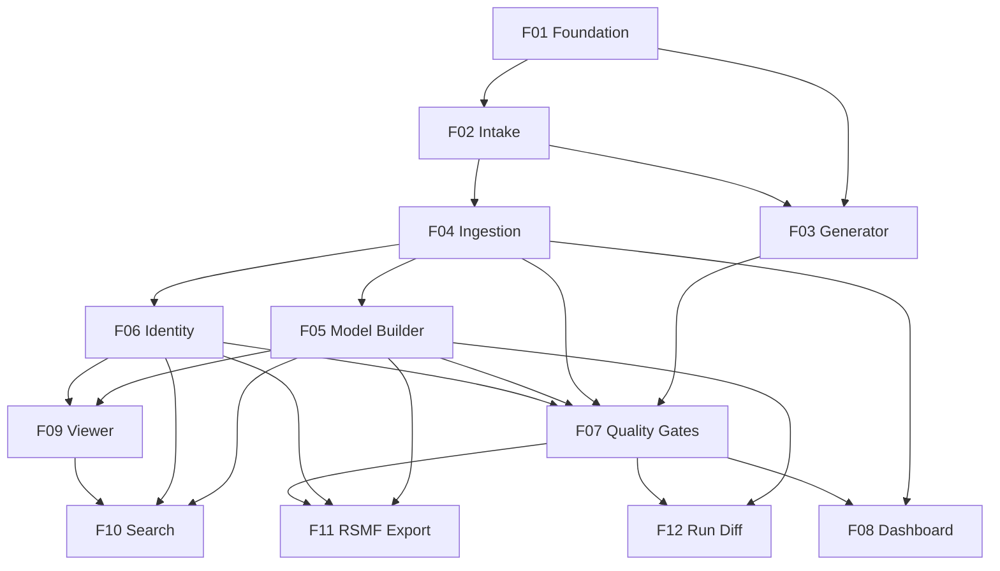

# ChatLedger

## 1. Executive Summary

ChatLedger is a portfolio-grade proof of concept that ingests classic Slack workspace export ZIPs, rebuilds the conversations into a faithful, audit-ready data model, and proves that its output is complete and reproducible. It models the core problem that eDiscovery and investigations teams face with short-message and chat data (Slack, Teams, mobile messages): the data is event-shaped, messy and high-volume, and every processing step has to hold up to scrutiny from opposing counsel, regulators or a court.

The product serves three audiences. Processing analysts at legal and forensics consultancies use it to load collections, run processing and verify completeness before handing data to review. Reviewers and investigators use it to read rebuilt conversations, including edit history, deleted messages and who could see each message, and to search them. Technical reviewers, such as hiring managers reading the public GitHub repository, use it to judge architecture, testing discipline and design reasoning. Its core value is **observable correctness**: every input record is accounted for, through deterministic quality gates, explicit reason codes, reconciliation counts and a run manifest attached to every output. The same input, settings and code version always produce byte-identical output hashes.

At a high level, an analyst creates a matter and adds one or more export ZIPs to it, either uploaded or produced by the built-in synthetic generator. Each ZIP is hashed and stored immutably by content address. A processing run inventories every file and splits the work into one unit per conversation. Parallel workers, coordinated through a PostgreSQL queue, stream-parse the JSON in bounded memory and build the conversation model: stable message IDs, threads, version history, reactions, attachments, membership intervals and provenance. Workers then resolve participants and evaluate quality gates. The web app shows live progress, a completeness report, a conversation viewer, search, and export to Relativity Short Message Format (RSMF 2.0). The whole stack is Next.js, FastAPI, a Python worker and PostgreSQL 16, and it starts with a single `docker compose up`.

## 2. Problem and Opportunity

### The Problem

**Chat data is event-shaped, not document-shaped**
- A Slack export is not a list of messages. It is a log of events: posts, `message_changed` edits, `message_deleted` tombstones, `channel_join`/`channel_leave`, `thread_broadcast` and file shares, spread across one JSON file per conversation per day.
- Naive loaders that treat each record as a message produce duplicate or contradictory rows. In a typical active workspace, 5–15% of records are edits, deletions or membership events rather than messages.
- Thread replies reference parents by `thread_ts`. Parents that fall outside the export window leave orphan replies with no context.

**Silent data loss destroys defensibility**
- Malformed day files, unknown subtypes and references to missing users are commonly skipped without trace by ad-hoc scripts.
- One unexplained missing message can invalidate a production or force an expensive re-collection, often costing weeks of review time.
- Teams usually cannot answer "how many records came in, and where did each one go?" with a number that reconciles to zero.

**Processing is not reproducible**
- Re-running the same collection with a different script version or setting often yields different message counts or IDs, and there is no record of which version produced which output.
- Without stable, deterministic identifiers, re-deliveries of overlapping exports create duplicates. That breaks review coding already applied to earlier productions.
- There is rarely a manifest tying an output to its exact input hash, settings and code version.

**Scale breaks naive tooling**
- A mid-size workspace export holds 1,000,000+ messages in a single ZIP of 1–2 GB. Loading whole files into memory (`json.load`) exhausts laptop RAM on large channels.
- Single-threaded processing of 1,000,000 messages commonly takes 30+ minutes, which makes iteration on settings impractical.

**Reviewers lack conversational context**
- Flattened exports lose who could see a message at the time it was sent, which matters for knowledge and notice questions in investigations.
- Edit history and deleted content are either discarded or shown as noise, so reviewers cannot see what a participant originally wrote.

### The Opportunity

- **Event-shaped data → a correct conversation model.** A model builder folds events into messages with immutable version history, thread links with orphan flags, reactions, attachment references with resolution status, and membership intervals derived from join/leave events.
- **Silent loss → zero-loss reconciliation.** Every record is classified as loaded, excluded, flagged or quarantined using an 18-code reason catalogue. A hard gate fails any run where `records in ≠ loaded + excluded + quarantined`.
- **Non-reproducibility → determinism by construction.** Message IDs are content-independent hashes of workspace, conversation and `ts`. Each run carries a manifest (git SHA, settings hash, input inventory hash, output hash). A run-diff tool proves two runs are identical or explains why they are not.
- **Scale limits → streaming, parallel ingestion.** Parsing is streamed with `ijson` in batches of 5,000 records, and one work unit covers one conversation. Workers pull units through a `FOR UPDATE SKIP LOCKED` queue, which keeps worker memory under 300 MB whatever the input size. The target is 100,000 messages in under 2 minutes with 2 workers.
- **Missing context → a reviewer-grade viewer.** The viewer has thread side panels, edit timelines, deletion tombstones with recoverable text, and a "Visible to" list computed from membership intervals. It is backed by full-text search and RSMF 2.0 export for downstream review platforms.
- **Differentiator:** a synthetic generator injects known anomalies and writes a ground-truth file. The completeness report then shows detected and injected anomaly counts side by side, so correctness is demonstrated rather than claimed.

## 3. Target Audience

### Primary Users

**Processing Analyst (legal/forensics consultancy)**
- Loads client collections into matters, starts processing runs, and must sign off that a run is complete before data goes to review. Is not a programmer and works entirely in the web UI.
- Needs clear run status, a completeness report that reconciles to zero, plain-language reason codes, and a documented override path when a gate fails for a known, acceptable reason.
- Produces RSMF exports for review platforms and must be able to show which run, settings and input produced each export.

**Reviewer / Investigator**
- Reads rebuilt conversations to find relevant communications, often under time pressure, and filters by participant, conversation, date range and keyword.
- Needs to see what was edited or deleted, the original text where it can be recovered, and who could see a message when it was sent.
- Does not care about pipeline internals, but needs every message to link back to its source file and record for testimony or challenge.

**Technical Reviewer (hiring manager / senior engineer reading the repo)**
- Reads the GitHub repository rather than using the app day to day. Clones it, runs `docker compose up`, and generates a dataset to try it.
- Looks for clean layering, explicit design decisions (ADRs), deterministic tests, a passing CI pipeline and evidence of performance claims.
- Wants to verify the claims quickly: determinism test, golden-dataset regression, coverage report and benchmark numbers in the README.

### Behavioral Profile

- All users run ChatLedger locally as a single-user application with no login. They expect it to start with one command and need no cloud account.
- All users value traceability over convenience. Any number the UI shows (counts, rates, hashes) must be explainable down to source files and record indexes.
- All users treat correctness failures as blocking. A warning they cannot explain is worse than a slower run.
- Analysts and reviewers work in desktop browsers (Chrome, Edge, Firefox; latest 2 versions) on laptops with 16 GB RAM and screens 1366 px wide or wider.

## 4. Objectives

### Product Objectives

1. **Process** large Slack exports with streaming, bounded memory and parallel work units.
2. **Guarantee** zero silent data loss: every input record is accounted for through reason-coded reconciliation and deterministic quality gates.
3. **Reproduce** outputs deterministically, so that the same input, settings and code version always yield identical output hashes, with a manifest attached to every output.
4. **Enable** analysts and reviewers to run, monitor, inspect, search and export processed conversations through a web UI without command-line work.
5. **Demonstrate** senior-level engineering quality in a public repository through architecture, tests, CI and documented design decisions.

### Success Metrics

| Objective | Metric | Measurement condition |
|---|---|---|
| Process | 100,000 messages processed end to end (inventory → gates) in **< 120 seconds** | Generator `medium` preset (100,000 messages, 500 conversations), `default` anomaly profile, 2 workers, laptop with 8 cores and 16 GB RAM, measured by run `started_at`→`finished_at` |
| Process | 1,000,000 messages processed with **no manual splitting** and worker peak RSS **< 300 MB** | Generator `large` preset (1,000,000 messages, 5,000 conversations), plus a single-channel case of 200,000 messages. RSS sampled every 1 s by the benchmark script |
| Process | Worker peak RSS varies by **≤ 10%** between the 100k and 1M presets | Same benchmark script, both presets |
| Guarantee | **0** unaccounted records in 100% of completed runs | Reconciliation gate result across the full automated test suite and benchmark runs |
| Guarantee | **100%** of anomalies injected by the generator are detected with their expected reason code | Ground-truth comparison in the completeness report for `default` and `stress` profiles |
| Reproduce | **2 of 2** runs with identical input, settings and code version produce identical run output hashes | Automated determinism test in CI (seed 42, `small` preset, run twice, compare manifests) |
| Reproduce | **100%** of exports and completeness reports embed a run manifest hash | Automated check on every export bundle in the test suite |
| Enable | An analyst completes create matter → generate or upload → run → review report → export in **≤ 10 UI actions**, with no CLI | Scripted walkthrough with the `small` preset |
| Enable | Search p95 latency **< 1 s** | 1,000,000-message dataset, 50 representative queries with filters |
| Demonstrate | Line coverage **≥ 80%** for the parsing, model-building and gate modules | `pytest --cov` enforced as a CI failure threshold |
| Demonstrate | CI (lint, type-check, pytest, frontend build) passes on `main` in **< 10 minutes** | GitHub Actions run duration |
| Demonstrate | Golden-dataset regression test passes with **0** diffs | Seed 42 `small` preset, committed expected manifest and output hash |

## 5. User Stories

### F01. Project Foundation
- As a technical reviewer, I want to run `docker compose up` and have the web app, API, worker and database start with migrations applied so that I can try the product without manual setup.
- As a technical reviewer, I want a monorepo with `apps/web`, `apps/api`, `apps/worker` and shared Python packages so that I can see clear boundaries between layers.
- As a developer, I want CI to run lint, type-check, tests with a coverage threshold, and the frontend build on every push so that regressions are caught before merge.
- As an analyst, I want a consistent app shell with navigation to matters, runs and search so that I can move between tasks quickly.
- As the system, I want an append-only audit event log so that every state-changing action is recorded with a timestamp and details.

### F02. Matter and Collection Intake
- As an analyst, I want to create a named matter with an optional description so that I can group the collections that belong to one case.
- As an analyst, I want to drag a Slack export ZIP of up to 2 GB onto the matter page and see upload progress so that I know when the collection has been received.
- As an analyst, I want the platform to compute the SHA-256 of the ZIP on arrival and show it so that I can match it against the chain-of-custody record I received.
- As an analyst, I want uploading a ZIP that is already in the matter to be rejected with a reference to the existing collection so that I don't process the same evidence twice.
- As an analyst, I want ZIPs that are not valid Slack exports to be rejected with a specific reason so that I can go back to the data source quickly.
- As a reviewer, I want to see each collection's original filename, size, hash, upload time and detected export date range so that I understand what the matter contains.

### F03. Synthetic Slack Export Generator
- As a technical reviewer, I want to run `chatledger-gen --seed 42 --preset medium --profile default --out ./out` so that I get a realistic Slack export without needing real data.
- As a technical reviewer, I want the same seed and parameters to produce a byte-identical ZIP so that tests and benchmarks are reproducible.
- As an analyst, I want a "Generate synthetic export" button in a matter so that I can create a test collection directly in the UI.
- As an analyst, I want to choose an anomaly profile (clean, default, stress) so that I can see how the platform handles clean and messy data.
- As a technical reviewer, I want a ground-truth file that lists every injected anomaly with its expected reason code so that detection can be verified automatically.
- As a technical reviewer, I want to generate an overlapping re-delivery export from the same seed so that I can test duplicate handling across exports.

### F04. Inventory and Streaming Ingestion
- As an analyst, I want to start a processing run on a matter with a time zone and gate thresholds so that all its collections are processed together.
- As the system, I want to record every file in every collection (path, size, SHA-256, kind) in an inventory before parsing so that the inputs are fixed and hashable.
- As the system, I want to split the run into one work unit per conversation and let workers claim units through a PostgreSQL queue so that processing runs in parallel without extra infrastructure.
- As the system, I want to stream-parse day files in batches of 5,000 records so that worker memory stays under 300 MB whatever the file size.
- As the system, I want every malformed or unrecognised record written to a quarantine table with a reason code, source file and record index so that nothing is dropped silently.
- As the system, I want work units leased by a crashed worker to be re-queued after 60 seconds so that a crash never stalls a run.
- As an analyst, I want to cancel a running run so that I can stop processing started with the wrong settings.

### F05. Conversation Model Builder
- As the system, I want to assign each message a deterministic ID derived from workspace, conversation and `ts` so that IDs stay stable across runs and re-deliveries.
- As the system, I want to fold `message_changed` and `message_deleted` events into an immutable version history so that no earlier text is ever overwritten.
- As the system, I want to link thread replies to their parents and flag replies whose parent is missing so that thread structure is correct and gaps are visible.
- As the system, I want to derive membership intervals from join/leave events so that it can be shown who could see each message.
- As the system, I want to deduplicate records with the same source identity across overlapping collections while keeping a provenance link to every source file so that duplicates disappear without losing traceability.
- As the system, I want to record attachment references with a resolution status so that reviewers know which file metadata is present.

### F06. Participant Identity Resolution
- As the system, I want to create one canonical person per Slack user, with typed aliases (Slack user ID, email, display name with history), so that the same person is shown consistently across conversations.
- As the system, I want to merge Slack users that share the same email address under one person and store the rule that linked them so that identity links are explainable.
- As the system, I want to record every user ID referenced in messages but missing from `users.json` as unresolved so that the gap is visible and counted.
- As a reviewer, I want to see a person's aliases and which source supplied each one so that I can trust the attribution.

### F07. Quality Gates, Completeness Report and Run Manifest
- As the system, I want to reconcile records in against loaded, excluded and quarantined records, per conversation and per run, so that any unaccounted record fails the run.
- As the system, I want to evaluate configurable gates (quarantine rate, orphan-reply rate, unresolved-user rate, unresolved-attachment rate, malformed-file rate) as PASS, WARN or FAIL so that data quality is judged by explicit rules.
- As an analyst, I want a completeness report with the run header, gate table, reconciliation equation by reason code, per-conversation table and quarantine browser so that I can sign off a run.
- As an analyst, I want to download the report as canonical JSON and the per-conversation table as CSV so that I can archive and share them.
- As an analyst, I want to override a failed gate with a written reason so that I can proceed when the failure is understood and acceptable, with the override recorded.
- As a technical reviewer, I want each run to produce a manifest (git SHA, settings hash, input inventory hash, output hash, gate results) so that any output can be traced to exactly what produced it.
- As an analyst, I want to see detected and injected anomaly counts side by side for generated collections so that I can confirm the platform caught everything.
- As a reviewer, I want to browse the reason-code catalogue so that I understand what each code means.

### F08. Run Monitoring Dashboard
- As an analyst, I want a "Start run" form on the matter page with time zone and gate thresholds prefilled with defaults so that I can launch processing in one step.
- As an analyst, I want to see live progress per stage (inventory, parse, build, identity, gates) refreshed every 2 seconds so that I know how far the run has got.
- As an analyst, I want to see throughput, elapsed time, estimated time remaining and quarantine counts by reason code during the run so that I can spot problems early.
- As an analyst, I want to see the work units table with state and retry count so that I can find conversations that are failing.
- As an analyst, I want a clear final status banner (passed, gate failed, failed, cancelled) with a link to the completeness report so that I know what to do next.
- As an analyst, I want a list of all runs for a matter with status, duration, record counts and output hash so that I can compare runs over time.

### F09. Conversation Viewer
- As a reviewer, I want a sidebar listing conversations grouped by type (public channels, private channels, DMs, group DMs) with message counts so that I can choose what to read.
- As a reviewer, I want messages shown in chronological order with day separators, author names, resolved mentions and reactions so that the conversation reads naturally.
- As a reviewer, I want to open a thread in a side panel so that I can read replies without losing my place.
- As a reviewer, I want deleted messages shown as a tombstone with the last known text in muted strikethrough so that I can see what was removed.
- As a reviewer, I want an "(edited N×)" badge that opens a version timeline so that I can see every earlier version of a message.
- As a reviewer, I want a "Visible to" popover on each message listing who was a member at that moment so that I can answer who-knew-what questions.
- As a reviewer, I want to see attachment names, types and resolution status so that I know which files were shared.
- As a reviewer, I want to open the provenance of a message (collection, source file, record index) so that I can cite it.
- As a reviewer, I want to switch timestamps between UTC and the run time zone so that times match the matter's jurisdiction.

### F10. Search
- As a reviewer, I want to search message text by keyword with phrase, OR and exclusion syntax so that I can find relevant communications.
- As a reviewer, I want to filter by participant, conversation, date range, has-attachment, edited and deleted so that I can narrow results.
- As a reviewer, I want results with highlighted snippets, author, conversation and timestamp so that I can judge relevance without opening each one.
- As a reviewer, I want to click a result and land on that message in context in the viewer so that I can read the surrounding conversation.
- As a reviewer, I want to sort results by relevance or date so that I can choose between triage and timeline review.

### F11. RSMF Export
- As an analyst, I want to export a conversation as RSMF 2.0 sliced into 24-hour windows in the run time zone so that it can be loaded into a review platform.
- As an analyst, I want the export bundle to include the run manifest and a SHA-256 for every file so that the production can be defended.
- As an analyst, I want export to be blocked for runs that failed a gate unless an override was recorded so that suspect data isn't produced by accident.
- As an analyst, I want to see export progress and download the bundle when it is ready so that I don't have to wait on a blocked page.
- As an analyst, I want to export the results of a search as RSMF so that I can produce only the relevant subset.

### F12. Re-delivery and Run Diff
- As an analyst, I want to select two runs and see whether their outputs are identical so that I can confirm reproducibility.
- As an analyst, I want differences explained by cause (input changed, settings changed, code version changed) so that I know whether a difference is expected.
- As a technical reviewer, I want a "Re-run with same settings" action that diffs automatically against the original so that determinism can be shown in two clicks.
- As an analyst, I want a list of added, removed and changed messages per conversation for differing runs so that I can inspect exactly what changed.
- As an analyst, I want to add an expanded re-delivery to a matter and have only changed files reprocessed while message IDs stay stable so that re-deliveries are fast and review coding is preserved.

## 6. Functionalities

### F01. Project Foundation

**Capabilities:**
- Monorepo layout:
  - `apps/web`: Next.js App Router, TypeScript strict mode, Tailwind.
  - `apps/api`: FastAPI, Pydantic v2, SQLAlchemy 2, Alembic.
  - `apps/worker`: Python 3.12 worker process.
  - `packages/core`: shared Python domain models, reason-code catalogue and hashing utilities.
  - `docs/adr`: Architecture Decision Records.
- `docker-compose.yml` defines 4 services: `db` (PostgreSQL 16), `api` (port 8000), `worker` (scalable with `--scale worker=N`, default 2) and `web` (port 3000). It also defines one named volume, `blobstore`, mounted at `/data/blobs` in `api` and `worker`.
- The `api` container runs `alembic upgrade head` before starting. Startup is ready, migrations included, within 60 seconds on a warm image cache.
- Health endpoints: `GET /health` returns DB connectivity, migration revision and git SHA. The worker writes a heartbeat row every 10 seconds.
- Shared PostgreSQL job-queue primitives: a `job` table with `id`, `kind`, `payload`, `state` (`queued` | `leased` | `done` | `failed`), `lease_expires_at`, `attempts` and `last_error`, claimed with `SELECT … FOR UPDATE SKIP LOCKED LIMIT 1`.
- Append-only `audit_event` table with ID, timestamp (UTC), action, entity type, entity ID and a JSON details field. A DB trigger rejects UPDATE and DELETE on it.
- Git SHA is injected at build time (`GIT_SHA` build arg) and exposed to the API and worker for manifests.
- CI (GitHub Actions, on push and PR):
  - `ruff` lint and format check, `mypy --strict` on Python packages.
  - `eslint`, `tsc --noEmit` and `next build` for the web app.
  - `pytest` against a PostgreSQL 16 service container, with a `--cov-fail-under=80` threshold on the `parsing`, `model` and `gates` modules.
- Base UI shell:
  - Left navigation (Matters, Reason Codes) and a header showing the current matter.
  - Toast notifications, plus empty, loading (skeleton) and error states as shared components.
- A README covers quick start (3 commands), architecture diagram, benchmark table and links to ADRs. At least 5 initial ADRs: Postgres as queue, content-addressed storage, deterministic IDs, streaming parse, reason-code accounting.

**Experience:**
1. The user runs `git clone`, `cd chatledger`, then `docker compose up`.
2. The console shows all 4 services healthy, and `http://localhost:3000` opens the Matters page.
3. With no matters yet, the page shows an empty state: "No matters yet. Create one to start." and a primary "New matter" button.
4. If the API is unreachable, the shell shows a top banner: "API unavailable at http://localhost:8000. Check `docker compose ps`." It retries every 5 seconds.

### F02. Matter and Collection Intake

**Provides:**
- Matter records (matter ID, name) and a collection registration entry point that accepts a local ZIP path and returns collection ID and SHA-256 (used by F03)
- Collection records (collection ID, matter ID, SHA-256, stored ZIP path, size, original filename, added-at timestamp) (used by F04)

**Capabilities:**
- Matter fields:
  - Name: required, 3–80 characters, unique case-insensitively.
  - Description: optional, at most 500 characters.
  - Created-at timestamp.
- Matters cannot be deleted in the PoC. This preserves the audit trail.
- Upload:
  - One ZIP per upload, `.zip` extension, maximum 2 GB (2,147,483,648 bytes).
  - Streamed to disk in 8 MB chunks while computing SHA-256 incrementally. API memory stays under 100 MB during upload.
- Storage:
  - The blob is written to `/data/blobs/sha256/<first 2 hex>/<full hex>.zip` via a temp file and atomic rename, then set read-only (mode 0444).
  - Existing blobs are never rewritten. The same bytes added to a different matter reuse the blob.
- Duplicate rule: a ZIP whose SHA-256 already exists as a collection in the same matter is rejected (HTTP 409). Adding the same hash to a different matter is allowed.
- Validation, run on the stored ZIP before the collection is committed:
  - The ZIP contains `users.json` and `channels.json` at the root or inside a single top-level folder.
  - At most 200,000 entries.
  - Total uncompressed size at most 20 GB.
  - Per-entry compression ratio at most 100:1.
  - No entry path containing `..` or starting with `/`.
- Detected metadata stored per collection: entry count, conversation folder count, and the earliest and latest day-file dates (from the `YYYY-MM-DD.json` filenames).
- Each matter can hold at most 20 collections.
- Audit events: `matter.created`, `collection.added` (with SHA-256 and source `upload` or `generator`) and `collection.rejected` (with reason).

**Experience:**
1. On the Matters page, the user clicks "New matter". A modal opens with Name and Description fields.
2. Name is validated inline: "Name must be 3–80 characters" or "A matter with this name already exists".
3. On save, the user lands on the Matter page. It has tabs for Collections, Runs, Conversations, Search and Exports; tabs that need a completed run are disabled with a tooltip.
4. The Collections tab shows a drop zone: "Drop a Slack export ZIP (max 2 GB) or click to browse", plus a "Generate synthetic export" button (F03).
5. While uploading, a progress row shows filename, percentage, MB transferred / total and transfer speed.
6. After upload, the row reads "Verifying export structure…". On success it becomes a collection card showing:
   - Original filename, size and SHA-256 (with a copy button).
   - Added-at time.
   - Conversation count.
   - Date range, for example "2024-01-03 → 2024-06-28".
7. Collections are listed by added-at, oldest first. The run form (F08) reminds the user that runs process all of them.

**Error Handling:**
- **Duplicate in matter:** HTTP 409. "This export is already in this matter as collection *<filename>* (added <date>). SHA-256: <hash>." The temp file is deleted, and no blob is written unless it is already shared with another matter.
- **File over 2 GB:** rejected client-side before upload, and server-side after 2 GB of streamed bytes. "File exceeds the 2 GB limit (<size>)." Partial temp data is deleted.
- **Not a Slack export:** "Not a Slack workspace export: users.json and channels.json not found." The collection is not created, and a `collection.rejected` audit event is written.
- **Unsafe archive:** "Archive rejected: <specific rule>". The rule is one of: entry path escapes archive, compression ratio above 100:1, more than 200,000 entries, uncompressed size above 20 GB.
- **Upload interrupted:** the client shows "Upload interrupted at <n>%. Retry?" The server discards the temp file after 10 minutes of inactivity. No partial collection ever exists.

### F03. Synthetic Slack Export Generator

**Consumes:**
- F02: matter records (matter ID, name); the collection registration entry point (local ZIP path in, collection ID and SHA-256 out)

**Provides:**
- Ground-truth anomaly file linked to the collection ID: generator seed, preset, profile, and per anomaly the anomaly type, conversation ID, message `ts`, source file path, record index and expected reason code (used by F07)

**Capabilities:**
- CLI: `chatledger-gen --seed <int> --preset small|medium|large|custom --messages <n> --conversations <n> --profile clean|default|stress [--overlap-of <seed> --overlap-days-pct 30] --out <dir>`.
- Presets:
  - `small`: 10,000 messages, 50 conversations, 40 users, 90 days.
  - `medium`: 100,000 messages, 500 conversations, 300 users, 365 days.
  - `large`: 1,000,000 messages, 5,000 conversations, 2,000 users, 730 days.
  - `custom`: up to 1,000,000 messages and 5,000 conversations.
- Realism:
  - Conversation type mix: 60% public channels, 15% private (`groups.json`), 20% DMs, 5% MPIMs.
  - Message volume per conversation follows a Zipf distribution (s = 1.1), so at least one channel holds over 5% of all messages.
  - 20% of messages are thread replies, and 3% of replies are thread broadcasts.
  - Text includes `<@U…>` mentions and `<url|label>` links.
  - 8% of messages carry reactions and 4% share files.
  - Bot messages make up 2%.
  - Channel join/leave events produce membership changes.
- Determinism:
  - A single seeded PRNG (`random.Random(seed)`), with no wall-clock or environment reads.
  - ZIP entries are written in sorted path order with a fixed timestamp of 1980-01-01 00:00:00 and fixed permissions.
  - JSON is serialised with sorted keys and fixed separators.
  - The same seed and parameters always give byte-identical ZIP and ground-truth SHA-256.
- Anomaly profiles, as rates over the relevant base:

| Anomaly | Expected reason code | clean | default | stress |
|---|---|---|---|---|
| Orphan reply (parent `ts` absent) | F_ORPHAN_REPLY | 0 | 0.3% of replies | 3% of replies |
| Edit (`message_changed`) | X_EDIT_EVENT | 0 | 3% of messages | 3% |
| Deletion (`message_deleted`) | X_DELETE_EVENT | 0 | 1% of messages | 1% |
| Edit after delete | F_EDIT_AFTER_DELETE | 0 | 0.05% | 0.5% |
| Edit/delete of unknown target | Q_EDIT_TARGET_MISSING / Q_DELETE_TARGET_MISSING | 0 | 0.02% | 0.3% |
| Unknown subtype | Q_UNKNOWN_SUBTYPE | 0 | 0.05% | 1% |
| Missing/invalid `ts` | Q_MISSING_TS / Q_INVALID_TS | 0 | 0.01% | 0.3% |
| Schema violation (wrong field type) | Q_SCHEMA_VIOLATION | 0 | 0.02% | 0.3% |
| Malformed JSON day file (truncated) | Q_MALFORMED_JSON | 0 | 0.05% of files | 0.5% of files |
| Empty day file `[]` | X_EMPTY_FILE | 0 | 0.5% of files | 0.5% |
| User missing from users.json | F_UNRESOLVED_USER | 0 | 0.2% of messages | 2% |
| File ref without metadata | F_UNRESOLVED_FILE | 0 | 2% of file refs | 10% |
| Bot message without identity | F_BOT_NO_IDENTITY | 0 | 0.1% of bot msgs | 2% |
| `ts` outside the day file's date | F_TS_OUT_OF_RANGE | 0 | 0.01% | 0.2% |

- With `default` rates, every gate passes with defaults (F07). With `stress`, at least 3 gates fail.
- Overlapping re-delivery: `--overlap-of <seed>` produces a second export. It covers the last `overlap-days-pct`% (default 30%) of the original period, extends 30 days beyond it, and reproduces overlapping messages byte-identically. Overlapping messages in the second export are recorded in the ground truth as expected `X_DUPLICATE_SOURCE`.
- Output: `<out>/slack-export-<seed>-<preset>-<profile>.zip` and `<out>/ground-truth-<seed>.json`. The ground truth is canonical JSON with anomalies sorted by conversation, then `ts`, then type.
- Performance: `large` generates in under 5 minutes, with generator peak RSS under 500 MB because conversations are streamed to the ZIP one at a time.
- UI generation runs as a worker job of kind `generate`. When finished, it calls the F02 registration entry point with source `generator`, then stores the ground truth next to the collection blob.

**Experience:**
1. On the Matter → Collections tab, the user clicks "Generate synthetic export". A modal shows:
   - Seed (integer, default random 6-digit, editable).
   - Preset (small / medium / large / custom). Custom reveals Messages (1,000–1,000,000) and Conversations (1–5,000).
   - Anomaly profile (clean / default / stress), each with a one-line description.
   - "Generate as re-delivery of" (optional dropdown of earlier generated collections in this matter).
2. On submit, a pending collection card shows "Generating… <n> / <total> messages" with a progress bar refreshed every 2 seconds.
3. When done, the card becomes a normal collection card with a "Synthetic · seed 4821 · default" badge and a "Download ground truth" link.
4. From the CLI, a progress line prints every 10,000 messages. It ends with the paths and SHA-256 of both output files.

**Error Handling:**
- **Invalid parameters:** "Messages must be between 1,000 and 1,000,000" or "Conversations must not exceed messages / 2". Validated client-side and server-side.
- **Disk space insufficient:** before starting, an estimated size (about 350 bytes per message compressed) is checked against free space on `/data/blobs`. Below estimate × 1.5, the job fails with "Not enough disk space: need ~<x> GB, <y> GB free." Partial output is deleted.
- **Worker crash during generation:** the job lease expires after 60 seconds and the job restarts from scratch, up to 3 attempts. The output is deterministic, so the retry is identical. After 3 failures the card shows "Generation failed: <last_error>" with a "Retry" button.
- **Generated ZIP is a duplicate in the matter:** same seed and parameters as an existing collection. Registration returns 409, and the card shows "Identical synthetic export already in this matter (same seed and parameters)."

### F04. Inventory and Streaming Ingestion

**Consumes:**
- F02: collection records (collection ID, matter ID, SHA-256, stored ZIP path, size)

**Provides:**
- Parsed message records per work unit, plus conversation and workspace metadata (used by F05):
  - Message records: conversation ID, source collection ID, source file path, record index, and raw message fields (`ts`, `user`, `bot_id`, `username`, `text`, `thread_ts`, `reply_count`, `parent_user_id`, `subtype`, `edited`, `reactions`, `files`, `message`/`previous_message` for change and delete events).
  - Conversation metadata: conversation ID, name, type (public, private, dm, mpim), created, initial members, topic, purpose.
  - Workspace team ID.
- Workspace user records and referenced user IDs (used by F06):
  - User records: Slack user ID, team ID, name, real name, display name, email, is_bot, deleted flag, source file.
  - Referenced user IDs per work unit: authors with message counts, mentions, editors, reaction users, membership event users.
- Inventory, quarantine and accounting data (used by F07):
  - File inventory: path, size, SHA-256, file kind (users, channels, dms, mpims, groups, day_file, other), collection ID.
  - Input inventory hash.
  - Record-in counts per file and per conversation.
  - Parse-stage quarantine entries: reason code, source file, record index, byte offset, raw excerpt.
  - Work unit outcomes.
  - Run settings (gate thresholds, time zone) and settings hash.
- Run status and stage progress (used by F08): run ID, status, current stage, work units total/done/failed, records processed, records per second, quarantine count by reason code, started and finished timestamps.

**Capabilities:**
- Run creation: `POST /matters/{id}/runs` with settings. A run covers all collections in the matter at creation time; the collection list is frozen into the run.
  - Settings: IANA time zone (default `UTC`) and the 5 configurable gate thresholds (defaults in F07).
  - The settings hash is SHA-256 of canonical JSON of the settings.
  - At most 1 active (non-terminal) run per matter. A second start returns 409.
- Run states: `queued` → `inventory` → `parse_build` → `identity` → `gates` → one of `completed_passed`, `completed_gate_failed`, `failed`, `cancelled`.
- Inventory stage:
  - Reads ZIP central directories only, without extracting to disk.
  - Hashes every entry by streaming (64 KB chunks) and records path, size, SHA-256 and kind.
  - Input inventory hash = SHA-256 over the sorted lines `collection_sha256\tpath\tsize\tsha256`.
  - Workspace metadata files are parsed in this stage.
  - Target: at least 200 MB/s hashing throughput per worker.
- Work units: one unit per distinct conversation ID across all collections in the run. A unit lists every day file for that conversation from every collection, ordered by date, then collection added-at. Units are inserted as jobs of kind `unit`.
- Workers claim units with `FOR UPDATE SKIP LOCKED`.
  - Leases last 60 seconds and are renewed every 20 seconds while working.
  - Expired leases are re-queued. A unit is attempted at most 3 times.
  - Each attempt first deletes that unit's partial rows inside a transaction, so retries are idempotent.
- Streaming parse:
  - `ijson.items(stream, 'item')` reads directly from the ZIP entry stream.
  - Records are buffered and flushed to staging tables via `COPY` in batches of 5,000.
  - A worker never holds more than 1 batch plus 1 file's metadata in memory.
  - Peak worker RSS is under 300 MB whatever the file or conversation size.
- Malformed JSON: when `ijson` raises mid-file, all records parsed before the error are kept. One `Q_MALFORMED_JSON` quarantine entry records the byte offset of the failure and the unparsed tail size, and it counts as 1 record in. Files that fail at offset 0 also count as 1 malformed-file entry.
- Parse-stage reason codes: `Q_MALFORMED_JSON`, `Q_MISSING_TS`, `Q_INVALID_TS` (does not match `^\d{10}\.\d{6}$`), `Q_UNKNOWN_SUBTYPE` (outside the supported set below), `Q_SCHEMA_VIOLATION` (e.g. `text` not a string, `reactions` not a list), `X_EMPTY_FILE`.
- Supported subtypes: none (plain message), `channel_join`, `channel_leave`, `message_changed`, `message_deleted`, `bot_message`, `file_share`, `thread_broadcast`, `me_message`, `channel_topic`, `channel_purpose`, `channel_name`.
- Quarantine rows store the raw record excerpt truncated to 4 KB and are never deleted.
- Throughput target: 100,000 messages end to end in under 120 seconds with 2 workers. The parser is pluggable behind a `SourceParser` interface (`inventory()`, `units()`, `parse_unit()`), with a Slack implementation only.
- Cancellation:
  - `POST /runs/{id}/cancel` sets a flag. Workers check it between batches and stop within 10 seconds.
  - The run becomes `cancelled`, keeps its partial counts, never becomes the matter's eligible run, and is excluded from gates.
- System failures move a run to `failed` with `last_error`: DB unavailable for more than 5 minutes, unreadable ZIP blob, or an inventory stage exception.
- Audit events: `run.started` (with settings hash), `run.cancelled` and `run.finished` (with status).

**Experience:**
- This is a backend feature with no direct UI. Its UI is F08.
- API errors return a JSON body `{code, message}` with specific codes such as `RUN_ALREADY_ACTIVE` or `MATTER_HAS_NO_COLLECTIONS`.
- Worker logs are structured JSON with run ID, unit ID, stage, records and elapsed milliseconds, so they can be read in `docker compose logs worker`.

**Error Handling:**
- **Worker crash mid-unit:** the lease expires after 60 seconds and another worker re-claims the unit. Partial staging rows for that unit are deleted transactionally before reprocessing, so no duplicates are created. The attempt count is visible in F08.
- **Unit fails 3 times:** the unit is marked `failed` with its last error. The run continues. The unit's records are unaccounted, so the reconciliation gate (F07) fails and lists the unit. Data is never silently skipped.
- **Blob missing or hash mismatch:** at inventory, the stored ZIP's SHA-256 is re-verified. On mismatch the run becomes `failed` with "Collection <filename> failed integrity check: stored blob hash differs from intake hash." The audit event `run.integrity_failure` is written.
- **Start with no collections:** 422 `MATTER_HAS_NO_COLLECTIONS`, "Add at least one collection before starting a run."
- **Second concurrent run:** 409 `RUN_ALREADY_ACTIVE`, "Run #<n> is still in progress for this matter."

### F05. Conversation Model Builder

**Consumes:**
- F04: parsed message records per work unit (conversation ID, source collection ID, source file path, record index, raw message fields), conversation metadata (conversation ID, name, type, created, initial members), workspace team ID

**Provides:**
- Conversation model for the run (used by F09, F10, F11, F12):
  - Conversations: ID, name, type, created.
  - Messages: message ID, `ts`, author Slack user ID or bot identity, current text, thread parent message ID, reply count, subtype, flags, deleted state with deleted-at, deleted-by and last known text, edit count, has-attachment.
  - Version records: message ID, version number, text, timestamp, editor Slack user ID, source file.
  - Reactions: message ID, emoji name, Slack user IDs, count.
  - Attachment references: file ID, name, mimetype, resolution status.
  - Membership intervals: conversation ID, Slack user ID, joined-at, left-at.
  - Provenance links: message ID, collection ID, source file path, record index.
- Per-conversation reconciliation counts (used by F07): records in, loaded, excluded by reason code, flagged by reason code, build-stage quarantine by reason code.
- Per-conversation output hash (used by F07, F12)

**Capabilities:**
- Message ID = first 32 hex characters of SHA-256(`team_id` + `:` + `conversation_id` + `:` + `ts`).
  - The ID does not depend on content, collection or run.
  - If `team_id` is absent from `users.json`, the matter ID is used instead and the run settings record that fallback.
- Source identity used for dedup is (conversation ID, `ts`, SHA-256 of canonical record JSON).
  - Identical source identity seen again, in the same or another collection: excluded as `X_DUPLICATE_SOURCE`, with an extra provenance link added.
  - Same `ts` with different content in a later collection: a new version with source `redelivery`.
- Event folding, processed per conversation in `ts` order using SQL set operations over staging tables rather than in-memory maps, so memory stays bounded:
  - `message_changed` → new version (text, edited-at, editor), excluded as `X_EDIT_EVENT`. If the target is unknown: `Q_EDIT_TARGET_MISSING`.
  - `message_deleted` → deletion version that keeps the `previous_message.text` when present, excluded as `X_DELETE_EVENT`. If the target is unknown: `Q_DELETE_TARGET_MISSING`.
  - An edit after a deletion is applied as a version and the message is flagged `F_EDIT_AFTER_DELETE`. Deletion state persists.
  - `channel_join` / `channel_leave` → membership intervals, excluded as `X_MEMBERSHIP_EVENT`.
- Versions are append-only. Version 1 is the original post, and no row is ever updated in place.
- Membership intervals:
  - Initial members from `channels.json` / `groups.json` open an interval at the conversation's `created` time.
  - Join opens an interval and leave closes it. Unclosed intervals end at `null` (still a member).
  - For DMs and MPIMs, members come from `dms.json` / `mpims.json` and are members for the whole lifetime.
  - Overlapping intervals for the same user are merged.
- Threads:
  - A reply (`thread_ts` ≠ `ts`) is linked to the message with `ts = thread_ts` in the same conversation.
  - If none exists, it is flagged `F_ORPHAN_REPLY`.
  - `thread_broadcast` replies appear both in the thread and in the channel timeline.
- Flags:
  - `F_BOT_NO_IDENTITY`: bot message without `bot_id` and without `username`.
  - `F_TS_OUT_OF_RANGE`: `ts` date in UTC differs from the day-file date by more than 1 day.
  - `F_UNRESOLVED_FILE`: file reference missing `name` or `mimetype`, or with `mode: tombstone`.
  - Attachment resolution status is `resolved` or `unresolved_metadata`. Binaries are never downloaded.
- Text is stored raw. Mentions `<@U123>` and links `<url|label>` are tokenised into a structured list for rendering (F09) and export (F11).
- Per-conversation output hash: SHA-256 over canonical JSON lines of all message, version, reaction, attachment and membership rows for the conversation.
  - Sorted by message ID, then version number.
  - Excludes run ID and processing timestamps.
- Accounting invariant per conversation: `records_in = loaded + Σ excluded + Σ quarantined`. Flagged records count within loaded.

**Experience:**
- This is a backend feature that runs inside each work unit after the parse stage. Its counts appear live in F08 under the "build" stage.
- Its results surface in the viewer (F09), search (F10), export (F11) and the completeness report (F07).

**Error Handling:**
- **Invariant violation inside a unit:** records in ≠ loaded + excluded + quarantined. The unit is marked `failed` with "Accounting mismatch in conversation <id>: in=<n>, accounted=<m>". The reconciliation gate then fails. Nothing is committed for that unit.
- **Conflicting duplicate within a single collection:** same `ts` with different content in the same collection. The first record in file and index order is loaded and later ones become versions with source `intra_collection_conflict`. Each is listed in the report under `X_DUPLICATE_SOURCE` with a note.
- **Database write failure during a batch:** the transaction rolls back the whole unit, and the unit is retried through the F04 lease mechanism (up to 3 attempts). Half-built conversations never become visible.
- **Version history would require overwrite:** for example, the same version number is written twice. A database unique constraint on (message ID, version number) rejects it, and the unit fails with "Version conflict for message <id>". Data is never overwritten.

### F06. Participant Identity Resolution

**Consumes:**
- F04: workspace user records (Slack user ID, team ID, name, real name, display name, email, is_bot, deleted flag, source file), referenced user IDs per work unit (authors with message counts, mentions, editors, reaction users, membership event users)

**Provides:**
- Canonical person records (person ID, display label, typed aliases each with source and rule) and the Slack user ID → person ID mapping (used by F09, F10, F11)
- Unresolved Slack user IDs and the count of messages authored by unresolved users (used by F07)

**Capabilities:**
- Runs as the `identity` stage after all units finish, as a single job.
- Alias types:
  - `slack_user_id`
  - `email` (lowercased and trimmed)
  - `display_name` (one alias per distinct value seen across collections, each with a first-seen collection)
  - `real_name`
  - `bot_id`
- Deterministic rules, applied in order:
  - **R1:** each Slack user ID is one alias.
  - **R2:** Slack user IDs sharing an identical normalised email are merged into one person (rule `R2_EMAIL_MATCH`).
  - **R3:** bots are grouped by `bot_id`.
  - No fuzzy, name-based or probabilistic matching.
- Person ID = first 32 hex characters of SHA-256 of the lexicographically smallest Slack user ID (or `bot_id`) in the person. The ID is stable across runs.
- Display label priority: display name → real name → name → Slack user ID.
- Each alias stores its source (collection ID and file `users.json`, or `message.user_profile`) and the rule that linked it.
- Unresolved users: a referenced ID with no record in any collection's `users.json` becomes a placeholder person labelled "Unknown user (U…)" with alias source `reference_only`. Its authored messages count toward `F_UNRESOLVED_USER`.
- Users marked `deleted: true` keep their person record with a "Deactivated" attribute.

**Experience:**
- Mostly a backend feature. Visible surfaces:
  - In the viewer (F09), author names show the person display label. Hovering shows a person card with all aliases, their types and sources, and the linking rule.
  - Unresolved authors show a grey "Unknown user U01ABC" label with a warning icon.
- `GET /runs/{id}/persons` lists persons with alias counts and message counts, sorted by message count, 50 per page. It is used by the F10 participant filter.

### F07. Quality Gates, Completeness Report and Run Manifest

**Consumes:**
- F03: ground-truth anomaly file (generator seed, preset, profile, anomaly type, conversation ID, message `ts`, source file path, record index, expected reason code)
- F04: file inventory (path, size, SHA-256, file kind, collection ID), input inventory hash, record-in counts per file and per conversation, parse-stage quarantine entries (reason code, source file, record index, byte offset, raw excerpt), work unit outcomes, run settings (gate thresholds, time zone) and settings hash
- F05: per-conversation reconciliation counts (records in, loaded, excluded by reason code, flagged by reason code, build-stage quarantine by reason code), per-conversation output hash
- F06: unresolved Slack user IDs and the count of messages authored by unresolved users

**Provides:**
- Gate results (gate code, measured value, threshold, WARN boundary, verdict) and run final status with override state (overridden yes/no, override reason, override timestamp) (used by F08, F11)
- Run manifest and its manifest hash (used by F11, F12): run ID, matter ID, git SHA, settings including time zone, settings hash, input inventory hash, run output hash, per-conversation output hashes, gate results, completeness report hash

**Capabilities:**
- Reason-code catalogue. It is fixed, versioned in `packages/core`, served at `GET /reason-codes`, and each entry has code, category, description and pipeline stage:
  - **Quarantined:**

    | Code | Meaning |
    |---|---|
    | `Q_MALFORMED_JSON` | File or record could not be parsed |
    | `Q_MISSING_TS` | Message has no `ts` |
    | `Q_INVALID_TS` | `ts` is not a valid epoch.micro |
    | `Q_UNKNOWN_SUBTYPE` | Subtype is not in the supported set |
    | `Q_SCHEMA_VIOLATION` | A required field has the wrong type |
    | `Q_EDIT_TARGET_MISSING` | `message_changed` refers to an unknown `ts` |
    | `Q_DELETE_TARGET_MISSING` | `message_deleted` refers to an unknown `ts` |

  - **Excluded** (accounted for, not loaded as a message): `X_DUPLICATE_SOURCE`, `X_MEMBERSHIP_EVENT`, `X_EDIT_EVENT`, `X_DELETE_EVENT`, `X_EMPTY_FILE`.
  - **Flagged** (loaded with a data-quality flag): `F_ORPHAN_REPLY`, `F_UNRESOLVED_USER`, `F_UNRESOLVED_FILE`, `F_EDIT_AFTER_DELETE`, `F_BOT_NO_IDENTITY`, `F_TS_OUT_OF_RANGE`.
- Gates. WARN applies when the value exceeds 50% of the threshold; FAIL applies when it exceeds the threshold.

  | Gate | Formula | Default threshold | Configurable |
  |---|---|---|---|
  | `G_RECONCILIATION` | records in − (loaded + excluded + quarantined), including records in failed units | 0 | No (hard FAIL, no WARN band) |
  | `G_QUARANTINE_RATE` | quarantined ÷ records in | 0.5% | Yes, 0–100% |
  | `G_ORPHAN_REPLY_RATE` | `F_ORPHAN_REPLY` ÷ thread replies | 1% | Yes |
  | `G_UNRESOLVED_USER_RATE` | messages by unresolved users ÷ loaded messages | 0.5% | Yes |
  | `G_UNRESOLVED_ATTACHMENT_RATE` | `F_UNRESOLVED_FILE` ÷ file references | 5% | Yes |
  | `G_MALFORMED_FILE_RATE` | day files with `Q_MALFORMED_JSON` ÷ day files | 0.1% | Yes |

- Rates are computed with exact integer arithmetic and shown to 3 decimal places.
- Run outcome:
  - Any FAIL → `completed_gate_failed`.
  - Otherwise → `completed_passed`. WARN does not block.
- Eligible run: the matter's "eligible run" pointer used by F09, F10 and F11 moves only to the newest run that is `completed_passed`, or `completed_gate_failed` with an override.
- Override:
  - Only for `completed_gate_failed` runs.
  - Requires a reason of 20–1,000 characters.
  - Records an `run.gate_override` audit event and adds `override` (reason, timestamp, gates overridden) to the manifest.
  - `G_RECONCILIATION` failures can never be overridden.
- Run output hash: SHA-256 over sorted lines `conversation_id\tconversation_output_hash`.
- Run manifest: canonical JSON (sorted keys, UTF-8, no insignificant whitespace) stored per run, with its own SHA-256. Fields:
  - `run_id`, `matter_id`, `git_sha`, `settings`, `settings_hash`
  - `collections` (ID and SHA-256 each), `input_inventory_hash`
  - `output_hash`, `conversation_output_hashes`
  - `gates`, `reason_code_catalogue_version`, `report_hash`
  - `started_at`, `finished_at`
  - Timestamps are excluded from the determinism comparison.
- Completeness report sections:
  1. Run header: status, durations per stage, settings, and every hash with a copy button.
  2. Gate table: gate, value, threshold, WARN boundary, verdict chip.
  3. Run reconciliation equation, with a breakdown by reason code (count and % of records in).
  4. Per-conversation table: conversation, type, records in, loaded, excluded, quarantined, flagged, balance, orphan rate, output hash. 100 rows per page, sortable by any column, with filters "Imbalanced only" and "Quarantine > 0".
  5. Quarantine browser: reason code filter, source collection, file path, record index, byte offset, raw excerpt (up to 4 KB, monospace). 50 per page.
  6. Ground truth comparison, shown when any collection was generated: per anomaly type, injected count, detected count with the expected code, and match status. Mismatches list up to 100 specific (conversation, `ts`) pairs.
- Downloads:
  - `completeness-report-<run>.json`: canonical; its hash is `report_hash`.
  - `conversations-<run>.csv`: UTF-8, RFC 4180, the per-conversation table.
  - `manifest-<run>.json`.
- Golden test: seed 42, `small` preset, `default` profile. The committed expected `output_hash`, gate values and ground-truth match must equal the actual results in CI.

**Experience:**
1. When the run reaches a terminal state, F08 shows the final banner with "Open completeness report".
2. The report page starts with a large status chip:
   - Green "Passed".
   - Amber "Passed with warnings" (any WARN).
   - Red "Gate failed".
   - Purple "Gate failed · overridden".
3. Below the chip is the reconciliation equation in large type, for example `1,000,214 in = 981,330 loaded + 18,512 excluded + 372 quarantined ✓`. An imbalance shows a red `≠` and the unaccounted count.
4. Clicking a reason code in the breakdown opens the quarantine browser, or the per-conversation table filtered by that code.
5. For gate-failed runs, an "Override gates" button opens a modal. It lists the failing gates and has a reason textarea with a 20-character minimum and live character count, plus a confirmation checkbox: "I understand this override is recorded in the audit trail and in every export manifest."
6. A "Reason codes" page from the navigation lists the full catalogue, grouped by category.

**Error Handling:**
- **Override attempted on a reconciliation failure:** the button is disabled with the tooltip "Reconciliation failures cannot be overridden — every record must be accounted for." The API returns 422 `RECONCILIATION_NOT_OVERRIDABLE`.
- **Override reason too short:** "Reason must be at least 20 characters (currently <n>)." Nothing is recorded.
- **Gate stage crashes:** the run becomes `failed` with "Gate evaluation failed: <error>". No manifest is marked final and the eligible-run pointer is unchanged. "Re-evaluate gates" re-runs only the gate stage. Its output is deterministic.
- **Ground truth missing for a generated collection:** the comparison section shows "Ground truth file not found for collection <name>". Gates still evaluate normally.

### F08. Run Monitoring Dashboard

**Consumes:**
- F04: run status and stage progress (run ID, status, current stage, work units total/done/failed, records processed, records per second, quarantine count by reason code, started and finished timestamps)
- F07: gate results (gate code, measured value, threshold, verdict) and run final status with override state

**Capabilities:**
- Start run form, on the Runs tab:
  - Time zone: searchable IANA list, default `UTC`.
  - 5 gate threshold inputs (percent, 0–100, 3 decimals) prefilled with defaults. A "Reset to defaults" link.
  - A read-only list of the collections that will be included.
- Polling:
  - `GET /runs/{id}/progress` every 2 seconds while the run is non-terminal; stops at a terminal state.
  - The endpoint responds in under 100 ms using pre-aggregated counters updated by workers every batch.
- Progress view:
  - 5 stage rows (Inventory, Parse, Build, Identity, Gates), each with state (pending, running, done), a progress bar, done/total counts (files for Inventory, units for Parse and Build) and elapsed time.
  - Throughput: records/second over a rolling 10-second window, with a sparkline of the last 60 samples.
  - Elapsed time, and ETA = remaining records ÷ rolling throughput, shown once at least 5% done.
  - Quarantine counter with the top 5 reason codes.
  - Active workers count, from heartbeats in the last 30 seconds.
- Work units table:
  - Conversation name, records, state (queued, leased, done, failed), attempts, worker, duration.
  - Filter by state, 50 rows per page, failed units first.
- Cancel button, available while non-terminal. A confirmation modal reads "Cancel run #<n>? Partial results will be discarded from viewing; counts are kept for audit."
- Runs list: run number, created, status chip, duration, records in, loaded, quarantined, output hash (first 12 characters) and an "Eligible" badge on the current eligible run.

**Experience:**
1. The user opens Matter → Runs and clicks "Start run". The form opens as a side drawer.
2. On submit, the user is taken to the Run page. It shows "Queued — waiting for a worker" until a worker picks up the run.
3. Stage rows animate as they progress. If no worker heartbeat is seen for 30 seconds while runs are queued, an amber notice appears: "No active workers. Start them with `docker compose up --scale worker=2`."
4. On completion, a full-width banner appears:
   - Green: "Run passed all gates · 100,214 records in 1m 37s".
   - Amber: "Passed with 1 warning".
   - Red: "Gate failed: G_ORPHAN_REPLY_RATE (3.012% > 1.000%)".
   - Grey: "Cancelled".
   - Dark red: "Failed: <error>".
   Each banner has buttons for "Open completeness report" and, if eligible, "View conversations".
5. If the run is `completed_gate_failed` and not overridden, a red banner shows on the matter's Conversations, Search and Exports tabs: "Latest run failed quality gates — viewing previous eligible run #<n>". If no eligible run exists: "No eligible run. Open the completeness report to review or override."

**Error Handling:**
- **Cancel during the gates stage:** gates finish within seconds, so a cancel after the run enters `gates` is refused with "Run is finalising and can no longer be cancelled." The button is disabled.
- **Polling failure:** after 3 consecutive failed polls, "Lost connection to API — retrying…" appears and polling backs off to 10 seconds. It recovers automatically without losing state, because progress is persisted server-side.
- **Start rejected (active run exists or no collections):** the server message from F04 is shown inline in the drawer and the form stays open.

### F09. Conversation Viewer

**Consumes:**
- F05: conversation model (conversations, messages with thread parent, flags, deleted state and edit count, version records, reactions, attachment references with resolution status, membership intervals, provenance links)
- F06: Slack user ID → person ID mapping and canonical person records (display label, typed aliases with source and rule)

**Provides:**
- Message deep-link route: matter ID, conversation ID and message ID → viewer URL `/matters/{m}/conversations/{c}?message={id}` that loads the right page, scrolls to and highlights the message (used by F10)

**Capabilities:**
- Always reads the matter's eligible run. A run selector lets the user view any other completed run, with a banner "Viewing run #<n> (not the eligible run)".
- Sidebar:
  - Conversations grouped as Public channels, Private channels, Direct messages, Group DMs.
  - Each entry shows its message count and a flag count badge.
  - A client-side name filter.
  - Up to 5,000 conversations, virtualised.
- Message pane:
  - Cursor-paginated, 100 top-level messages per request, with infinite scroll both ways and day separators.
  - Thread replies are hidden from the timeline except thread broadcasts. A "N replies" link opens the thread side panel.
- Rendering:
  - Person display label and avatar initials, and a timestamp in the selected zone (`UTC` or the run time zone toggle).
  - Mentions render as `@Display Label`, and links show their label with the URL on hover. Links are never auto-fetched.
  - Reactions render as chips with emoji name and count; hover lists the people.
  - Attachments render as chips showing name, mimetype and status. Resolved chips have no icon. Unresolved chips show a warning icon and "File metadata not found in export". There is no download.
- Deleted messages: a tombstone "Deleted <time> by <person>". The last known text shows in muted strikethrough when the source had it; otherwise the tombstone reads "Original text not available in export".
- Edited messages: an "(edited N×)" badge opens a version timeline popover listing v1…vN with text, timestamp, editor and source file. The current version is highlighted.
- Flag badges, each with a tooltip from the reason-code catalogue: Orphan reply, Edit after delete, Unknown user, Unresolved file, Timestamp out of range.
- Orphan replies: shown in the timeline at their own `ts` under an "Orphaned reply — parent message not in export" marker, grouped by `thread_ts`.
- "Visible to" popover: the people whose membership interval contains the message `ts`, sorted by label, with a count. For DMs and MPIMs, all members are shown.
- Provenance popover: every provenance link, showing collection filename, source file path and record index. Multiple links show the duplicates seen across collections.
- Page load under 1.5 seconds for a conversation with 200,000 messages, since only one page is fetched.

**Experience:**
1. The user opens Matter → Conversations. The first public channel opens by default.
2. If no eligible run exists, the page shows an empty state: "Process this matter to view conversations" and a "Go to Runs" button.
3. Clicking a "12 replies" link slides in a 420 px thread panel showing the parent and its replies in order. Esc closes it.
4. Each message has an overflow menu "⋯" with "Copy link", "Show provenance" and "Show visible to".
5. Opening a deep link loads the page containing the message, scrolls to it and highlights it with a yellow background that fades over 3 seconds. If the message is a reply, the thread panel opens with the reply highlighted.
6. Loading states use skeleton rows. A conversation with 0 loaded messages shows "No messages in this conversation (all records excluded or quarantined) — see completeness report", with a link to the report filtered to that conversation.

### F10. Search

**Consumes:**
- F05: conversation model (messages with current text, last known text of deleted messages, `ts`, author Slack user ID, conversation ID, has-attachment, edit count and deleted state)
- F06: Slack user ID → person ID mapping and canonical person records (display label)
- F09: message deep-link route (matter ID, conversation ID, message ID → viewer URL)

**Capabilities:**
- Index: a stored generated `tsvector` column over each message's current text plus all version texts, using the `simple` configuration. Mentions are expanded to display labels at build time. A GIN index covers it.
- Query syntax: PostgreSQL `websearch_to_tsquery`, supporting `"exact phrase"`, `OR` and `-exclude`. Queries are 1–200 characters. An empty query with at least 1 filter is allowed (filter-only browse).
- Filters:
  - Participant: up to 10 persons, OR within the filter. Matches the author.
  - Conversation: up to 20, OR.
  - Date range: inclusive, in the selected time zone.
  - Has attachment: any, yes, no.
  - Edited: any, yes, no.
  - Deleted: any, yes, no.
  - Filters combine with AND.
- Results:
  - 50 per page, total count (exact up to 10,000, otherwise "10,000+").
  - Sort by relevance (`ts_rank_cd`) or date (ascending or descending).
  - Each result has a highlighted snippet (`ts_headline`, up to 35 words), author label, conversation name, timestamp, and edited, deleted or attachment badges.
- Search always targets the eligible run.
- Performance: p95 under 1 second on 1,000,000 messages.
- Search state lives in URL query parameters, so searches can be bookmarked and shared.

**Experience:**
1. The user opens Matter → Search. A query box sits at the top, with a filter bar below it: participant typeahead (served by `GET /runs/{id}/persons`), conversation multi-select, date pickers and 3 tri-state toggles.
2. Results update on Enter or when a filter changes, with a 300 ms debounce for filters.
3. While loading, the result list is dimmed with a spinner.
4. With no results: "No messages match. Try removing filters or using OR." plus chips for the active filters with × to remove them.
5. Invalid syntax falls back to plain-term matching, with a note: "Showing results for plain terms; advanced syntax could not be parsed."
6. Clicking a result opens the viewer deep link (F09) in the same tab. The browser Back button returns to the result list at the same scroll position.

### F11. RSMF Export

**Consumes:**
- F05: conversation model (conversations, messages, version records, reactions, attachment references with resolution status, membership intervals, provenance links)
- F06: Slack user ID → person ID mapping and canonical person records (display label, typed aliases including email)
- F07: run final status with override state, gate results, and the run manifest (including time zone setting, manifest hash)

**Core Scope:**
- Export one conversation from the eligible run as RSMF 2.0, in 24-hour windows in the run time zone, packaged with an export manifest. Gate-failed runs without an override are blocked.

**Full Scope additions:**
- Export a search result set (from F10): the set of conversation-day windows containing at least one matching message, up to 50,000 matched messages. Each window is exported in full, for context. This requires F10 to be implemented.
- Export multiple selected conversations, up to 50, in one bundle.

**Capabilities:**
- One RSMF file per conversation per calendar day (00:00:00–23:59:59.999999 in the run time zone) that contains at least 1 event. Thread replies are placed in the window of their own `ts`, and the parent link is preserved via the `parent` field.
- RSMF file structure:
  - An RFC 5322 `.eml` with headers `X-RSMF-Version: 2.0.0`, `X-RSMF-Generator: ChatLedger <git_sha>`, `X-RSMF-BeginDate`, `X-RSMF-EndDate` and `X-RSMF-EventCount`.
  - A `text/plain` body with a human-readable transcript of the window.
  - An attachment `rsmf.zip` containing `rsmf_manifest.json`. The manifest has participants (person ID, display, email), one conversation (ID, display name, platform `slack`, type) and events.
- Event mapping:
  - Messages → `message`, with `id` = message ID, `parent` for replies, `deleted: true` for deleted messages, `edits` from version history, and `reactions` with participants.
  - Membership changes → `join` / `leave`.
- Attachments: each resolved or unresolved file reference adds a placeholder `<file_id>.txt` in `rsmf.zip` stating "Binary not collected — metadata: name, mimetype, status". The event's `attachments` entry points to it. No binaries are included.
- Every generated `rsmf_manifest.json` is validated against the RSMF 2.0 JSON schema bundled in the repo before packaging. Any validation error fails the export.
- Bundle:
  - `export-<matter>-<conversation>-<run>.zip` containing the `.eml` files named `<conversation_name>_<YYYY-MM-DD>.eml`.
  - `run-manifest.json` (from F07).
  - `export-manifest.json`: export ID, run manifest hash, time zone, scope, file list with SHA-256 and event counts, override details if any.
- Output determinism: identical run and scope give a byte-identical bundle. MIME boundaries are derived from content hashes and the `Date` header comes from the window end.
- Limits: at most 366 windows per conversation export. Longer conversations must be exported by date range, which is a required input once over 366 days.
- Runs as a worker job of kind `export`. Target: at least 5,000 messages/second.
- Bundles are stored for 7 days under `/data/exports`.
- Audit event `export.created` with export ID, scope and bundle SHA-256.

**Experience:**
1. In the viewer conversation header, the user clicks "Export RSMF". A modal shows:
   - Conversation name.
   - Date range (defaults to the whole conversation).
   - The run time zone (read-only, with a note "Set in run settings").
   - An estimate of windows and messages.
2. If the eligible run was overridden, the modal shows a purple note: "This run's gates were overridden: <reason>. The override is recorded in the export manifest."
3. On submit, the Exports tab shows a row with progress "Building window 42 / 180" refreshed every 2 seconds. When done, the row shows a "Download (<size>)" button and the bundle SHA-256.
4. The Exports tab lists all exports with scope, run, created time, status, size and hash.

**Error Handling:**
- **Run gate-failed without override:** the Export button is disabled with the tooltip "Export blocked: run #<n> failed quality gates. Override in the completeness report to proceed." The API returns 409 `EXPORT_BLOCKED_BY_GATES`.
- **RSMF schema validation failure:** the export becomes `failed` with "RSMF validation failed for <conversation> <date>: <json-path> — <message>". No partial bundle is offered and the incomplete bundle is deleted.
- **More than 366 windows without a date range:** a 422 validation error: "This conversation spans <n> days; select a date range of at most 366 days."
- **Worker crash during export:** the job is re-leased after 60 seconds and restarts from the beginning (up to 3 attempts). The output is deterministic, so the result is identical.
- **Disk full while writing the bundle:** the export becomes `failed` with "Not enough disk space to write export (<needed> needed)". The partial file is removed.

### F12. Re-delivery and Run Diff

**Consumes:**
- F05: conversation model message IDs and version records, per-conversation output hash
- F07: run manifests for both runs (git SHA, settings, settings hash, input inventory hash, run output hash, per-conversation output hashes, gate results)

**Core Scope:**
- Diff two completed runs: classify differences by manifest field, compare per-conversation output hashes, and produce message-level diffs for differing conversations.
- A "Re-run with same settings" determinism check that automatically diffs against the source run.

**Full Scope additions:**
- Delta reprocessing when a re-delivery collection is added to a matter. Units whose day-file set and every file SHA-256 match the previous eligible run reuse that run's output rows by copy-forward. Only units with new or changed files are reparsed.
- A re-delivery report: files new, changed and unchanged; conversations new, changed and unchanged; messages new, changed (new versions) and unchanged. It also confirms that every message ID present in both runs is identical.

**Capabilities:**
- Inputs: two terminal, non-cancelled runs of the same matter (A = baseline, B = comparison).
- Manifest comparison fields, with verdict precedence in this order: `input_inventory_hash`, `settings_hash`, `git_sha`, `reason_code_catalogue_version`. Then the outcome:
  - All equal and `output_hash` equal → **IDENTICAL**.
  - Some cause field differs → **EXPLAINED DIFFERENCE**, listing each differing cause. Settings differences are shown key by key (e.g. `gates.G_ORPHAN_REPLY_RATE: 1% → 2%`). Input differences are shown as files added, removed or modified (path and size).
  - All cause fields equal but outputs differ → **UNEXPLAINED DIFFERENCE**. This is a determinism violation, shown in red, with audit event `run.determinism_violation`.
- Conversation level: conversations only in A, only in B, and in both with different output hash.
- Message level, for up to 200 differing conversations and up to 1,000 message entries per conversation:
  - Added message IDs.
  - Removed message IDs.
  - Changed message IDs, with version-count delta and current-text diff (word-level, first 500 characters).
- "Re-run with same settings" creates a new run with an identical settings object. On completion it automatically opens the diff against the source run.
- Diff computation runs as a worker job and finishes in under 30 seconds for two 1,000,000-message runs that differ in 1% of conversations. Hash comparison prunes identical conversations.
- An automated CI test runs the same input and settings twice and asserts IDENTICAL.

**Experience:**
1. On the Runs tab, the user ticks the checkboxes of 2 runs, then clicks "Compare". Alternatively, they click "Re-run with same settings" on a completed run.
2. The diff page heading shows a verdict chip: green "Identical", blue "Explained difference" or red "Unexplained difference — determinism violation".
3. Below the heading is a manifest field table with A, B and an equal (✓) or differs (≠) column.
4. Next is the cause list. Under it, a table of differing conversations shows counts of added, removed and changed messages; clicking a row expands the message-level list. Each message ID links to the viewer deep link (F09) for run B.
5. While the diff job runs: "Comparing… <n> / <total> conversations".

**Error Handling:**
- **Runs from different matters, or a cancelled run selected:** the Compare button is disabled with the tooltip "Select two completed runs from this matter."
- **Determinism violation detected:** the result is persisted, an audit event is written, and the page shows a red explanation: "Same input, settings and code produced different outputs. Report this as a bug; affected conversations are listed below."
- **Re-run fails or is cancelled:** the auto-diff is skipped. The run page shows "Re-run did not complete (<status>); determinism check not performed."
- **Delta copy-forward fails mid-unit (Full Scope):** the unit transaction rolls back and the unit is reparsed from scratch. Reconciliation still applies, so no records are lost and the run proceeds.

## 7. Out of Scope

**Security and access**
- Authentication, authorisation, user accounts and roles. This is a single-user local app.
- Multi-tenancy and per-matter access control.
- Production-grade security hardening: TLS, secrets management, encryption at rest, penetration testing.

**Data sources and formats**
- Microsoft Teams, Google Chat, WhatsApp and mobile extractions (Cellebrite UFDR, etc.). These are planned as future plug-ins behind the `SourceParser` interface, but none are implemented.
- Slack Enterprise Grid exports, the Slack Discovery API, and live API collection.
- Slack Connect shared-channel cross-workspace identity reconciliation.
- Downloading, hashing or previewing real attachment binaries from `url_private`.
- Canvases, huddles, calls, workflows and Slack Lists.

**Processing and analytics**
- AI or LLM features of any kind: summarisation, classification, entity extraction, semantic search, or AI-driven quality gates. All gates are deterministic.
- Fuzzy or probabilistic identity matching beyond exact email match.
- Language detection, translation, stemming per language, and OCR.
- Emoji rendering as images. Reactions show as names.

**Review and legal workflow**
- Legal-hold notices and custodian management.
- Review coding, tagging, privilege logs, redaction and production numbering (Bates).
- Export formats other than RSMF 2.0: no load files (DAT/OPT), PDF or native Slack HTML.
- PDF rendering of the completeness report.

**Infrastructure and operations**
- Cloud deployment, Kubernetes, managed databases and object storage (S3).
- Kafka, Redis, Celery, OpenSearch/Elasticsearch, or other distributed infrastructure.
- Horizontal scaling across machines. Scaling is limited to `--scale worker=N` on one host.
- Deleting matters, collections or runs, and data retention policies. Export bundles expire after 7 days.
- Real-time push updates (SSE/WebSocket). The UI polls.
- Mobile layouts below 1024 px width, and internationalisation of the UI. English only.

## 8. Dependency Graph

| # | Feature | Priority | Dependencies |
|---|---------|----------|--------------|
| F01 | Project Foundation | 1 | None |
| F02 | Matter and Collection Intake | 1 | F01 |
| F03 | Synthetic Slack Export Generator | 1 | F01, F02 |
| F04 | Inventory and Streaming Ingestion | 1 | F02 |
| F05 | Conversation Model Builder | 1 | F04 |
| F06 | Participant Identity Resolution | 1 | F04 |
| F07 | Quality Gates, Completeness Report and Run Manifest | 1 | F03, F04, F05, F06 |
| F08 | Run Monitoring Dashboard | 1 | F04, F07 |
| F09 | Conversation Viewer | 1 | F05, F06 |
| F10 | Search | 2 | F05, F06, F09 |
| F11 | RSMF Export | 2 | F05, F06, F07 |
| F12 | Re-delivery and Run Diff | 3 | F05, F07 |

### Foundation Features
These features set up shared project infrastructure. In a greenfield project they must be implemented sequentially before or alongside any feature that depends on them:
- **F01 Project Foundation** — scaffolds the monorepo (`apps/web`, `apps/api`, `apps/worker`, `packages/core`), Docker Compose services and blob volume, PostgreSQL 16 with SQLAlchemy/Alembic migrations, the shared `FOR UPDATE SKIP LOCKED` job-queue primitives, the append-only audit event log, the base Next.js app shell with Tailwind, and the GitHub Actions CI pipeline with its coverage threshold.

### Execution Waves
Features within the same wave can be built in parallel. A wave starts only after every feature in earlier waves is complete.

**Note:** Foundation features (see "Foundation Features" above) cannot run in parallel in a greenfield project even if they appear together in a wave — they share scaffolding files and must be implemented sequentially until the base is in place.

- **Wave 1**: F01
- **Wave 2**: F02
- **Wave 3**: F03, F04
- **Wave 4**: F05, F06
- **Wave 5**: F07, F09
- **Wave 6**: F08, F10, F11, F12

### Priority levels
- **1** = Essential — product does not work without it
- **2** = Important — significant value addition
- **3** = Desirable — incremental improvement

## 9. Acceptance Criteria

### F01. Project Foundation
- [ ] On a clean clone, `docker compose up` starts `db`, `api`, `worker` (2 replicas) and `web`, with migrations applied, and `GET /health` returns 200 with DB status `ok`, the migration revision and the git SHA within 60 seconds on a warm image cache.
- [ ] `http://localhost:3000` renders the app shell with navigation and the "No matters yet" empty state.
- [ ] With the API stopped, the web app shows the "API unavailable" banner within 10 seconds and clears it automatically when the API returns.
- [ ] Two concurrent workers calling the queue claim function on one queued job: exactly one receives it, as tested with real PostgreSQL.
- [ ] An `UPDATE` or `DELETE` on `audit_event` raises a database error.
- [ ] CI fails when coverage of the `parsing`, `model` or `gates` modules drops below 80%, and fails on any ruff, mypy, eslint, tsc or `next build` error.
- [ ] The README contains a 3-command quick start, an architecture diagram, a benchmark table and links to at least 5 ADRs.

### F02. Matter and Collection Intake
- [ ] Creating a matter with a 2-character name shows "Name must be 3–80 characters", and a duplicate name (case-insensitive) shows "A matter with this name already exists".
- [ ] Uploading a valid 1.5 GB export succeeds, API memory stays under 100 MB during upload, and the displayed SHA-256 equals `sha256sum` of the source file.
- [ ] The stored blob exists at `/data/blobs/sha256/<2>/<hash>.zip` with mode 0444.
- [ ] Uploading the same ZIP to the same matter returns 409 with the existing collection referenced, and no new collection row is created.
- [ ] Uploading the same ZIP to a different matter succeeds and reuses the same blob path.
- [ ] A file over 2 GB is rejected before upload in the UI and by the API if sent directly.
- [ ] A ZIP without `users.json` is rejected with "Not a Slack workspace export…", and a `collection.rejected` audit event exists.
- [ ] A ZIP containing an entry `../evil.json` is rejected with "Archive rejected: entry path escapes archive".
- [ ] The collection card shows the correct conversation count and date range for a generated `small` export (50 conversations, 90-day range).
- [ ] Adding a 21st collection to a matter is rejected with a limit message.

### F03. Synthetic Slack Export Generator
- [ ] Running the generator twice with `--seed 42 --preset small --profile default` produces ZIP and ground-truth files with identical SHA-256.
- [ ] Changing the seed to 43 produces a different ZIP SHA-256.
- [ ] The `large` preset produces 1,000,000 message records across 5,000 conversations in under 5 minutes, with generator peak RSS under 500 MB.
- [ ] The ground-truth file lists every injected anomaly with type, conversation ID, `ts`, source file, record index and expected reason code. Counts per type match the profile rates within ±1 record of rounding.
- [ ] The `clean` profile produces a ground truth with 0 anomalies, and a run on it shows 0 quarantined and 0 flagged records.
- [ ] Generating via the UI into a matter creates a collection with source `generator` and a "Synthetic" badge, and "Download ground truth" returns the file.
- [ ] Generating with `--overlap-of 42` yields an export whose overlapping messages are byte-identical to the original and are listed in the ground truth as `X_DUPLICATE_SOURCE`.
- [ ] Submitting Messages = 2,000,000 in the UI shows "Messages must be between 1,000 and 1,000,000" and no job is created.
- [ ] Generating an export identical to an existing collection in the same matter shows the duplicate message and creates no collection.

### F04. Inventory and Streaming Ingestion
- [ ] Starting a run on a matter with no collections returns 422 `MATTER_HAS_NO_COLLECTIONS`, and starting a second run while one is active returns 409 `RUN_ALREADY_ACTIVE`.
- [ ] After inventory, every ZIP entry appears in the inventory with path, size, SHA-256 and kind, and the input inventory hash is identical across 2 runs of the same collections.
- [ ] A run on the `medium` preset with 2 workers reaches a terminal state in under 120 seconds.
- [ ] Worker peak RSS stays under 300 MB for the `large` preset and for a single-conversation export with 200,000 messages, with less than 10% difference between the `medium` and `large` presets.
- [ ] A day file truncated mid-array yields the records before the truncation as parsed, plus exactly one `Q_MALFORMED_JSON` entry with the correct byte offset.
- [ ] A record with subtype `huddle_thread` is quarantined as `Q_UNKNOWN_SUBTYPE` with its source file and record index, and the raw excerpt is at most 4 KB.
- [ ] Killing a worker with `docker kill` mid-unit causes that unit to be re-claimed after the lease expires (≤ 90 seconds). The run completes with reconciliation balance 0 and no duplicate rows.
- [ ] A unit forced to fail 3 times is marked `failed`, the run continues to completion, and `G_RECONCILIATION` fails, listing that unit.
- [ ] Cancelling a running run stops all workers within 10 seconds, and the run status becomes `cancelled`.
- [ ] Tampering with a stored blob's bytes causes the next run to end `failed` with the integrity-check message.

### F05. Conversation Model Builder
- [ ] A message with `ts` 1700000000.000100 in conversation C01 of team T01 has ID = first 32 hex of SHA-256("T01:C01:1700000000.000100") in every run.
- [ ] A message edited twice has 3 versions (v1 original, v2, v3) with correct editors and timestamps, and its current text equals v3.
- [ ] A deleted message has a deletion version, `deleted_at` and `deleted_by`, and keeps its last known text when `previous_message.text` was present.
- [ ] An edit after deletion produces a version and an `F_EDIT_AFTER_DELETE` flag, and the message remains deleted.
- [ ] A `message_changed` event for an unknown `ts` is quarantined as `Q_EDIT_TARGET_MISSING`.
- [ ] A reply whose `thread_ts` has no parent is loaded and flagged `F_ORPHAN_REPLY`, and a reply with an existing parent links to the parent's message ID.
- [ ] A user who joins at t1, leaves at t2 and rejoins at t3 has 2 membership intervals: [t1, t2] and [t3, null].
- [ ] Processing two overlapping generated exports in one matter yields each overlapping message once, with 2 provenance links and its duplicate counted as `X_DUPLICATE_SOURCE`.
- [ ] For every conversation, records in = loaded + excluded + quarantined.
- [ ] Two runs of identical input and settings produce identical per-conversation output hashes for every conversation.
- [ ] A database unique constraint prevents 2 versions with the same (message ID, version number).

### F06. Participant Identity Resolution
- [ ] Two Slack user IDs with emails `Ana@Example.com` and `ana@example.com ` resolve to one person with rule `R2_EMAIL_MATCH` recorded on the link.
- [ ] Two users with the same display name but different emails remain 2 distinct persons.
- [ ] A user ID referenced in messages but absent from all `users.json` files produces a placeholder person "Unknown user (U…)" with alias source `reference_only`, and its messages are counted as `F_UNRESOLVED_USER`.
- [ ] Person IDs are identical across 2 runs of the same input.
- [ ] A user whose display name changed between two collections has 2 `display_name` aliases, each with its first-seen collection.
- [ ] `GET /runs/{id}/persons` returns persons sorted by message count, 50 per page.

### F07. Quality Gates, Completeness Report and Run Manifest
- [ ] With all defaults on the `default` profile, all 6 gates PASS or WARN and the run ends `completed_passed`.
- [ ] With the `stress` profile, at least 3 gates FAIL and the run ends `completed_gate_failed`.
- [ ] Orphan-reply rate 0.6% with threshold 1% yields WARN, 1.2% yields FAIL, and 0.4% yields PASS.
- [ ] An overridden gate-failed run requires a reason of at least 20 characters. It writes a `run.gate_override` audit event, adds an `override` block to the manifest, and becomes the eligible run.
- [ ] An override is refused with 422 `RECONCILIATION_NOT_OVERRIDABLE` when `G_RECONCILIATION` failed.
- [ ] The report's reconciliation equation balances, and per-reason-code counts sum to excluded + quarantined (+ flagged shown separately).
- [ ] The per-conversation table's "Imbalanced only" filter shows exactly the conversations with a non-zero balance.
- [ ] The downloaded JSON report hashes to the `report_hash` in the manifest, and the CSV parses with RFC 4180 rules and has one row per conversation.
- [ ] For a generated `default` collection, the ground-truth comparison shows detected = injected for every anomaly type.
- [ ] Golden test: seed 42, `small`, `default` produces the committed expected `output_hash` and gate values in CI.
- [ ] `GET /reason-codes` returns exactly 18 codes with category and description.

### F08. Run Monitoring Dashboard
- [ ] The Start run form is prefilled with `UTC` and the default thresholds, and "Reset to defaults" restores them after editing.
- [ ] During a run, the progress view updates at most every 2 seconds, with 5 stage rows, throughput, elapsed time, ETA (after 5%) and the top 5 quarantine codes.
- [ ] `GET /runs/{id}/progress` responds in under 100 ms during a `large` run.
- [ ] With no workers running, the "No active workers" notice appears within 30 seconds of queuing a run.
- [ ] Cancelling via the modal changes the status to `cancelled` and shows the grey banner.
- [ ] Cancel is disabled once the run enters `gates`.
- [ ] A gate-failed run shows a red banner naming the failing gate with its value and threshold, and the Conversations tab shows the "viewing previous eligible run" banner.
- [ ] After 3 failed polls, the "Lost connection" notice appears, and polling resumes normally when the API returns.
- [ ] The runs list shows status, duration, counts, a truncated output hash and the "Eligible" badge on exactly one run.

### F09. Conversation Viewer
- [ ] The sidebar groups conversations into 4 types with message counts and stays responsive (no frame over 100 ms when scrolling) with 5,000 conversations.
- [ ] A conversation with 200,000 messages loads its first page in under 1.5 seconds and scrolls with cursor pagination of 100 messages.
- [ ] A deleted message with recoverable text renders a tombstone plus strikethrough text. Without recoverable text, it renders "Original text not available in export".
- [ ] An "(edited 2×)" badge opens a timeline with v1–v3, each showing text, timestamp, editor and source file.
- [ ] The "Visible to" popover for a message at time t lists exactly the people whose membership intervals contain t.
- [ ] An orphan reply renders under the "Orphaned reply — parent message not in export" marker.
- [ ] Opening a reply's deep link opens the thread panel and highlights the reply.
- [ ] Mentions render as `@Display Label`, and an unresolved author renders "Unknown user U…" with a warning icon.
- [ ] Unresolved attachments show the warning icon and "File metadata not found in export", and no download link exists for any attachment.
- [ ] The provenance popover for a message deduplicated across 2 collections lists 2 sources.
- [ ] Toggling UTC and the run time zone changes every displayed timestamp and day separator accordingly.
- [ ] With no eligible run, the page shows the "Process this matter to view conversations" empty state.

### F10. Search
- [ ] The query `"quarterly numbers" -draft` returns only messages containing the phrase and not the word "draft".
- [ ] A term that appears only in an earlier version of an edited message returns that message.
- [ ] Combining the participant, date range and Deleted = yes filters returns only deleted messages by that person in that range.
- [ ] Filter-only search (empty query + conversation filter) returns that conversation's messages sorted by date.
- [ ] Results show highlighted snippets, author label, conversation, timestamp and badges, 50 per page, with the total count.
- [ ] p95 latency is under 1 second across 50 benchmark queries on 1,000,000 messages.
- [ ] Clicking a result opens the viewer scrolled to and highlighting that message, and Back restores the result list.
- [ ] A zero-result search shows the empty-state message with removable filter chips.
- [ ] Reloading the page with the same URL reproduces the same results.

### F11. RSMF Export
- [ ] Exporting a conversation spanning 10 active days in time zone `America/New_York` produces exactly 10 `.eml` files, with windows bounded at local midnight.
- [ ] Every `.eml` has the X-RSMF headers. Its `rsmf.zip` contains `rsmf_manifest.json`, which validates against the bundled RSMF 2.0 schema.
- [ ] A deleted message appears with `deleted: true`, an edited message includes its edits, and replies carry `parent`.
- [ ] Attachments appear as placeholder `.txt` files referenced from events, and no binaries are present.
- [ ] `export-manifest.json` lists every file with a SHA-256 that matches the file, plus the run manifest hash.
- [ ] Exporting the same conversation twice from the same run yields byte-identical bundles.
- [ ] For a gate-failed run without override, the Export button is disabled and the API returns 409 `EXPORT_BLOCKED_BY_GATES`.
- [ ] For an overridden run, the export manifest includes the override reason.
- [ ] A conversation spanning 400 days without a date range returns a 422 validation message.
- [ ] A forced schema validation error marks the export `failed` with the JSON path, and no downloadable bundle exists.

### F12. Re-delivery and Run Diff
- [ ] "Re-run with same settings" on a completed run produces a diff verdict of IDENTICAL, with equal output hashes.
- [ ] Two runs differing only in the orphan threshold show EXPLAINED DIFFERENCE, with the settings key change listed.
- [ ] A matter run before and after adding an overlap re-delivery shows EXPLAINED DIFFERENCE (input changed), with added files listed and added message IDs per conversation. Message IDs present in both runs are identical.
- [ ] A simulated non-deterministic output (test fixture altering one conversation hash with all cause fields equal) shows UNEXPLAINED DIFFERENCE and writes a `run.determinism_violation` audit event.
- [ ] Comparing two 1,000,000-message runs that differ in 1% of conversations finishes in under 30 seconds.
- [ ] Selecting a cancelled run or runs from different matters keeps Compare disabled.
- [ ] The CI determinism test (same input and settings, twice) asserts IDENTICAL.

### Cross-Feature Integration
- [ ] A matter created in intake (F02) appears in the generator's matter selection (F03), and a generated ZIP registered through the F02 entry point appears as a collection with the SHA-256 returned by registration.
- [ ] A collection record from intake (F02) is picked up by a new run (F04): the stored ZIP path is read, and the inventory references the collection ID and SHA-256.
- [ ] Parsed message records, conversation metadata and the team ID from ingestion (F04) are consumed by the model builder (F05): message IDs use the F04 team ID, and every F05 provenance link points to a source file and record index that exist in the F04 inventory.
- [ ] Workspace user records and referenced user IDs from ingestion (F04) produce persons and unresolved placeholders in identity resolution (F06). An author ID missing from `users.json` in F04 appears as an unresolved person in F06.
- [ ] The ground truth from the generator (F03) is read by the completeness report (F07), and injected counts per type equal the ground-truth file counts.
- [ ] Inventory, input inventory hash, record-in counts, quarantine entries, work unit outcomes and run settings from ingestion (F04) appear in the F07 report and manifest. The manifest's `input_inventory_hash` and `settings_hash` equal the F04 values, and the F07 thresholds equal the run settings.
- [ ] Per-conversation reconciliation counts and output hashes from the model builder (F05) appear unchanged in the F07 per-conversation table and manifest, and the run output hash is derived from them.
- [ ] The unresolved-user message count from identity resolution (F06) is the numerator of `G_UNRESOLVED_USER_RATE` in F07.
- [ ] Run status and stage progress from ingestion (F04) render in the dashboard (F08), and a worker-processed batch increases the displayed record count within 2 polls.
- [ ] Gate results and final status from F07 drive the dashboard's (F08) final banner, including the failing gate name, value and threshold.
- [ ] The conversation model from the model builder (F05) renders in the viewer (F09), including versions, tombstones, reactions, attachment status, membership-based "Visible to" and provenance.
- [ ] Person labels and aliases from identity resolution (F06) display as author names and person cards in the viewer (F09).
- [ ] Search (F10) matches text from F05 current and version texts, filters by participants from the F06 person list, and links each result through the F09 deep-link route to the correct message.
- [ ] RSMF export (F11) uses F05 messages, versions, reactions and attachments, F06 person display labels and emails as participants, and the F07 time zone and manifest hash. Export is blocked or allowed according to the F07 final status and override state.
- [ ] Run diff (F12) reads F07 manifests and F05 per-conversation output hashes, message IDs and versions to classify differences. Its message-level diff lists exactly the message IDs that differ between the two runs' F05 data.
